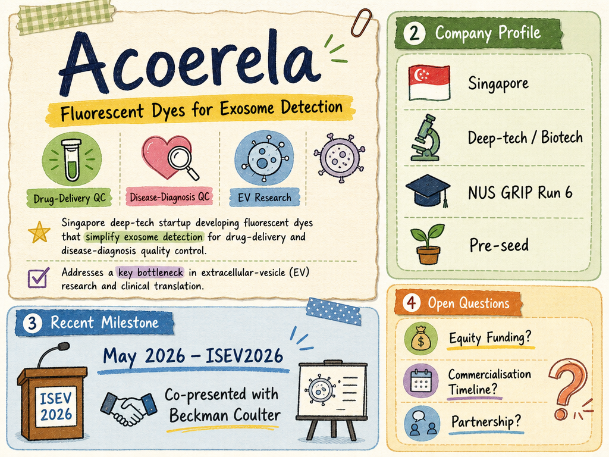

# Acoerela — LIVING BRIEF
_Last updated: 2026-05-25 15:58 UTC_

## Thesis
Acoerela is an NUS GRIP-incubated Singapore deep-tech startup developing fluorescent dyes that simplify exosome detection for drug-delivery and disease-diagnosis quality control. Its novel chemistry addresses a key bottleneck in extracellular-vesicle (EV) research and clinical translation. The company continues to build scientific visibility through conference collaborations, including a joint presentation with Beckman Coulter at ISEV2026.

## Profile
- Sector: Deep-tech / biotechnology (fluorescent dye chemistry for exosome detection)
- Region: Singapore
- Stage / funding: NUS GRIP Run 6 portfolio (incubation / pre-seed)

## Recent signals
- **2026-05-25** — Co-presented with Beckman Coulter at ISEV2026 on an exosome EV purification method — [linkedin.com](https://www.linkedin.com/posts/activity-7454042039400386560-9kdf)

## Older signals
_none_

## Open questions
- Has Acoerela raised any equity funding beyond NUS GRIP incubation support, or is the company still grant-funded?
- What is the commercialisation timeline for the fluorescent dye technology — is it being used in research settings or heading toward clinical diagnostic kits?
- Is the Beckman Coulter collaboration a development partnership, a distribution agreement, or a co-marketing arrangement?
