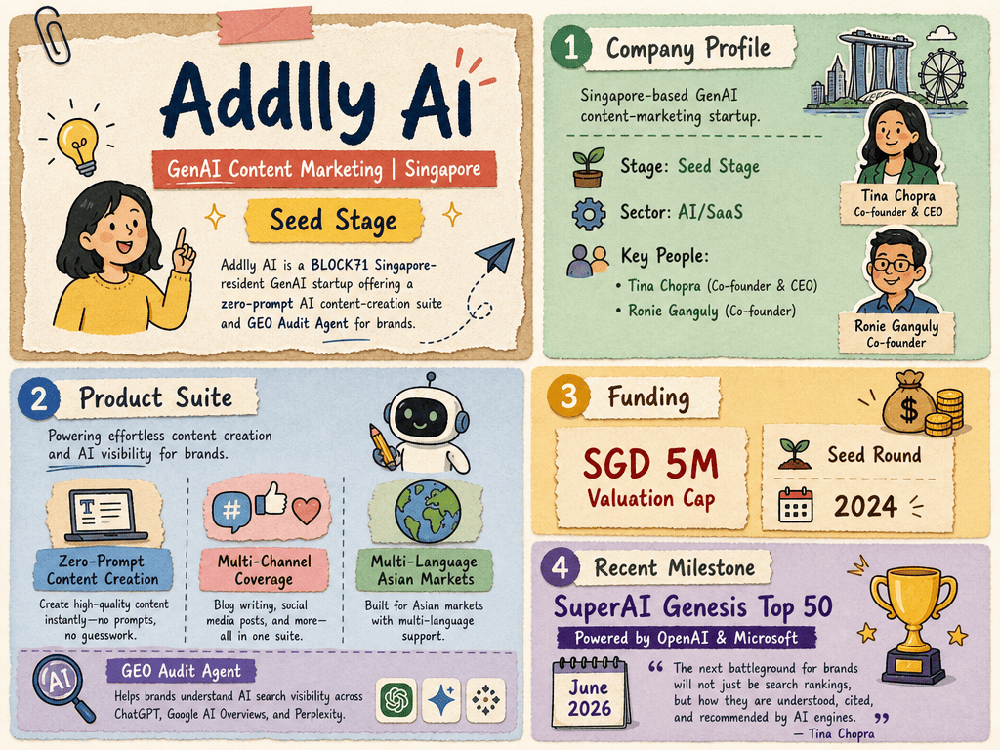

# Addlly AI — LIVING BRIEF
_Last updated: 2026-07-08 15:16 UTC_

## Thesis
BLOCK71 Singapore-resident GenAI content-marketing startup operating a zero-prompt AI content-creation suite covering blog writing, social media posts, and multi-language Asian-market support. Its GEO (Generative Engine Optimization) Audit Agent helps brands understand their AI search visibility across platforms like ChatGPT, Google AI Overviews, and Perplexity.

## Profile
- Sector: AI / SaaS
- Region: Singapore
- Stage / funding: Seed
- Key people: Tina Chopra (Co-founder & CEO), Ronie Ganguly (Co-founder)

## Funding history
- **2024-01-01** — Seed, Undisclosed (SGD 5M valuation cap) — investors undisclosed — [wate.com](https://www.wate.com/business/press-releases/ein-presswire/683195059/addlly-ai-secures-first-round-of-funding-at-a-5-million-valuation-cap/)

## Recent signals
- **2026-06-02** — Addlly AI selected for the SuperAI Genesis Top 50 Startup cohort, powered by OpenAI and Microsoft for Startups, strengthening its position as an enterprise GEO platform — [addlly.ai](https://addlly.ai/press/addlly-ai-named-superai-genesis-top-50-startup)
  - Summary: Addlly AI was named to the Genesis Top 50 Startup Cohort at SuperAI 2026, one of Asia's leading AI conferences held in Singapore June 10-11. The recognition highlights the company's enterprise-grade AI Marketing Agents and GEO Audit Agent, which help brands manage visibility across AI-generated search results.
  - People: Tina Chopra (Co-founder & CEO)
  - Counterparties: OpenAI, Microsoft for Startups
  - Quote: "The next battleground for brands will not just be search rankings, but how they are understood, cited, and recommended by AI engines." — Tina Chopra, Co-Founder and CEO

## Older signals
_none_

## Open questions
- What is Addlly's current customer count and revenue trajectory?
- Has Addlly raised a follow-on round beyond its Seed at SGD 5M valuation cap?
- How does Addlly differentiate from incumbent AI content and SEO platforms entering the GEO space?
