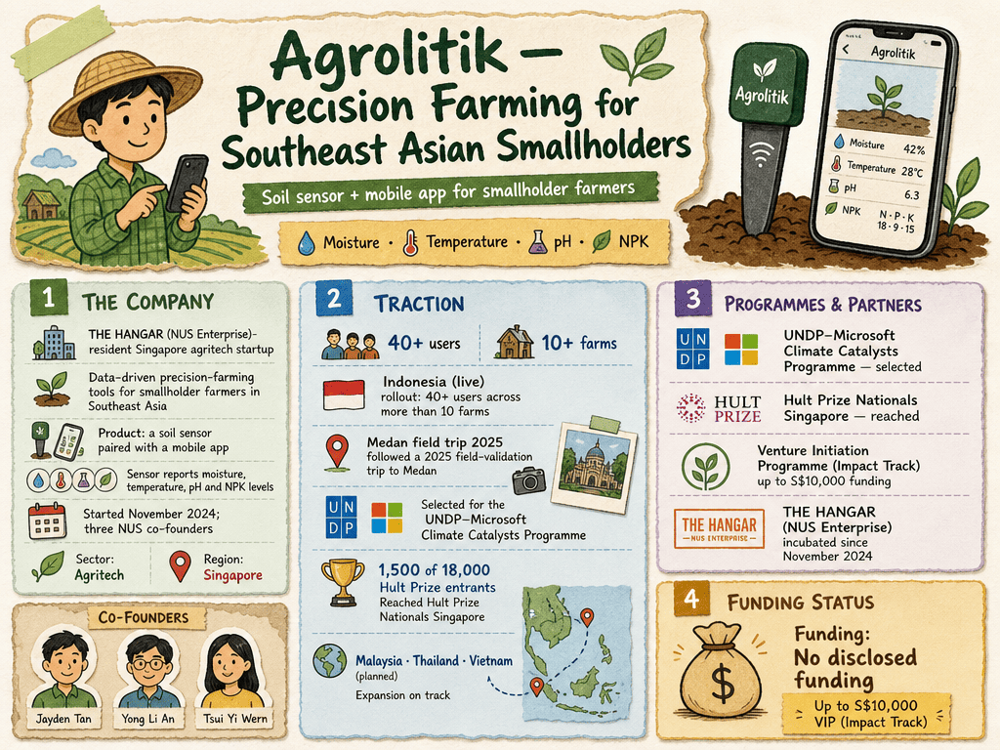

# Agrolitik — LIVING BRIEF
_Last updated: 2026-08-27 23:00 UTC_

## Thesis
Agrolitik is a THE HANGAR (NUS Enterprise)-resident Singapore agritech startup building data-driven precision-farming tools for smallholder farmers in Southeast Asia: a soil sensor paired with a mobile app that reports moisture, temperature, pH and NPK levels. Since starting in November 2024, the three NUS co-founders have rolled the product out in Indonesia with 40+ users across more than 10 farms and have expansion to Malaysia, Thailand and Vietnam on track.

_Last material event: 2026-07-22 — NUS Commencement profile discloses Indonesia rollout (40+ users, 10+ farms) and selection for the UNDP–Microsoft Climate Catalysts Programme_

## Profile
- Sector: Agritech
- Region: Singapore

## Funding history
_No disclosed funding._

## Recent signals
_none_

## Older signals
- **2026-07-22** — NUS News Commencement profile details Agrolitik's Indonesia rollout (40+ users across 10+ farms) and its selection for the UNDP–Microsoft Climate Catalysts Programme — [news.nus.edu.sg](https://news.nus.edu.sg/starting-out-and-up-nus-graduates-launch-entrepreneurial-ventures-in-precision-farming-wearable-tech-and-scent-based-marketing/)
  - Summary: NUS News profiled Agrolitik at Commencement 2026, covering its soil-sensor plus mobile-app precision-farming tool for Southeast Asian smallholder farmers, incubated at THE HANGAR since November 2024. The product is live in Indonesia with over 40 users across more than 10 farms, following a 2025 field-validation trip to Medan. Agrolitik was also selected for the UNDP–Microsoft Climate Catalysts Programme and reached Hult Prize Nationals Singapore (1,500 start-ups chosen from 18,000 worldwide), with expansion to Malaysia, Thailand and Vietnam planned.
  - People: Jayden Tan (co-founder), Yong Li An (co-founder), Tsui Yi Wern (co-founder)
  - Counterparties: UNDP (programme partner), Microsoft (programme partner)
  - Numbers: 40+ users; 10+ farms; 1,500 of 18,000 Hult Prize entrants; up to S$10,000 Venture Initiation Programme (Impact Track) funding

## Open questions
- Are the 40+ Indonesia users paying customers or pilot participants, and what is the sensor-plus-app pricing model?
- What support does the UNDP–Microsoft Climate Catalysts Programme selection provide beyond recognition?
- What funding and timeline back the planned Malaysia, Thailand and Vietnam expansion?
