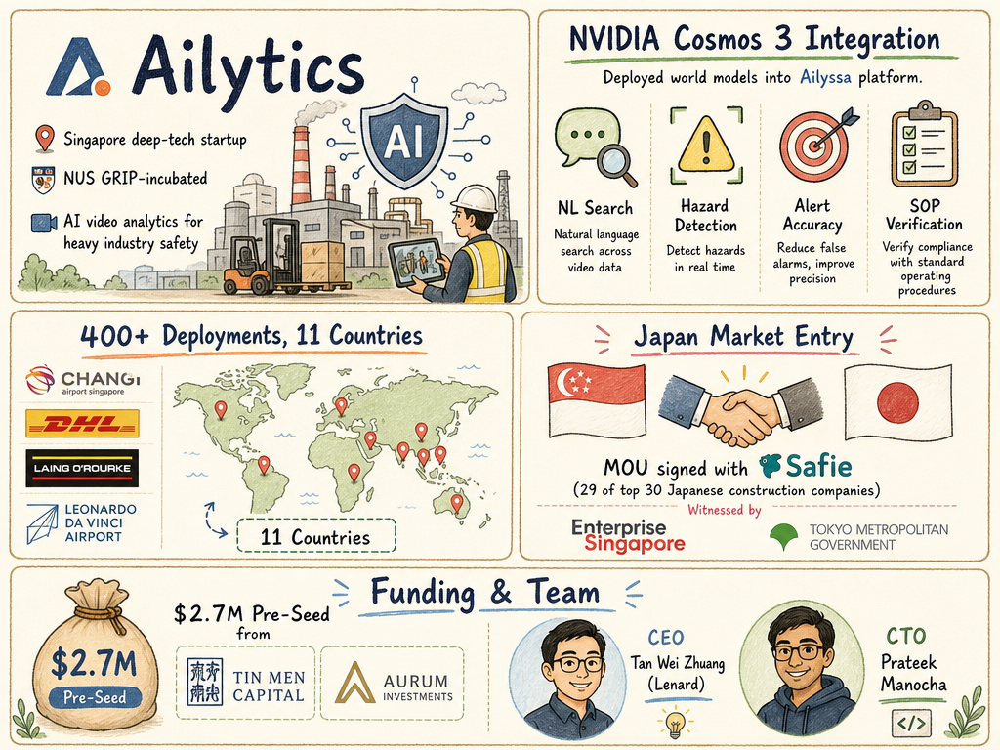

# Ailytics — LIVING BRIEF
_Last updated: 2026-06-02 12:00 UTC_

## Thesis
NUS GRIP-incubated Singapore deep-tech startup developing AI-powered video analytics for heavy industries. Ailytics is building momentum through strategic partnerships (Japan expansion with Safie), industry recognition, and a major technology leap by integrating NVIDIA Cosmos 3 world models into its Ailyssa platform — unlocking spatio-temporal reasoning and SOP-verification capabilities that were previously unsolvable with traditional computer vision.

## Profile
- Sector: AI video analytics / deep-tech
- Region: Singapore
- Stage / funding: Early-stage (seed + pre-seed)
- Key people: Huang Shao-Ning (lead seed investor, early backer)

## Funding history
- **2022-04-01** — Seed, undisclosed — Huang Shao-Ning; National University of Singapore, AngelCentral — [ailytics.ai](https://ailytics.ai/ailytics-announces-seed-investment/)
- **2024** — Pre-Seed, $2.7M — Tin Men Capital; Aurum Investments, AngelCentral — [prnewswire.com](https://www.prnewswire.com/apac/news-releases/ailytics-raises-us2-7m-to-power-next-generation-scenario-based-ai-monitoring-for-heavy-industries-302105965.html)

_Total disclosed: $2.7M._

## Recent signals
- **2026-06-02** — Deployed NVIDIA Cosmos 3 world models into its Ailyssa platform, enabling spatio-temporal reasoning for industrial safety that was previously unsolvable with traditional CV — [Ailytics](https://www.ailytics.ai/news/industrial-video-intelligence-reimagined-ailytics-deploys-nvidia-cosmos-3-across-heavy-industry)
  - Summary: Ailytics integrated NVIDIA Cosmos 3 across four capabilities of its Ailyssa platform — contextual natural-language search across CCTV footage, periodic image reasoning for slow-moving hazards, second-layer false-positive reduction on generated alerts, and spatio-temporal SOP verification. The company positions this as a complement to its existing fast specialized models, not a replacement. Customers include Changi Airport Group, DHL, Laing O'Rourke, and Leonardo da Vinci International Airport.
  - People: Tan Wei Zhuang, Lenard (Co-Founder & CEO), Prateek Manocha (Co-Founder & CTO)
  - Counterparties: NVIDIA (Cosmos 3 model provider)
  - Numbers: 400+ deployments across 11 countries
  - Quote: "What Cosmos 3 adds is the ability to reason about a series of events within a view, across multiple views, and against a specific SOP. That is a genuinely new capability for CCTV-based safety in heavy industry, and our job is to make it work cost-effectively and accurately at scale." — Tan Wei Zhuang, Lenard, Co-Founder & CEO
- **2026-06-02** — Signed an MOU with Safie, Japan's leading cloud video platform (29 of top 30 Japanese construction companies as customers), to bring AI-powered industrial safety to Japan and beyond — [Ailytics](https://www.ailytics.ai/news/ailytics-and-safie)
  - Summary: Ailytics and Safie signed an MOU covering technology integration, joint market development in Japan, commercial/reseller collaboration, and pilot deployments. The partnership will start with safety management at construction and manufacturing sites, then expand to process and progress management. No hardware replacement is required as it works with existing camera infrastructure. The signing was witnessed by Enterprise Singapore and Tokyo Metropolitan Government officials.
  - People: Tan Wei Zhuang (CEO, Ailytics), Tetsuharu Furuta (Director & COO, Safie)
  - Counterparties: Safie (cloud video platform partner), Enterprise Singapore, Tokyo Metropolitan Government
  - Quote: "Japan is a market we deeply respect, with world-class industrial standards and a strong culture of safety, and Safie is exactly the right partner to help us earn trust there." — Tan Wei Zhuang, CEO, Ailytics
- **2026-05-20** — Partnered with Safie for market entry into Japan, extending its AI monitoring platform beyond Southeast Asia — [ailyitics.ai](https://www.ailytics.ai/news/winning-at-the-design-ai-and-tech-awards)
- **2026-05-20** — Won first place at the Supernova Challenge, an industry competition, validating its technology in a public forum — [ailyitics.ai](https://www.ailytics.ai/news/we-won-first-place-at-the-supernova-challenge)
- **2026-05-20** — Featured on The Business Times in April 2026, gaining mainstream business media coverage in Singapore — [ailyitics.ai](https://www.ailytics.ai/news/april-2026-business-times-feature)
- **2026-05-20** — Published its 2025 retrospective marking five years of operations, reflecting on growth and milestones achieved — [ailyitics.ai](https://www.ailytics.ai/news/turning-five-our-2025-retrospective)

## Older signals
_none_

## Open questions
- Who is Safie and what specific AI monitoring use cases does the Japan partnership cover?
- Is Ailytics currently fundraising for its next round, given the 2024 pre-seed and growing momentum?
