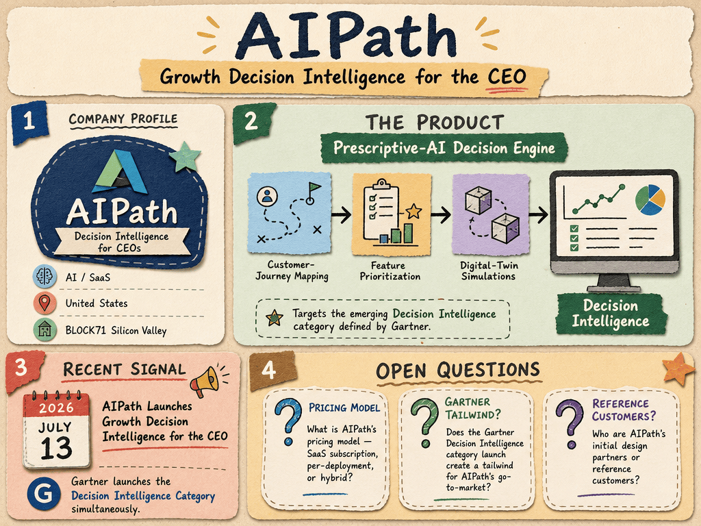

# AIPath — LIVING BRIEF
_Last updated: 2026-07-16 15:06 UTC_

## Thesis
AIPath is a BLOCK71 Silicon Valley-resident SaaS startup building a prescriptive-AI decision engine for product and go-to-market teams. The company applies AI customer-journey mapping, evidence-based feature prioritization, and digital-twin simulations to help CEOs make growth decisions, targeting the emerging Decision Intelligence category defined by Gartner.

## Profile
- Sector: AI / SaaS
- Region: United States

## Recent signals
- **2026-07-13** — AIPath Launches Growth Decision Intelligence for the CEO as Gartner launches the Decision Intelligence Category — [markets.businessinsider.com](https://markets.businessinsider.com/news/stocks/aipath-launches-growth-decision-intelligence-for-the-ceo-as-gartner-launches-the-decision-intelligence-category-1036318213)

## Older signals
_none_

## Open questions
- What is AIPath's pricing model — SaaS subscription, per-deployment, or hybrid?
- Does the Gartner Decision Intelligence category launch create a tailwind for AIPath's go-to-market?
- Who are AIPath's initial design partners or reference customers?
