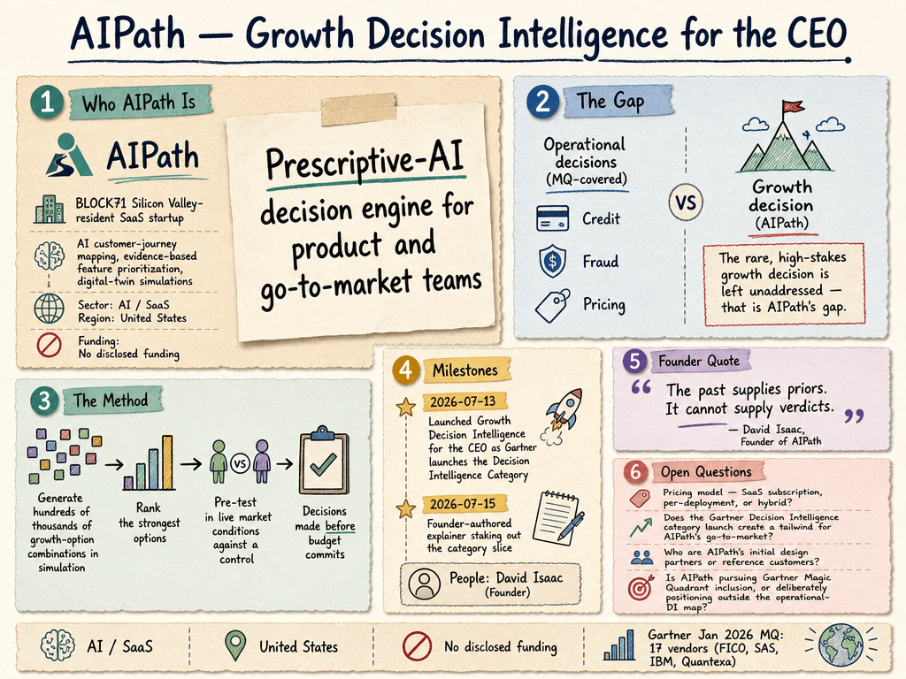

# AIPath — LIVING BRIEF
_Last updated: 2026-08-27 23:00 UTC_

## Thesis
AIPath is a BLOCK71 Silicon Valley-resident SaaS startup building a prescriptive-AI decision engine for product and go-to-market teams. The company applies AI customer-journey mapping, evidence-based feature prioritization, and digital-twin simulations to help CEOs make growth decisions, targeting the emerging Decision Intelligence category defined by Gartner.

_Last material event: 2026-07-13 — AIPath launched Growth Decision Intelligence for the CEO, timed with Gartner's Decision Intelligence category launch_

## Profile
- Sector: AI / SaaS
- Region: United States

## Funding history
_No disclosed funding._

## Recent signals
_none_

## Older signals
- **2026-07-15** — AIPath published a founder-authored explainer staking out "Growth Decision Intelligence" as the strategic-decision slice of the category Gartner's January 2026 Decision Intelligence Magic Quadrant doesn't cover — [aipath.one](https://www.aipath.one/post/what-is-growth-decision-intelligence)
  - Summary: Founder David Isaac's post defines Growth Decision Intelligence as decision intelligence applied to the growth decision — which segments, positions, and initiatives a company funds next. It argues Gartner's inaugural January 2026 Magic Quadrant for Decision Intelligence Platforms (17 vendors, including FICO, SAS, IBM, Quantexa) covers only high-frequency operational decisions such as credit, fraud, and pricing, leaving the rare, high-stakes growth decision unaddressed. AIPath says it closes that gap by generating and ranking hundreds of thousands of growth-option combinations in simulation, then pre-testing the strongest in live market conditions against a control before budget commits; the post links a live demo at library.aipath.one/home and a free 45-minute working session.
  - People: David Isaac (Founder)
  - Quote: "The past supplies priors. It cannot supply verdicts." — David Isaac, Founder of AIPath
- **2026-07-13** — AIPath Launches Growth Decision Intelligence for the CEO as Gartner launches the Decision Intelligence Category — [markets.businessinsider.com](https://markets.businessinsider.com/news/stocks/aipath-launches-growth-decision-intelligence-for-the-ceo-as-gartner-launches-the-decision-intelligence-category-1036318213)
- **2026-07-02** — Tech in Asia features AIPath's AI-simulation approach to lowering customer acquisition cost — [techinasia.com](https://www.techinasia.com/lowering-customer-acquisition-cost-ai-simulation)

## Open questions
- What is AIPath's pricing model — SaaS subscription, per-deployment, or hybrid?
- Does the Gartner Decision Intelligence category launch create a tailwind for AIPath's go-to-market?
- Who are AIPath's initial design partners or reference customers?
- Is AIPath pursuing Gartner Magic Quadrant inclusion, or deliberately positioning outside the operational-DI map?
