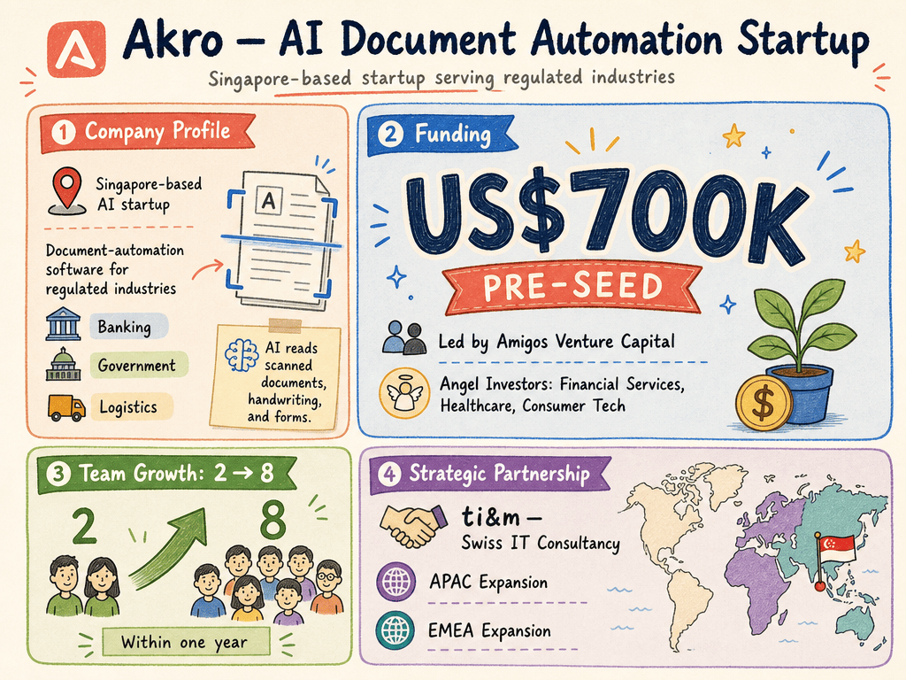

# Akro — LIVING BRIEF
_Last updated: 2026-06-30 15:32 UTC_

## Thesis
Akro is a Singapore-based AI startup building document-automation software for regulated industries including banking, government, and logistics. After raising a US$700,000 pre-seed round led by Amigos Venture Capital in mid-2026, the company grew from 2 to 8 employees within a year and signed a partnership with Swiss IT firm ti&m to expand into Asia-Pacific and EMEA markets.

## Profile
- Sector: AI
- Region: Singapore
- Stage / funding: Pre-seed
- Identifiers: [akro.ai](https://akro.ai)

## Recent signals
- **2026-06-30** — Akro raised US$700,000 in pre-seed funding led by Amigos Venture Capital, with angel investors from financial services, healthcare, and consumer tech joining the round; team grew from 2 to 8 within a year. — [techinasia.com](https://www.techinasia.com/news/singapore-ai-startup-akro-ai-raised-700k-preseed)
  - Summary: Akro's AI reads scanned documents, handwriting, and forms for regulated-industry customers. It secured US$700k pre-seed from Amigos VC and unnamed angels, grew headcount from 2 to 8, and signed a partnership with Swiss IT consultancy ti&m to expand in APAC and EMEA.
  - Counterparties: Amigos Venture Capital (lead investor); ti&m (partner)
  - Numbers: US$700,000 pre-seed; team 2 → 8 within one year
- **2026-06-30** — Corroborates the 2026-06-30 announcement; no new facts. — [beamstart.com](https://beamstart.com/news/singapore-based-ai-startup-akro-17827896499640)

## Older signals
_none_

## Open questions
- Who are the named founders or key executives leading Akro?
- Which specific government and enterprise customers has Akro deployed with?
- What is the pricing model (per-document, SaaS subscription) for Akro's AI document-reading product?
