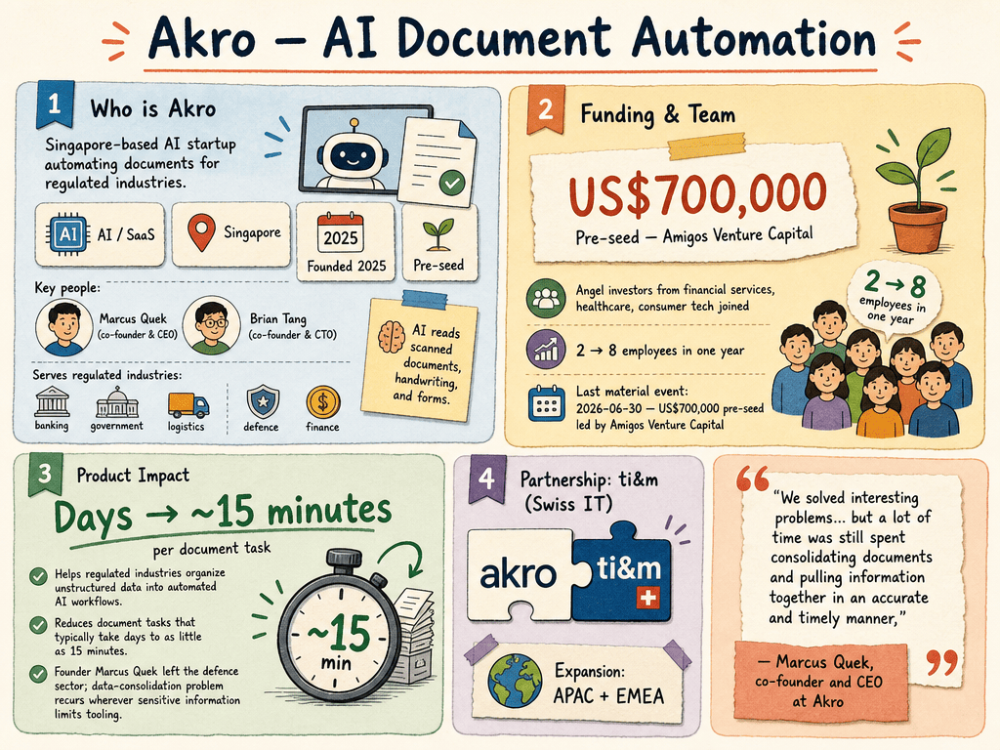

# Akro — LIVING BRIEF
_Last updated: 2026-07-31 15:30 UTC_

## Thesis
Akro is a Singapore-based AI startup building document-automation software for regulated industries including banking, government, and logistics. After raising a US$700,000 pre-seed round led by Amigos Venture Capital in mid-2026, the company grew from 2 to 8 employees within a year and signed a partnership with Swiss IT firm ti&m to expand into Asia-Pacific and EMEA markets.

_Last material event: 2026-06-30 — US$700,000 pre-seed round led by Amigos Venture Capital_

## Profile
- Sector: AI / SaaS
- Region: Singapore
- Founded: 2025
- Stage / funding: Pre-seed
- Key people: Marcus Quek (co-founder & CEO), Brian Tang (co-founder & CTO)
- Identifiers: [akro.ai](https://akro.ai)

## Funding history
_No disclosed funding._

## Recent signals
- **2026-07-23** — Singapore Business Review profiles Akro's AI document-automation workflows for regulated industries, naming founders and a 15-minute document-task reduction — [sbr.com.sg](https://sbr.com.sg/information-technology/exclusive/akro-ai-tackles-enterprise-data-bottleneck)
  - Summary: Akro AI Pte Ltd, founded in 2025 by Marcus Quek and Brian Tang, helps regulated industries (defence, finance, logistics) organize unstructured data into automated AI workflows, reducing document tasks that typically take days to as little as 15 minutes. Quek, who left the defence sector, said the same data-consolidation problem recurs wherever sensitive information limits tooling.
  - People: Marcus Quek (co-founder & CEO), Brian Tang (co-founder & CTO)
  - Numbers: document tasks reduced from days to ~15 minutes
  - Quote: "We solved interesting problems… but a lot of time was still spent consolidating documents and pulling information together in an accurate and timely manner," — Marcus Quek, co-founder and CEO at Akro

## Older signals
- **2026-06-30** — Akro raised US$700,000 in pre-seed funding led by Amigos Venture Capital, with angel investors from financial services, healthcare, and consumer tech joining the round; team grew from 2 to 8 within a year. — [techinasia.com](https://www.techinasia.com/news/singapore-ai-startup-akro-ai-raised-700k-preseed)
  - Summary: Akro's AI reads scanned documents, handwriting, and forms for regulated-industry customers. It secured US$700k pre-seed from Amigos VC and unnamed angels, grew headcount from 2 to 8, and signed a partnership with Swiss IT consultancy ti&m to expand in APAC and EMEA.
  - Counterparties: Amigos Venture Capital (lead investor); ti&m (partner)
  - Numbers: US$700,000 pre-seed; team 2 → 8 within one year
- **2026-06-30** — Corroborates the 2026-06-30 announcement; no new facts. — [beamstart.com](https://beamstart.com/news/singapore-based-ai-startup-akro-17827896499640)

## Open questions
- Which specific government and enterprise customers has Akro deployed with?
- What is the pricing model (per-document, SaaS subscription) for Akro's AI document-reading product?
