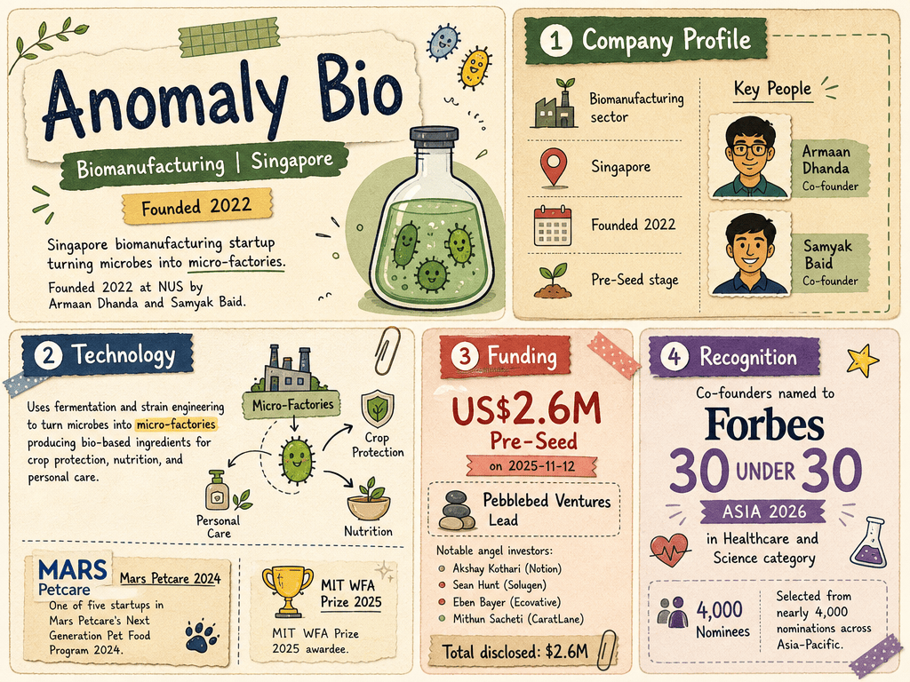

# Anomaly Bio — LIVING BRIEF
_Last updated: 2026-07-08 15:16 UTC_

## Thesis
The Hangar (NUS Enterprise)-resident biomanufacturing startup using fermentation and strain engineering to turn microbes into 'micro-factories' producing bio-based ingredients for crop protection, nutrition, and personal care. Founded in 2022 at NUS by Armaan Dhanda and Samyak Baid, the company was one of five startups in Mars Petcare's Next Generation Pet Food Program 2024 and an MIT WFA Prize 2025 awardee.

## Profile
- Sector: Biomanufacturing
- Region: Singapore
- Founded: 2022
- Stage / funding: Pre-Seed
- Key people: Armaan Dhanda (Co-founder), Samyak Baid (Co-founder)

## Funding history
- **2025-11-12** — Pre-Seed, US$2.6M — Pebblebed Ventures; Akshay Kothari (Notion), Sean Hunt (Solugen), Eben Bayer (Ecovative), Mithun Sacheti (CaratLane) — [technode.global](https://technode.global/2025/11/12/singapores-anomaly-bio-raises-2-6m-in-funding-led-by-pebblebed-ventures/)

_Total disclosed: $2.6M._

## Recent signals
- **2026-05-28** — Co-founders Samyak Baid and Armaan Dhanda named to Forbes 30 Under 30 Asia 2026 list in the Healthcare and Science category — [mustsharenews.com](https://mustsharenews.com/forbes-30-under-30-2026)
  - Summary: The Anomaly Bio co-founders were among 18 Singaporeans selected for Forbes 30 Under 30 Asia 2026. They were recognised in the Healthcare and Science category from nearly 4,000 nominations across Asia-Pacific.
  - People: Samyak Baid (Co-founder), Armaan Dhanda (Co-founder)

## Older signals
_none_

## Open questions
- What is Anomaly Bio's first target ingredient or product, and does it have any pilot or commercial offtake agreements?
- Has the company secured follow-on funding since the November 2025 Pre-Seed round?
