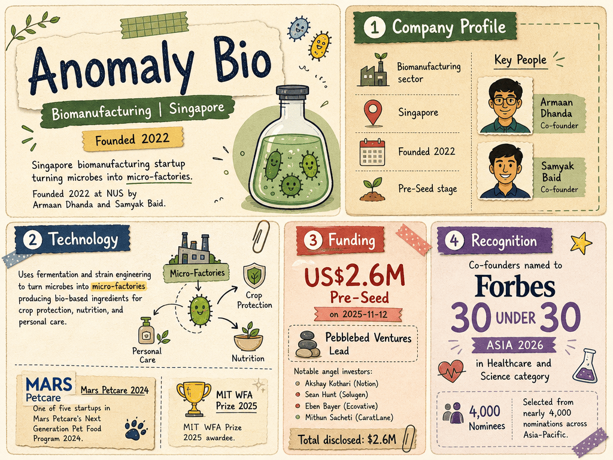

# Anomaly Bio — LIVING BRIEF
_Last updated: 2026-09-12 16:14 UTC_

## Thesis
The Hangar (NUS Enterprise)-resident biomanufacturing startup using fermentation and strain engineering to turn microbes into 'micro-factories' producing bio-based ingredients for crop protection, nutrition, and personal care. Founded in 2022 at NUS by Armaan Dhanda and Samyak Baid, the company was one of five startups in Mars Petcare's Next Generation Pet Food Program 2024 and an MIT WFA Prize 2025 awardee.

_Last material event: 2026-08-27 — Selected for ProVeg Incubator's second Fast-track to Impact cohort_

## Profile
- Sector: Biomanufacturing
- Region: Singapore
- Founded: 2022
- Stage / funding: Pre-Seed
- Key people: Armaan Dhanda (Co-founder), Samyak Baid (Co-founder)

## Funding history
- **2025-11-12** — Pre-Seed, US$2.6M — Pebblebed Ventures; Akshay Kothari (Notion), Sean Hunt (Solugen), Eben Bayer (Ecovative), Mithun Sacheti (CaratLane) — [technode.global](https://technode.global/2025/11/12/singapores-anomaly-bio-raises-2-6m-in-funding-led-by-pebblebed-ventures/)

_Total disclosed: $2.6M._

## Recent signals
- **2026-08-27** — Selected for ProVeg Incubator's second Fast-track to Impact cohort, the Singapore entry among 15 fermentation, next-generation-fat and upcycled-ingredient startups — [proveg.org](https://proveg.org/press-release/15-high-impact-startups-selected-for-second-fast-track-to-impact-cohort-at-proveg-incubator)
  - Summary: ProVeg Incubator, which describes itself as the world's first and longest-running alternative-protein incubator, selected 15 startups from a global applicant pool spanning 11 countries and four continents; Anomaly Bio is listed under fermentation. The cohort entry states the company has raised US$2.6M in pre-seed funding led by Pebblebed and secured more than US$125,000 in grants, including the 2025 MIT Food, Water and Agriculture Innovation Prize — confirmation that no follow-on equity round has been announced since November 2025. Anomaly Bio engineers microbes into "micro-factories" that convert simple sugars into functional ingredients for nutrition and health, and is supported by strategic advisor Ingeborg Gasser-Kriss.
  - People: Armaan Dhanda (Co-founder), Samyak Baid (Co-founder)
  - Numbers: 15 startups selected; 11 countries; US$2.6M pre-seed; US$125,000+ in grants

## Older signals
- **2026-05-28** — Co-founders Samyak Baid and Armaan Dhanda named to Forbes 30 Under 30 Asia 2026 list in the Healthcare and Science category — [mustsharenews.com](https://mustsharenews.com/forbes-30-under-30-2026)
  - Summary: The Anomaly Bio co-founders were among 18 Singaporeans selected for Forbes 30 Under 30 Asia 2026. They were recognised in the Healthcare and Science category from nearly 4,000 nominations across Asia-Pacific.
  - People: Samyak Baid (Co-founder), Armaan Dhanda (Co-founder)

## Open questions
- What is Anomaly Bio's first target ingredient or product, and does it have any pilot or commercial offtake agreements?
- What does the ProVeg Incubator programme provide beyond mentorship — funding, pilot facilities, or industry introductions — and does it take equity?
