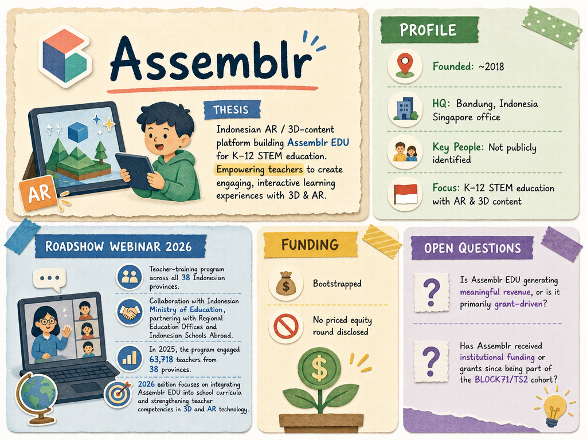

# Assemblr — LIVING BRIEF
_Last updated: 2026-06-07 15:01 UTC_

## Thesis
Assemblr is an Indonesian AR / 3D-content platform building the Assemblr EDU product for K-12 STEM education, with a growing teacher-training program across all 38 Indonesian provinces. The 2026 return of its Roadshow Webinar, which engaged over 63,718 teachers in 2025, indicates sustained adoption of AR technology in Indonesia's education system.

## Profile
- Sector: EdTech / augmented reality
- Region: Indonesia (HQ Bandung), Singapore (CT HUB2, 336 Smith St)
- Founded: ~2018
- Stage / funding: Bootstrapped; no priced equity round disclosed
- Key people: Not publicly identified
- Identifiers: [LinkedIn](https://www.linkedin.com/company/assemblr)

## Recent signals
- **2026-04-13** — Assemblr EDU Roadshow Webinar returns for 2026, targeting teachers across all 38 Indonesian provinces to enhance AR-based teaching skills — [Assemblr Blog](https://www.assemblrworld.com/blog/assemblre-edus-roadshow-webinar-returns-in-2026-to-enhance-teachers-skills-with-ar-technology)
  - Summary: The program is a collaboration between the Indonesian Ministry of Education and Assemblr EDU, partnering with Regional Education Offices and Indonesian Schools Abroad. In 2025, the program engaged 63,718 teachers from 38 provinces. The 2026 edition focuses on integrating Assemblr EDU into school curricula and strengthening teacher competencies in 3D and AR technology for education.

## Older signals
_none_

## Open questions
- Is Assemblr generating meaningful revenue from its EDU product, or is growth primarily grant- and partnership-driven?
- Has the company raised any institutional funding since joining the BLOCK71 / TS2 cohort?
