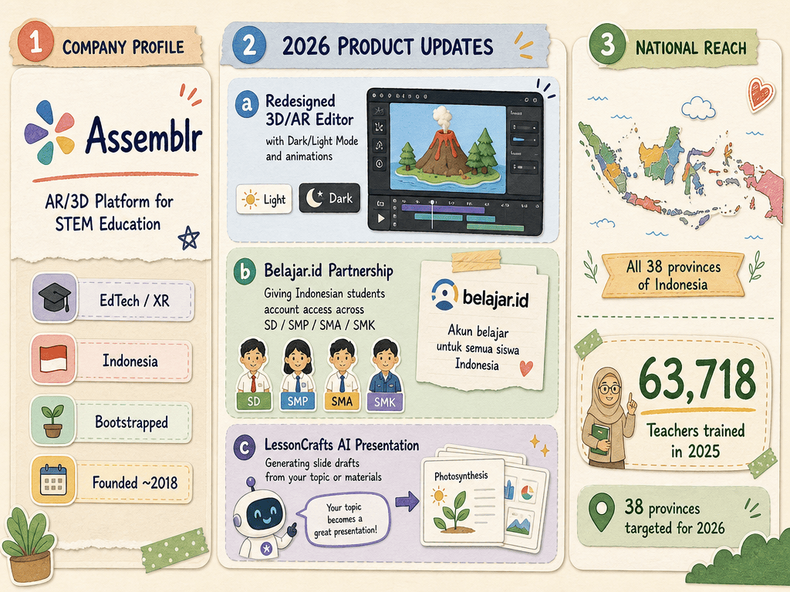

# Assemblr — LIVING BRIEF
_Last updated: 2026-08-20 13:50 UTC_

## Thesis
Assemblr is an Indonesian AR / 3D-content platform building the Assemblr EDU product for K-12 STEM education, with a growing teacher-training program across all 38 Indonesian provinces. The 2026 return of its Roadshow Webinar, which engaged over 63,718 teachers in 2025, indicates sustained adoption of AR technology in Indonesia's education system.

_Last material event: 2026-08-03 — ImajiNation 2026 national visual-coding competition launched with Kemendikdasmen and Samsung for Education_

## Profile
- Sector: EdTech / XR
- Region: Indonesia (HQ Bandung), Singapore (CT HUB2, 336 Smith St)
- Founded: ~2018
- Stage / funding: Bootstrapped; no priced equity round disclosed
- Key people: Not publicly identified
- Identifiers: [LinkedIn](https://www.linkedin.com/company/assemblr)

## Funding history
_No disclosed funding._

## Recent signals
- **2026-08-03** — Assemblr EDU, Indonesia's education ministry (Kemendikdasmen), and Samsung for Education launch ImajiNation 2026, a national visual-coding competition targeting 11,000+ participants from 2,000+ schools across 38 provinces — [assemblrworld.com](https://www.assemblrworld.com/blog/imajination-2026-officially-launches-bringing-a-national-visual-coding-competition-to-students-and-teachers-across-38-provinces) (Also reported by: [techinasia.com](https://www.techinasia.com/indonesias-education-ministry-partners-assemblr-samsung-nationwide-visual-coding-championship))
  - Summary: ImajiNation 2026 is a national digital creation championship co-launched by Kemendikdasmen, Assemblr EDU, and Samsung (through Samsung for Education), targeting more than 11,000 participants from over 2,000 schools across all 38 provinces. Students build projects using Visual Coding, 3D, and AR, aligned with Indonesia's new Coding and AI school subject and the Ministry's Deep Learning approach. Minister Abdul Mu'ti publicly endorsed the competition as part of the ministry's coding and AI learning agenda. A six-week national learning program precedes an in-person Grand Final in Jakarta in October 2026, including a live Junior High School Visual Coding Battle on the Samsung EDU Innovation Stage and an Education Expo (about 1,000 on-site visitors and 5,000 livestream viewers).
  - People: Abdul Mu'ti (Minister of Primary and Secondary Education), Hasbi Asyadiq (Co-Founder & CEO, Assemblr), Ian Chong (Head of Mobile Enterprise & Education, Samsung SEA & Oceania)
  - Counterparties: Kemendikdasmen (partner); Samsung for Education (supporter)
  - Numbers: 11,000+ participants; 2,000+ schools; 38 provinces; ~1,000 on-site / ~5,000 livestream at Education Expo
  - Quote: "Our goal is not simply to teach students how to write code, but to nurture systematic, creative, collaborative, and problem-solving ways of thinking." — Abdul Mu'ti, Minister of Primary and Secondary Education

## Older signals
- **2026-06-29** — Assemblr 2026 Updates: New Editor, Belajar.id & AI Presentation — [assemblrworld.com](https://www.assemblrworld.com/es/blog/latest-assemblr-updates-new-editor-belajar-id-and-lessoncrafts)
  - Summary: Assemblr redesigned its 3D/AR editor with Dark Mode/Light Mode, animations, visual coding templates, and real-time collaboration. Assemblr EDU expanded exclusive access to students with Belajar.id accounts across Indonesia (SD/SMP/SMA/SMK domains). LessonCrafts launched an AI Presentation feature generating editable slide drafts from a lesson topic, with a new Competition Page aggregating all monthly Assemblr EDU contests.
- **2026-04-13** — Assemblr EDU Roadshow Webinar returns for 2026, targeting teachers across all 38 Indonesian provinces to enhance AR-based teaching skills — [Assemblr Blog](https://www.assemblrworld.com/blog/assemblre-edus-roadshow-webinar-returns-in-2026-to-enhance-teachers-skills-with-ar-technology)
- **2025-05-05** — Assemblr EDU announced as an official Belajar.id partner platform at Kemendikdasmen's CDT Talks #1 seminar, joining Canva and Quizizz among the ministry's national platform partners — [assemblrworld.com](https://www.assemblrworld.com/blog/meet-assemblr-edu-the-first-official-partner-platform-of-belajar-id-from-indonesia)
  - Summary: Kemendikdasmen's CDT Talks #1 seminar (April 30, 2025) marked the official launch of the ministry's collaboration with Assemblr EDU, adding the 3D/AR platform to Belajar.id's partner list alongside Canva and Quizizz. Assemblr EDU (founded 2020) provides 3D/AR teaching aids, ready-to-use topics, and a drag-and-drop editor for teachers and students.
  - People: Hasbi Asyadiq (CEO & Founder, Assemblr EDU)
  - Counterparties: Kemendikdasmen (partner)

## Open questions
- Is Assemblr generating meaningful revenue from its EDU product, or is growth primarily grant- and partnership-driven?
- Has the company raised any institutional funding since joining the BLOCK71 / TS2 cohort?
- What are the commercial terms of the Belajar.id partnership — paid government contract or freemium distribution?
- Is LessonCrafts generating stand-alone revenue, or is it bundled into Assemblr EDU subscriptions?
