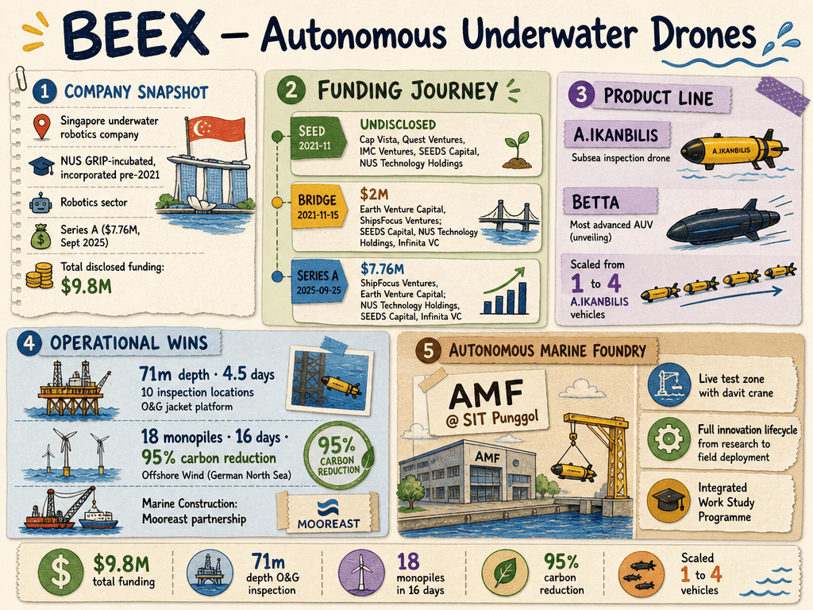

# BEEX — LIVING BRIEF
_Last updated: 2026-06-22 17:50 UTC_

## Thesis
NUS GRIP-incubated Singapore autonomous underwater vehicle (AUV) startup building inspection and survey drones for the maritime industry. BEEX has progressed from seed funding through a Series A in 2025 and is now unveiling its most advanced drone, BETTA, signaling product maturation and a push into global markets.

## Profile
- Sector: Robotics
- Region: Singapore
- Stage / funding: Series A (raised ~$7.76M in Sept 2025)
- Founded: NUS GRIP-incubated, incorporated pre-2021

## Funding history
- **2021-11** — Seed, undisclosed — Cap Vista; Quest Ventures, IMC Ventures, SEEDS Capital, NUS Technology Holdings — [questventures.com](https://www.questventures.com/press/sg-based-underwater-robot-maker-beex-bags-seed-funding/)
- **2023-11-15** — Bridge, $2M — Earth Venture Capital, ShipsFocus Ventures; SEEDS Capital, NUS Technology Holdings, Infinita VC — [technode.global](https://technode.global/2023/11/15/singapores-beex-raises-2m-in-funding-led-by-earth-venture-capital-shipsfocus-ventures/)
- **2025-09-25** — Series A, $7.76M — ShipFocus Ventures, Earth Venture Capital; NUS Technology Holdings, SEEDS Capital, Infinita VC — [technode.global](https://technode.global/2025/09/25/singapores-beex-launches-7-76m-series-a-funding-round-to-fuel-global-expansion/)

_Total disclosed: $9.8M._

## Recent signals
- **2026-06-22** — BeeX, SIT launch test site for AI underwater inspection systems — [theedgesingapore.com](https://www.theedgesingapore.com/digitaledge/technopreneurs/beex-sit-launch-test-site-ai-underwater-inspection-systems)
- **2026-06-22** — BeeX Launches Live Underwater Drone Test-Zone with Opening of Autonomous Marine Foundry at SIT Punggol Campus — [beex.sg](https://www.beex.sg/news/beex-opens-autonomous-marine-foundry-and-live-test-zone-at-sit-punggol)
  - Summary: BeeX and SIT inaugurated the Autonomous Marine Foundry (AMF) at SIT Punggol Campus, a purpose-built hub for maritime robotics innovation including a live test zone with a davit crane for drone launch and recovery. The facility supports the full innovation lifecycle from research to field deployment and includes an Integrated Work Study Programme for talent development.
  - Counterparties: Singapore Institute of Technology (Academic Partner)
- **2026-06-22** — Successful Adaptive Autonomous Inspection at 4-Legged Jacket Platform for Major O&G Company — [beex.sg](https://www.beex.sg/case-studies/successful-adaptive-autonomous-inspection-at-4-legged-jacket-platform-for-major-o-g-company)
  - Summary: BeeX completed its first adaptive autonomous inspection of a 4-legged oil and gas jacket platform at 71 meters depth for a major O&G operator, completing the campaign in 4.5 operational days with full General Visual Inspection and Cathodic Protection stabs across 10 pre-defined locations.
  - Numbers: 71 meters depth, 4.5 operational days, 10 pre-defined inspection locations
- **2026-06-22** — Enhancing Inspection Efficiency in Marine Construction with Autonomous Solutions — [beex.sg](https://www.beex.sg/case-studies/meet-a-ikanbilis-the-autonomous-underwater-drone-transforming-how-moorings-are-installed)
  - Summary: BeeX partnered with Mooreast, a Singapore-based marine construction company, to provide autonomous underwater inspection for a coastal protection project involving geotextile fabric placement verification. BeeX scaled from 1 to 4 A.IKANBILIS vehicles, delivering higher efficiency than diver-based inspection.
  - Counterparties: Mooreast (Customer)
  - Numbers: 1 to 4 vehicles scaled
- **2026-06-22** — BeeX Provides Integrated Inspection Approach for Offshore Industry Giant — [beex.sg](https://www.beex.sg/case-studies/beex-provides-integrated-inspection-approach-for-offshore-industry-giant)
  - Summary: BeeX deployed its autonomous underwater inspection system for an offshore wind farm in the German North Sea (Lower Saxony), inspecting 18 monopiles in 16 days with a 95% reduction in carbon emissions versus conventional ROV operations. The system operated in currents up to 1.8 knots and delivered AI-enhanced visuals with real-time data access via the Sambal portal.
  - Numbers: 18 monopiles in 16 days, 95% reduction in carbon emissions, 1.8 knots current handling
- **2026-05-20** — Preparing to unveil BETTA, its most advanced autonomous underwater drone, at a Singapore launch event — [news.google.com](https://news.google.com/rss/articles/CBMiogJBVV95cUxPYXRYRnFKRW9PTU9rek1La1hITjQxc2g2STZ5VkF2clhlZFl4WWcxTUNsd1lQSmlNTFJ)
- **2026-05-20** — Demonstrated its A.IKANBILIS autonomous subsea inspection drone at Oceanology International 2026, a major global ocean technology trade show — [news.google.com](https://news.google.com/rss/articles/CBMimwJBVV95cUxPS29FUW9kcWwtdUJMWVFIRGVHWnYtQVFEZXF6MVhWN1lsU0lFT00tUlJqV3lEMDNyQk5)

## Older signals
_none_

## Open questions
- What are the key technical specifications of BETTA and how does it differ from A.IKANBILIS?
- Which commercial sectors (offshore wind, O&G, coastal infrastructure) is BEEX prioritizing for expansion?
