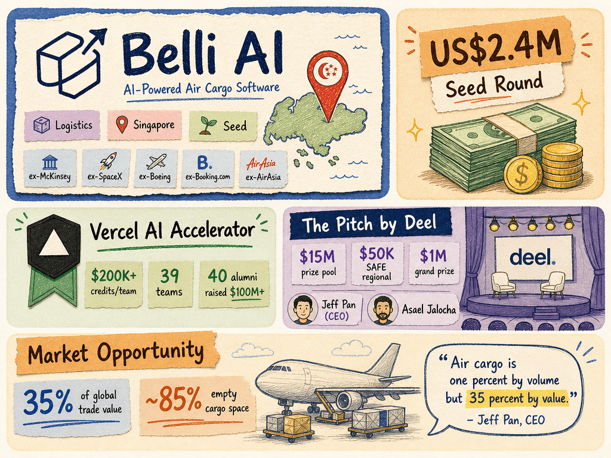

# Belli AI — LIVING BRIEF
_Last updated: 2026-06-23 16:06 UTC_

## Thesis
Belli AI is a BLOCK71 Singapore-resident air-cargo software startup founded by veterans of McKinsey, SpaceX, Boeing, Booking.com, and AirAsia, digitising end-to-end airline cargo operations. The company has raised a US$2.4M seed round and been selected for the Vercel AI Accelerator program. Its inclusion as a named alumni with signed enterprise customers signals product-market validation and growing traction in the air-cargo digitisation space.

## Profile
- Sector: Logistics
- Region: Singapore
- Stage / funding: Seed (US$2.4M)
- Founders: ex-McKinsey, SpaceX, Boeing, Booking.com, AirAsia

## Funding history
- **2024-01-01** — Seed, US$2.4M — investors undisclosed — [source](https://block71.co/directory/startups/belli-ai/)

_Total disclosed: $2.4M._

## Recent signals
- **2026-06-23** — Belli takes the stage at The Pitch by Deel — [belli.ai](https://www.belli.ai/blog)
  - Summary: Belli AI was selected to pitch at The Pitch by Deel, a global startup tournament by Deel with a $15M prize pool. Co-founder and CEO Jeff Pan and Associate Product Engineer Asael Jalocha presented Belli's airline cargo software in separate editions of the competition.
  - People: Jeff Pan (Co-founder & CEO), Asael Jalocha (Associate Product Engineer)
  - Numbers: $15M prize pool from Deel; $50K SAFE for regional winners; $1M grand prize for global finale; air cargo carries 35% of global trade value with ~85% empty cargo space
  - Quote: "Air cargo is only one percent of global trade by volume but 35 percent by value, and most flights still fly with around 85 percent of their cargo space empty." — Jeff Pan, CEO
- **2026-05-25** — Named as alumni with signed enterprise customers in Vercel's 2026 AI Accelerator recap — [Vercel Blog](https://vercel.com/blog/2026-vercel-ai-accelerator-recap)
  - Summary: Belli AI was highlighted among past Vercel AI Accelerator alumni that have signed enterprise customers and formed partnerships through the program. The 2026 cohort demo day was held April 16 at Vercel's San Francisco HQ with 39 teams presenting.
  - Numbers: Over $200K in credits and infrastructure per team; 40 alumni have raised $100M+ in venture funding collectively

## Older signals
_none_

## Open questions
- Which enterprise customers has Belli AI signed, and what is the scale of deployment (pilot vs. production across how many airlines)?
- What is the specific revenue or ARR trajectory after the Vercel Accelerator program?
- Is the US$2.4M seed round the company's only external funding, or are there additional grants or angel rounds?
