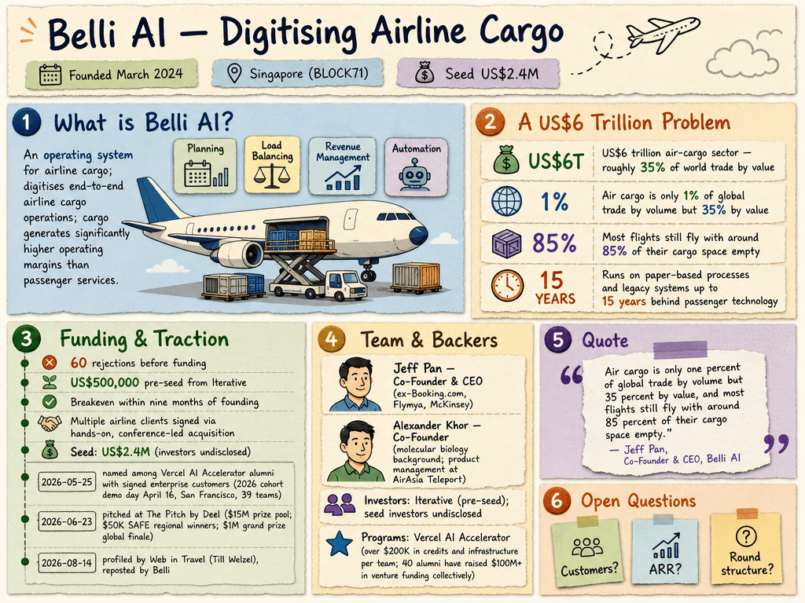

# Belli AI — LIVING BRIEF
_Last updated: 2026-09-18 16:59 UTC_

## Thesis
Belli AI is a BLOCK71 Singapore-resident air-cargo software startup founded by veterans of McKinsey, SpaceX, Boeing, Booking.com, and AirAsia, digitising end-to-end airline cargo operations. The company has raised a US$2.4M seed round and been selected for the Vercel AI Accelerator program. Its inclusion as a named alumni with signed enterprise customers signals product-market validation and growing traction in the air-cargo digitisation space.

_Last material event: 2026-09-11 — Crowned champion of the 2026 SWC Asia Finale, earning a place at November's San Francisco Grand Finale and a shot at its US$1M investment prize_

## Profile
- Sector: Logistics
- Region: Singapore
- Stage / funding: Seed (US$2.4M)
- Founders: ex-McKinsey, SpaceX, Boeing, Booking.com, AirAsia

## Funding history
- **2024-01-01** — Seed, US$2.4M — investors undisclosed — [block71.co](https://block71.co/directory/startups/belli-ai/)

_Total disclosed: $2.4M._

## Recent signals
- **2026-09-11** — Belli was crowned champion of the 2026 SWC Asia Finale and will represent Asia at the San Francisco Grand Finale in November, competing for a US$1M investment prize — [belli.ai](https://belli.ai/company/news/belli-crowned-champion-at-the-2026-swc-asia-finale)
  - Summary: Belli took the top spot at the 2026 SWC Asia Finale, where it was judged on its enterprise-grade SaaS for aviation cargo and its commercial scalability. As regional champion the team travels to San Francisco in November 2026 for the SWC Grand Finale and a US$1,000,000 investment prize; DPBIO Technology Limited and Set Sail AI were named first and second runner-up respectively.
  - Numbers: US$1,000,000 Grand Finale investment prize; November 2026 Grand Finale

## Older signals
- **2026-08-14** — Web in Travel profile (reposted by Belli) details the company's March 2024 founding, the US$500K Iterative pre-seed secured after 60 investor rejections, and breakeven within nine months with multiple airline clients — [belli.ai](https://www.belli.ai/news/read-what-web-in-travel-wit-wrote-about-belli-from-early-challenges-to-building-product-to-the-air-cargo-market)
  - Summary: A Web in Travel profile (by Till Welzel, reposted on Belli's news page) recounts the company's early path: Belli AI was founded in March 2024 by Jeff Pan (ex-Booking.com, Flymya, McKinsey) and Alexander Khor (molecular biology background; product management at AirAsia Teleport) to attack a US$6 trillion air-cargo sector — roughly 35% of world trade by value — that still runs on paper-based processes and legacy systems up to 15 years behind passenger technology. Pan and Khor faced 60 investor rejections before securing US$500,000 in pre-seed funding from Iterative, and reached breakeven within nine months of founding while signing multiple airline clients through hands-on, conference-led acquisition. Belli's software functions as an operating system for cargo spanning planning, load balancing, revenue management and automation; the profile notes cargo generates significantly higher operating margins than passenger services.
  - People: Jeff Pan (Co-Founder & CEO), Alexander Khor (Co-Founder)
  - Counterparties: Iterative (pre-seed investor)
  - Numbers: US$500K pre-seed (Iterative); 60 investor rejections; breakeven within 9 months; multiple airline clients; US$6T annual goods value; ~35% of world trade by value
- **2026-06-23** — Belli takes the stage at The Pitch by Deel — [belli.ai](https://www.belli.ai/blog)
  - Summary: Belli AI was selected to pitch at The Pitch by Deel, a global startup tournament by Deel with a $15M prize pool. Co-founder and CEO Jeff Pan and Associate Product Engineer Asael Jalocha presented Belli's airline cargo software in separate editions of the competition.
  - People: Jeff Pan (Co-founder & CEO), Asael Jalocha (Associate Product Engineer)
  - Numbers: $15M prize pool from Deel; $50K SAFE for regional winners; $1M grand prize for global finale; air cargo carries 35% of global trade value with ~85% empty cargo space
  - Quote: "Air cargo is only one percent of global trade by volume but 35 percent by value, and most flights still fly with around 85 percent of their cargo space empty." — Jeff Pan, CEO
- **2026-05-25** — Named as alumni with signed enterprise customers in Vercel's 2026 AI Accelerator recap — [Vercel Blog](https://vercel.com/blog/2026-vercel-ai-accelerator-recap)
  - Summary: Belli AI was highlighted among past Vercel AI Accelerator alumni that have signed enterprise customers and formed partnerships through the program. The 2026 cohort demo day was held April 16 at Vercel's San Francisco HQ with 39 teams presenting.
  - Numbers: Over $200K in credits and infrastructure per team; 40 alumni have raised $100M+ in venture funding collectively

## Open questions
- Which enterprise customers has Belli AI signed, and what is the scale of deployment (pilot vs. production across how many airlines)?
- What is the specific revenue or ARR trajectory after the Vercel Accelerator program?
- Does the directory-listed 2024-01-01 seed date predate Belli's March 2024 founding (per the WiT profile), and is the US$500K Iterative pre-seed a separate priced round or was it folded into the seed?
- What is the cash value and structure of the 2026 SWC Asia Finale win, and would a Grand Finale US$1M prize arrive as equity investment or a grant?
