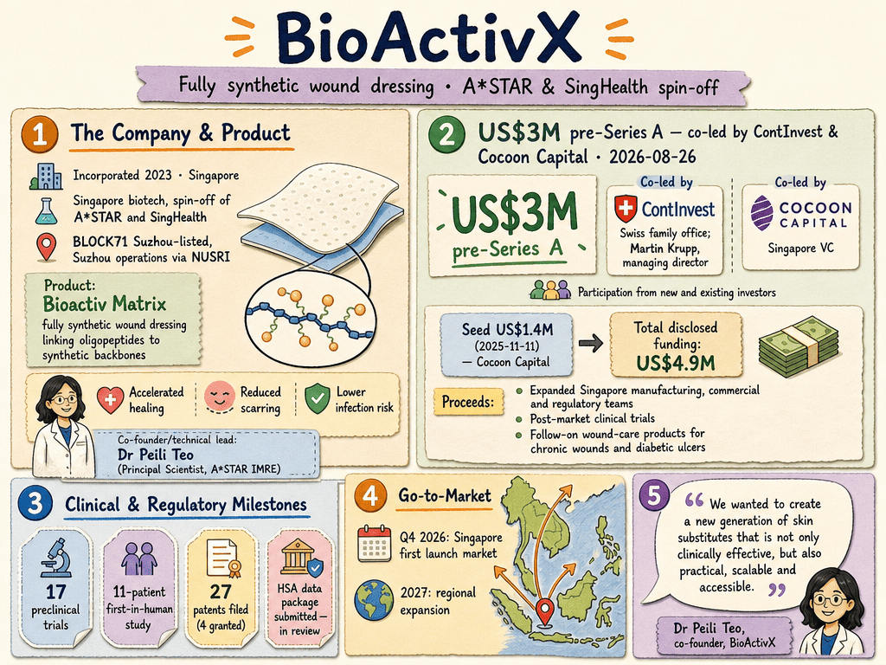

# BioActivX — LIVING BRIEF
_Last updated: 2026-08-26 14:21 UTC_

## Thesis
BioActivX is a Singapore biotech startup spun out of A*STAR and SingHealth (incorporated 2023; BLOCK71 Suzhou-listed, with Suzhou operations via the NUSRI translation institute) developing Bioactiv™ Matrix, a fully synthetic wound dressing that links oligopeptides to synthetic backbones for accelerated healing, reduced scarring and lower infection risk. Its US$3M pre-Series A, co-led by Swiss family office ContInvest and Cocoon Capital, funds Singapore manufacturing, commercial and regulatory hires, and post-market trials — an HSA data package is in review and a Q4 2026 Singapore launch is targeted.

_Last material event: 2026-08-26 — US$3M pre-Series A co-led by ContInvest and Cocoon Capital_

## Profile
- Sector: Biotechnology / MedTech
- Region: Singapore (BLOCK71 Suzhou-listed; Suzhou ops via NUSRI)
- Founded: 2023
- Key people: Dr Peili Teo (co-founder, technical lead; Principal Scientist, A*STAR IMRE)

## Funding history
- **2025-11-11** — Seed, US$1.4M — Cocoon Capital — [beamstart.com](https://beamstart.com/news/sg-biotech-startup-bioactivx-nets-17628411376784)

_Total disclosed: $1.4M._

## Recent signals
- **2026-08-26** — Raised US$3M in a pre-Series A co-led by Swiss family office ContInvest and Cocoon Capital for its Bioactiv Matrix synthetic wound-care platform, bringing total disclosed funding to US$4.9M — [techinasia.com](https://www.techinasia.com/news/cocoon-capital-coleads-3m-sg-biotech-startup-bioactivx) (Also reported by: [e27.co](https://e27.co/astar-singhealth-spin-off-bioactivx-lands-us3m-for-next-gen-wound-care-20260826/), [app.dealroom.co](https://app.dealroom.co/news/note/bioactivx-raises-3m-for-synthetic-wound-care-technology-in-singapore))
  - Summary: BioActivX, an A*STAR/SingHealth spin-off founded in 2023, raised US$3M in a pre-Series A co-led by Martin Krupp (managing director of Swiss family office ContInvest) and Singapore VC Cocoon Capital, with participation from new and existing investors. Proceeds go to expanded Singapore manufacturing, commercial and regulatory teams, post-market clinical trials for Bioactiv Matrix, and follow-on wound-care products targeting chronic wounds and diabetic ulcers. The company has submitted a full data package to Singapore's Health Sciences Authority and targets Singapore as a first launch market in Q4 2026, with regional expansion in 2027.
  - People: Dr Peili Teo (co-founder; Principal Scientist, A*STAR IMRE), Martin Krupp (managing director, ContInvest)
  - Counterparties: ContInvest (co-lead investor), Cocoon Capital (co-lead investor), Health Sciences Authority (regulator)
  - Numbers: US$3M pre-Series A (2026-08-26); US$4.9M total disclosed funding; 17 preclinical trials; 11-patient first-in-human study; 27 patents filed (4 granted); Q4 2026 Singapore launch target
  - Quote: "We wanted to create a new generation of skin substitutes that is not only clinically effective, but also practical, scalable and accessible." — Dr Peili Teo, co-founder, BioActivX

## Older signals
_none_

## Open questions
- The US$4.9M total cited by Tech in Asia exceeds the sum of the disclosed US$1.4M seed (Nov 2025) and the US$3M pre-Series A — what fills the gap?
- Is the Q4 2026 Singapore launch contingent on HSA approval of the Bioactiv Matrix data package, and what happens if review slips?
- Which route to market does BioActivX plan for first launch — hospital tenders, distributors, or direct sales?
