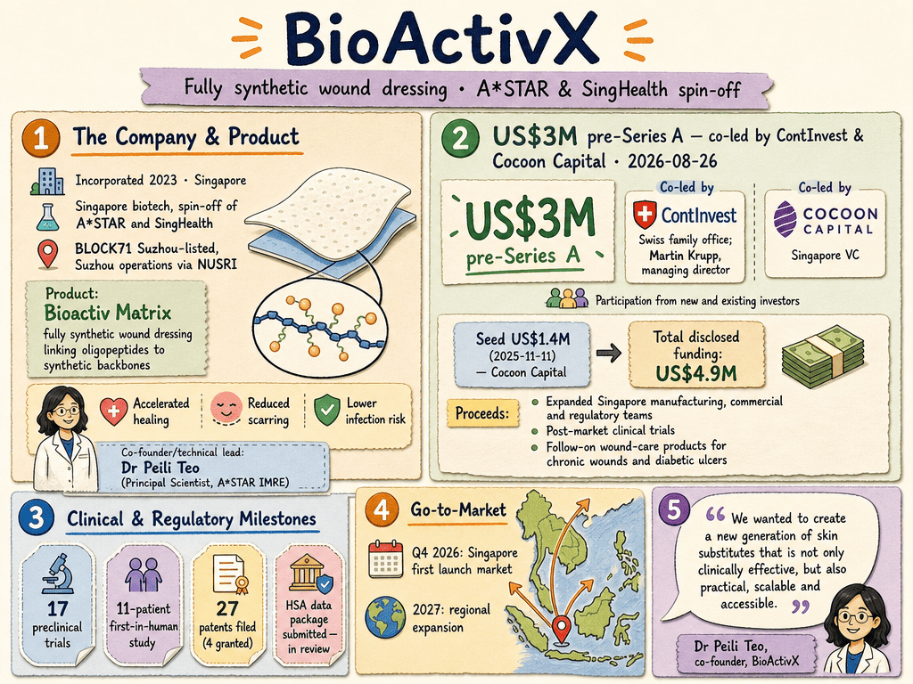

# BioActivX — LIVING BRIEF
_Last updated: 2026-10-05 23:23 UTC_

## Thesis
BioActivX is a Singapore regenerative-biomaterials company spun out of A*STAR and SingHealth (incorporated 2023; BLOCK71 Suzhou-listed, with Suzhou operations via the NUSRI translation institute) whose Bioactiv® Matrix fully synthetic skin substitute links oligopeptides to synthetic backbones for faster wound closure, reduced inflammation and lower infection risk without animal- or human-derived materials. HSA approval and the September 2026 commercial launch of Bioactiv® Matrix, paired with a new BLOCK71 manufacturing facility and an UltiMaker MoU on on-demand 3D-printed wound care, move the company from clinical development into commercialisation ahead of its previously stated Q4 2026 Singapore launch target. The US$3M pre-Series A co-led by ContInvest and Cocoon Capital now funds production scale-up, commercial and regulatory hiring, and international filings across the US, EU, Australia and ASEAN.

_Last material event: 2026-09-16 — HSA approval and commercial launch of Bioactiv® Matrix, plus the opening of its BLOCK71 office and manufacturing facility_

## Profile
- Sector: Biotechnology / MedTech
- Region: Singapore (BLOCK71 Suzhou-listed; Suzhou ops via NUSRI)
- Founded: 2023
- Key people: Dr Peili Teo (co-founder & CEO; Principal Scientist, A*STAR IMRE), Yew Lok Woo (co-founder, clinical lead; consultant orthopaedic surgeon, SGH), Mickey Cheong (co-founder, COO)

## Funding history
- **2025-11-11** — Seed, US$1.4M — Cocoon Capital — [beamstart.com](https://beamstart.com/news/sg-biotech-startup-bioactivx-nets-17628411376784)

_Total disclosed: $1.4M._

## Recent signals
- **2026-09-16** — Launched Bioactiv® Matrix commercially after HSA approval and opened its BLOCK71 office and manufacturing facility, alongside an UltiMaker MoU on on-demand 3D-printed wound care and a NovaTech distribution collaboration — [asiamd.com](https://asiamd.com/2026/09/16/bioactivx-launches-hsa-approved-synthetic-skin-substitute-and-opens-new-singapore-manufacturing-facility) (Also reported by: [3dprintingindustry.com](https://3dprintingindustry.com/news/ultimaker-and-bioactivx-to-target-on-demand-wound-care-via-new-collaboration-254875))
  - Summary: Singapore's Health Sciences Authority approved Bioactiv® Matrix, a fully synthetic, animal-free bioactive skin substitute for second-degree burns and deep abrasions, and BioActivX marked the shift from research to commercialisation by opening a combined corporate, research and manufacturing facility at BLOCK71, officiated by MacPherson MP Tin Pei Ling. The site runs under an ISO 13485 quality management system and makes Bioactiv® Matrix on a cleanroom print farm built around UltiMaker 3D printers, with the proprietary active-ingredient filament compounded in-house. Alongside the launch BioActivX formalised an MoU with UltiMaker to refine a deployable on-demand printing configuration for humanitarian and disaster-affected settings, and a NovaTech collaboration covering distribution in defence and field-care environments. 3D Printing Industry reports ongoing regulatory submissions in the US, EU, Australia and ASEAN, and notes no deployment timeline or unit targets were disclosed.
  - People: Dr Peili Teo (co-founder & CEO), Michiel Alting von Geusau (CEO, UltiMaker), Tin Pei Ling (MP, MacPherson)
  - Counterparties: UltiMaker (3D printing partner), NovaTech (distribution partner), Health Sciences Authority (regulator)
  - Numbers: US$3M pre-Series A; US$4.9M total raised; ISO 13485 certified; 27 patent filings (4 granted); 6 preclinical studies plus a first-in-human study; near-full re-epithelialisation by day 7 preclinically
  - Quote: "Regulatory approval is an essential milestone, but the real impact comes when an innovation reaches clinicians and patients" — Dr Peili Teo, co-founder & CEO

## Older signals
- **2026-08-26** — Raised US$3M in a pre-Series A co-led by Swiss family office ContInvest and Cocoon Capital for its Bioactiv Matrix synthetic wound-care platform, bringing total disclosed funding to US$4.9M — [techinasia.com](https://www.techinasia.com/news/cocoon-capital-coleads-3m-sg-biotech-startup-bioactivx) (Also reported by: [e27.co](https://e27.co/astar-singhealth-spin-off-bioactivx-lands-us3m-for-next-gen-wound-care-20260826/), [app.dealroom.co](https://app.dealroom.co/news/note/bioactivx-raises-3m-for-synthetic-wound-care-technology-in-singapore), [apac.entrepreneur.com](https://apac.entrepreneur.com/business-news/bioactivx-raises-3-mn-as-synthetic-wound-care-product-awaits-singapore-approval), [backscoop.com](https://www.backscoop.com/startups/3m-for-singapores-bioactivx-to-transform-the-way-we-treat-wounds))
  - Summary: BioActivX, an A*STAR/SingHealth spin-off founded in 2023, raised US$3M in a pre-Series A co-led by Martin Krupp (managing director of Swiss family office ContInvest) and Singapore VC Cocoon Capital, with participation from new and existing investors. Proceeds go to expanded Singapore manufacturing, commercial and regulatory teams, post-market clinical trials for Bioactiv Matrix, and follow-on wound-care products targeting chronic wounds, diabetic ulcers and inflammatory skin conditions. Entrepreneur Asia Pacific adds that the Q4 2026 Singapore launch is explicitly subject to HSA approval of the submitted data package, that BioActivX has not disclosed Bioactiv Matrix's risk classification or evaluation route (full evaluation runs 160–310 working days, priority review 104–202), and that the company's US$4.9M cumulative-funding claim exceeds the US$4.425M sum of its two disclosed rounds — a gap it did not explain. Its stated roadmap includes a 2026 FDA application, a 2027 EU MDR submission, and Series A fundraising starting this year; the product needs no cold-chain storage and is designed for use outside sterile operating theatres. BackScoop, writing on 28 August, adds a 2027 regional expansion plan and frames the target settings as emergency response, military and remote care, where cold chain and sterile environments are unavailable.
  - People: Dr Peili Teo (co-founder; Principal Scientist, A*STAR IMRE), Martin Krupp (managing director, ContInvest), Yew Lok Woo (co-founder, clinical lead), Mickey Cheong (co-founder, COO)
  - Counterparties: ContInvest (co-lead investor), Cocoon Capital (co-lead investor), Health Sciences Authority (regulator)
  - Numbers: US$3M pre-Series A (2026-08-26); US$4.9M total disclosed funding vs US$4.425M across the two disclosed rounds; HSA full evaluation 160–310 working days; 17 preclinical trials; 11-patient first-in-human study; 27 patents filed (4 granted); Q4 2026 Singapore launch target; FDA filing 2026; EU MDR 2027
  - Quote: "We wanted to create a new generation of skin substitutes that is not only clinically effective, but also practical, scalable and accessible." — Dr Peili Teo, co-founder, BioActivX

## Open questions
- Which route to market does BioActivX plan for first launch — hospital tenders, distributors, or direct sales?
- What size and terms will the planned 2026 Series A target, and will Cocoon Capital's follow-on reserve participate?
- What is the deployment timeline under the UltiMaker MoU, and will point-of-care printing of an approved device require separate regulatory clearance in each target market?
- What are the scope and commercial terms of the NovaTech distribution collaboration for defence and field-care settings?
