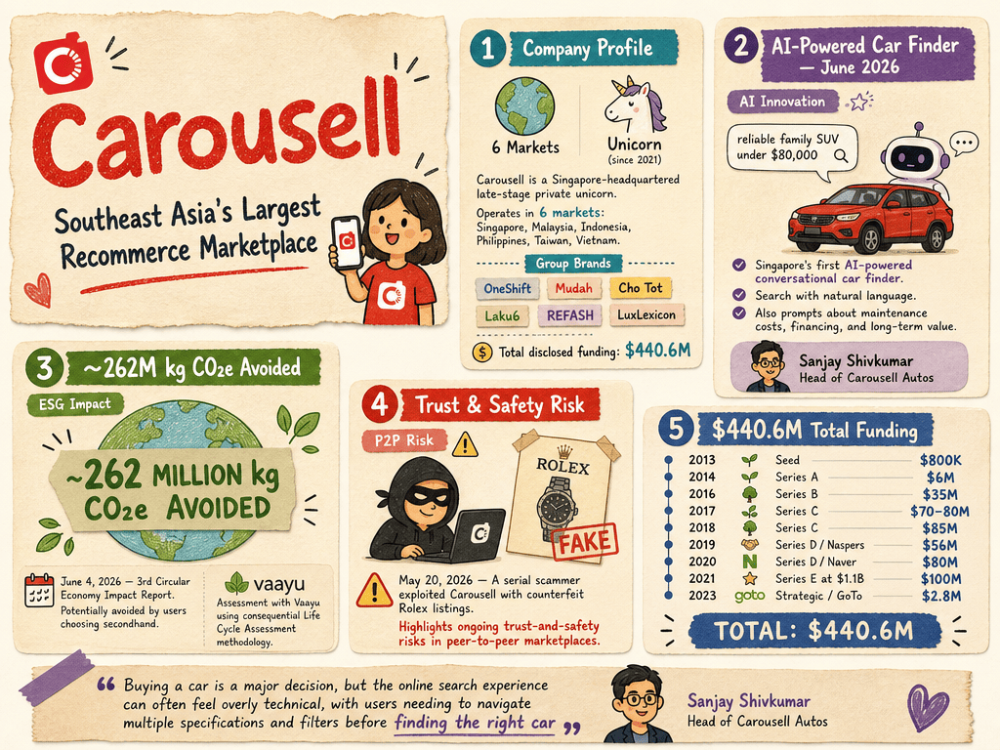

# Carousell — LIVING BRIEF
_Last updated: 2026-06-18 16:01 UTC_

## Thesis
Singapore-headquartered online classifieds and consumer marketplace platform operating across Southeast Asia and Taiwan. Carousell has built the region's largest recommerce ecosystem through its group brands (OneShift, Mudah, Cho Tot) but continues to face trust-and-safety challenges inherent in peer-to-peer marketplaces.

## Profile
- Sector: Marketplace
- Region: Southeast Asia (Singapore HQ; operates in Malaysia, Indonesia, Philippines, Taiwan, Vietnam)
- Stage / funding: Late-stage private (unicorn since 2021)
- Identifiers: [LinkedIn](https://www.linkedin.com/company/carousellgroup), [Crunchbase](https://www.crunchbase.com/organization/carousell)

## Funding history
- **2013-11** — Seed, $800K — Rakuten Ventures; Golden Gate Ventures, 500 Global, QuestVC — [en.wikipedia.org](https://en.wikipedia.org/wiki/Carousell_(company))
- **2014-11** — Series A, $6M — Sequoia Capital India; Rakuten Ventures, Golden Gate Ventures, 500 Global — [en.wikipedia.org](https://en.wikipedia.org/wiki/Carousell_(company))
- **2016-08-01** — Series B, $35M — Rakuten Ventures; Sequoia Capital India, Golden Gate Ventures, 500 Startups — [techcrunch.com](https://techcrunch.com/2016/08/01/southeast-asia-based-carousell-raises-35m-for-its-social-commerce-app/)
- **2017-10-27** — Series C, $70M-$80M — Rakuten Ventures, EDBI; Sequoia Capital India, Golden Gate Ventures, 500 Startups, DBS — [techcrunch.com](https://techcrunch.com/2017/10/27/carousell-series-c/)
- **2018-05-13** — Series C, $85M — Rakuten Ventures, EDBI; Sequoia Capital India, Golden Gate Ventures, 500 Startups, DBS — [techcrunch.com](https://techcrunch.com/2018/05/13/carousell-raises-85m/)
- **2019-04-10** — Series D, $56M — Naspers (OLX Group) — [techcrunch.com](https://techcrunch.com/2019/04/10/carousell-naspers-olx/)
- **2020-09-15** — Series D, $80M — Naver; Mirae Asset-Naver Asia Growth Fund, NH Investment & Securities, Rakuten Ventures, Steamboat Ventures — [press.carousell.com](https://press.carousell.com/2020/09/15/carousell-continues-growth-momentum-with-navers-us80-million-investment/)
- **2021-09-15** — Series E, $100M — STIC Investments; Sequoia Capital India, Golden Gate Ventures, Naver, EDBI — [bloomberg.com](https://www.bloomberg.com/news/articles/2021-09-15/singapore-s-carousell-raises-100-million-at-1-1-billion-value)
- **2023-09-04** — Strategic, $2.8M — GoTo Group — [aimgroup.com](https://aimgroup.com/2023/09/04/goto-invests-2-8m-in-singapore-based-carousell/)

_Total disclosed: $440.6M._

## Recent signals
- **2026-06-18** — Carousell Autos launched Singapore's first AI-powered conversational car finder, allowing users to search pre-owned cars with natural language queries instead of structured filters — [Carousell Press](https://press.carousell.com/2026/06/18/carousell-autos-launches-singapores-first-ai-powered-car-finder/)
  - Summary: The AI car finder on Carousell Autos lets buyers describe their needs in plain terms (e.g. "reliable family SUV under $80,000") and surfaces relevant listings. The tool also prompts users about maintenance costs, financing options, and long-term value. A 6.6 Deals campaign running through June offers $100 Shell petrol vouchers on qualifying purchases from participating dealers.
  - People: Sanjay Shivkumar (Head of Carousell Autos)
  - Numbers: $80,000 (example price threshold), $100 Shell petrol vouchers (promotional)
  - Quote: "Buying a car is a major decision, but the online search experience can often feel overly technical, with users needing to navigate multiple specifications and filters before finding the right car" — Sanjay Shivkumar

- **2026-06-04** — Carousell published its 3rd Circular Economy Impact Report with an interactive microsite, reporting ~262M kg CO2e potentially avoided by its community — [Carousell Press](https://press.carousell.com/impactreport/)
  - Summary: The report estimates that across group brands (Carousell, Laku6, REFASH, Mudah.my, Cho Tot, LuxLexicon), users potentially avoided ~262 million kg CO2e by choosing secondhand over new items. The assessment was conducted in partnership with Vaayu using consequential Life Cycle Assessment methodology.
  - Counterparties: Vaayu (LCA methodology partner)
  - Numbers: ~262 million kg CO2e avoided

- **2026-05-20** — A serial scammer exploited the Carousell platform to lure victims with counterfeit Rolex listings, highlighting ongoing trust-and-safety risks for peer-to-peer marketplaces — [The Straits Times](https://news.google.com/rss/articles/CBMivAFBVV95cUxQbEVVRWdWSnhFTGp0eHhOdU1CX0wzZlBRRHBUYUxteHhBUjc5X0FPOHprMXdLU1VfNkx)

## Older signals
_none_

## Open questions
- How is Carousell responding to this specific fraud incident — are there new platform safeguards being rolled out?
- Has the company continued to pursue profitability since its 2021 unicorn round, or is it still burning cash to acquire users?
