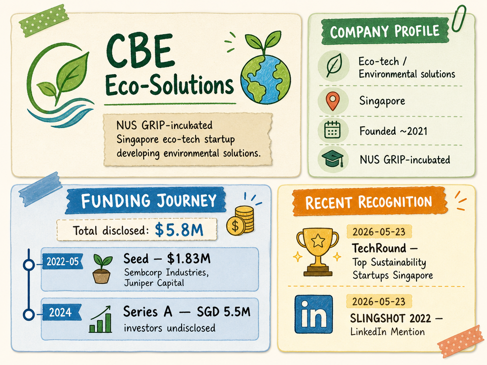

# CBE Eco-Solutions — LIVING BRIEF
_Last updated: 2026-05-23 14:34 UTC_

## Thesis
CBE Eco-Solutions is an NUS GRIP-incubated Singapore eco-tech startup developing environmental solutions. Recent recognition in TechRound's sustainability rankings and a SLINGSHOT-related mention point to growing visibility in Singapore's cleantech ecosystem.

## Profile
- Sector: Eco-tech / Environmental solutions
- Region: Singapore
- Founded: ~2021 (NUS GRIP portfolio)

## Funding history
- **2022-05** — Seed, $1.83M — Sembcorp Industries, Juniper Capital — [tracxn.com](https://tracxn.com/d/companies/cbeecosolutions/__jcBVEJ09k3YjQyE60of1FuidEmjZ_JV7124svm6AUj0/funding-and-investors)
- **2024** — Series A, SGD 5.5M — investors undisclosed — [nus.edu.sg](https://cde.nus.edu.sg/research/industry-partnership/cbe-eco-solutions/)

_Total disclosed: $5.8M._

## Recent signals
- **2026-05-23** — Named among TechRound's top sustainability startups in Singapore — [TechRound](https://techround.co.uk/startups/top-sustainability-startups-in-singapore/)
- **2026-05-23** — Featured in SLINGSHOT 2022 LinkedIn mention — [linkedin.com](https://www.linkedin.com/feed/hashtag/?keywords=slingshot2022&highlightedUpdateUrns=urn%3Ali%3Aactivity%3A6993667039101911040)

## Older signals
_none_

## Open questions
- What was CBE Eco-Solutions' specific involvement with SLINGSHOT 2022?
- Any commercial pilots or deployments stemming from the TechRound recognition?
