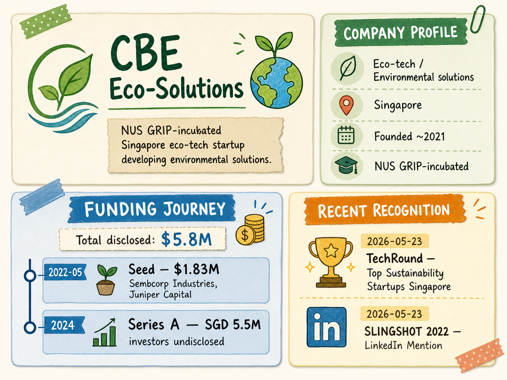

# CBE Eco-Solutions — LIVING BRIEF
_Last updated: 2026-09-18 16:59 UTC_

## Thesis
CBE Eco-Solutions is a Singapore eco-tech startup incubated by NUS GRIP, developing solutions to address climate change. It was featured in CNA's "Young Changemakers" documentary series, and has completed seed and Series A rounds backed by Sembcorp Industries and Juniper Capital.

_Last material event: 2024 — Completed a SGD 5.5M Series A alongside its Jurong Island demonstration plant_

## Profile
- Sector: Climate tech
- Region: Singapore
- Stage / funding: Series A (SGD 5.5M, 2024)
- Identifiers: [LinkedIn](https://www.linkedin.com/company/cbe-eco-solutions)

## Funding history
- **2022-05** — Seed, $1.83M — Sembcorp Industries, Juniper Capital — [tracxn.com](https://tracxn.com/d/companies/cbeecosolutions/__jcBVEJ09k3YjQyE60of1FuidEmjZ_JV7124svm6AUj0/funding-and-investors)
- **2024** — Series A, SGD 5.5M — investors undisclosed — [cde.nus.edu.sg](https://cde.nus.edu.sg/research/industry-partnership/cbe-eco-solutions/)

_Total disclosed: $5.8M._

## Recent signals
_none_

## Older signals
- **2026-06-26** — CBE Eco-Solutions Pte Ltd — Company profile — [sgpgrid.com](https://sgpgrid.com/company-details/cbe-ecosolutions-pte-ltd)
  - Summary: CBE Eco-Solutions offers a dual sustainable solution for treating industrial carbon waste by recycling it into valuable products. Revenue $1-10M. 14 officers. Share capital SGD 2,917,050 (ordinary) and SGD 2,783,950 (preference).
- **2026-06-07** — Featured in CNA's "Young Changemakers" documentary series about climate change solutions — [Channel NewsAsia](https://www.channelnewsasia.com/news/video-on-demand/on-the-red-dot/how-to-stop-climate-change-14306852)
- **2026-04-24** — NUS CDE's research newsletter names CBE Eco-Solutions' product: upcycling refinery carbon soot into carbon black for batteries, tyres and energy storage, with its Jurong Island demo plant slated to scale to about 15 tonnes of output a day — [cde.nus.edu.sg](https://cde.nus.edu.sg/cde-research-june2026)
  - Summary: The NUS College of Design and Engineering research newsletter profiled CBE Eco-Solutions as a deep-tech startup founded by former researchers Dr Yao Zhiyi and Dr Babu Cadiam Mohan under Professor Wang Chi-Hwa of Chemical and Biomolecular Engineering. The company upcycles refinery carbon soot into high-value materials for batteries, tyres and energy storage, and its demonstration plant on Jurong Island is planned to scale into a commercial facility producing around 15 tonnes of output daily.
  - People: Dr Yao Zhiyi (co-founder), Dr Babu Cadiam Mohan (co-founder), Prof Wang Chi-Hwa (Chemical and Biomolecular Engineering, NUS)
  - Numbers: ~15 tonnes/day planned commercial output; Jurong Island demonstration plant

## Open questions
- What capex and timeline does CBE Eco-Solutions need to scale the Jurong Island demonstration plant to roughly 15 tonnes/day, and is that capacity contracted?
- Who buys the carbon-black output today, and is any of it under offtake agreement with refineries or battery/tyre makers?
