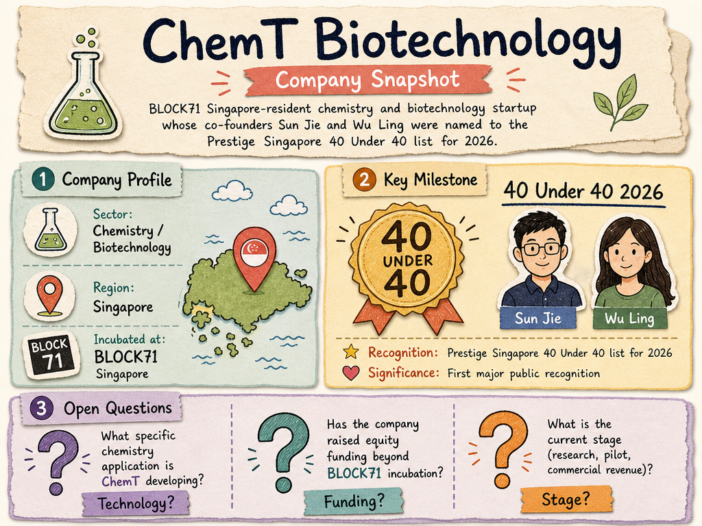

# ChemT Biotechnology — LIVING BRIEF
_Last updated: 2026-06-08 16:54 UTC_

## Thesis
BLOCK71 Singapore-resident chemistry and biotechnology startup whose co-founders Sun Jie and Wu Ling were named to the Prestige Singapore 40 Under 40 list for 2026. The recognition signals growing profile in Singapore's deep-tech ecosystem, though the company's specific technology platform and commercial traction remain lightly documented in public sources.

## Profile
- Sector: Chemistry / Biotechnology
- Region: Singapore

## Recent signals
- **2026-06-08** — Co-founders Sun Jie and Wu Ling named to Prestige Singapore 40 Under 40 2026, the first major public recognition for this BLOCK71-incubated startup — [Prestige Online](https://www.prestigeonline.com/sg/people/40-under-40/sun-jie-wu-ling-chemt-biotechnology-prestige-40-under-40-2026)

## Older signals
_none_

## Open questions
- What specific chemistry / biotechnology application is ChemT Biotechnology developing?
- Has the company raised any equity funding beyond BLOCK71 incubation support?
- What is the current operational stage (research, pilot, commercial revenue)?
