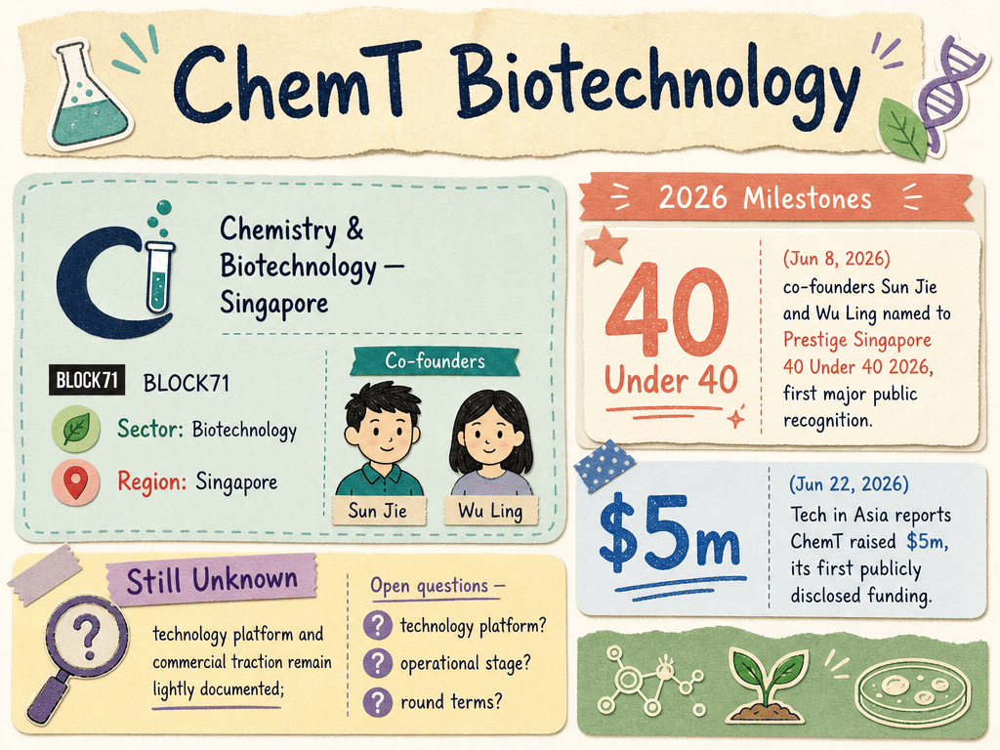

# ChemT Biotechnology — LIVING BRIEF
_Last updated: 2026-08-12 14:23 UTC_

## Thesis
BLOCK71 Singapore-resident AI-driven biotechnology startup building an intelligence layer for biomanufacturing. Core assets are CelMo™, an AI-driven Virtual Cell platform simulating how cells respond to manufacturing conditions, and Chemplify™, an AI-designed small molecule for T-cell manufacturing (50% faster development, 3× scalability, 60% lower costs, 10× higher cell expansion yield). Co-founders Sun Jie and Wu Ling were named to the Prestige Singapore 40 Under 40 list for 2026, and the company has raised $5M total ($1M angel plus a $4M seed led by Wavemaker Ventures) — its first publicly disclosed funding.

_Last material event: 2026-06-22 — $5M raise: $4M seed led by Wavemaker Ventures plus $1M angel_

## Profile
- Sector: Biotechnology
- Region: Singapore

## Funding history
_No disclosed funding._

## Recent signals
_none_

## Older signals
- **2026-06-22** — Tech in Asia reports Singapore biotech startup ChemT raised $5m, its first publicly disclosed funding — [techinasia.com](https://www.techinasia.com/news/singapore-ai-biotech-startup-chemt-raises-5m) (Also reported by: [biospectrumasia.com](https://www.biospectrumasia.com/news/26/27872/singapore-based-startup-chemt-biotechnology-raises-5-m-to-bring-ai-to-biomanufacturing.html))
  - Summary: BioSpectrum Asia's June 23 report details the $5M total: a $4M seed round led by Wavemaker Ventures (Wavemaker Partners' early-stage fund) with participation from SEEDS (an arm of SG Growth Capital, the investment platform of EDB and Enterprise Singapore), plus $1M in angel funding. ChemT builds intelligence directly into the biomanufacturing process: CelMo™, an AI-driven Virtual Cell platform trained on billions-to-trillions of proprietary biological sequencing reads and validated in the lab, simulates cell responses to manufacturing conditions; Chemplify™ applies the same approach to T-cell manufacturing for advanced cancer therapies. Proceeds fund AI and experimental infrastructure, GMP and regulatory readiness, and commercial partnerships.
  - Counterparties: Wavemaker Ventures (lead investor); SEEDS / SG Growth Capital (co-investor); Wavemaker 360 Health, Draper University Ventures, Temasek Life Sciences Accelerator (participants)
  - Numbers: $5M total ($1M angel + $4M seed); 50% faster development; 3× scalability; 60% lower costs; 10× higher cell expansion yield
  - Quote: "ChemT builds intelligence directly into the manufacturing process itself, helping companies better understand the cells behind biomanufacturing" — BioSpectrum Asia
- **2026-06-08** — Co-founders Sun Jie and Wu Ling named to Prestige Singapore 40 Under 40 2026, the first major public recognition for this BLOCK71-incubated startup — [Prestige Online](https://www.prestigeonline.com/sg/people/40-under-40/sun-jie-wu-ling-chemt-biotechnology-prestige-40-under-40-2026)

## Open questions
- What is ChemT's current commercial stage — has CelMo™ or Chemplify™ reached paying customers, and is any revenue being generated?
- Which manufacturing partners or customers is ChemT scaling commercial partnerships with, and in which geographies?
