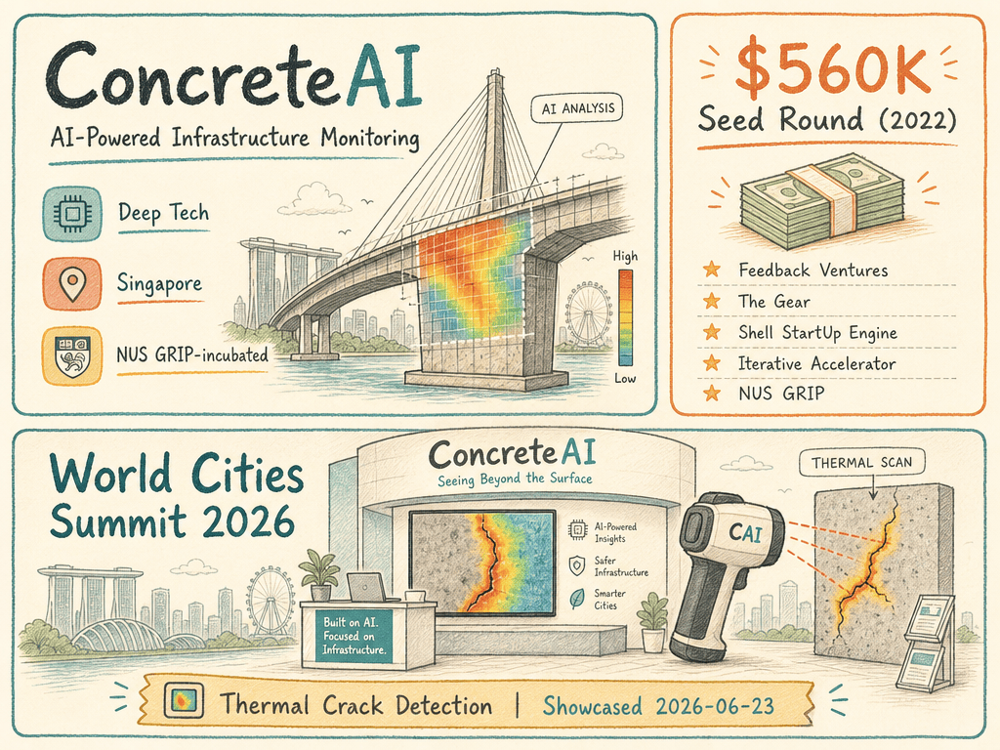

# ConcreteAI — LIVING BRIEF
_Last updated: 2026-06-23 16:06 UTC_

## Thesis
ConcreteAI is an NUS GRIP-incubated Singapore deep-tech startup developing AI-powered solutions for construction and infrastructure monitoring. The company showcased its thermal crack detection technology at World Cities Summit 2026, indicating traction in the smart infrastructure space.

## Profile
- Sector: Deep tech
- Region: Singapore

## Funding history
- **2022** — Seed, $560K — Feedback Ventures; The Gear; Shell StartUp Engine; Iterative Accelerator; NUS GRIP — [source](https://www.cbinsights.com/company/concreteai)

_Total disclosed: $0.6M._

## Recent signals
- **2026-06-23** — ConcreteAI at World Cities Summit 2026 in Singapore — [linkedin.com](https://www.linkedin.com/posts/concreteai_worldcitiessummit-concreteai-thermalcrack-activity-7471120375322664960-VTSa)

## Older signals
_none_

## Open questions
- What specific product or solution did ConcreteAI showcase at World Cities Summit 2026?
- Is ConcreteAI's thermal crack monitoring technology deployed commercially or still in pilot phase?
