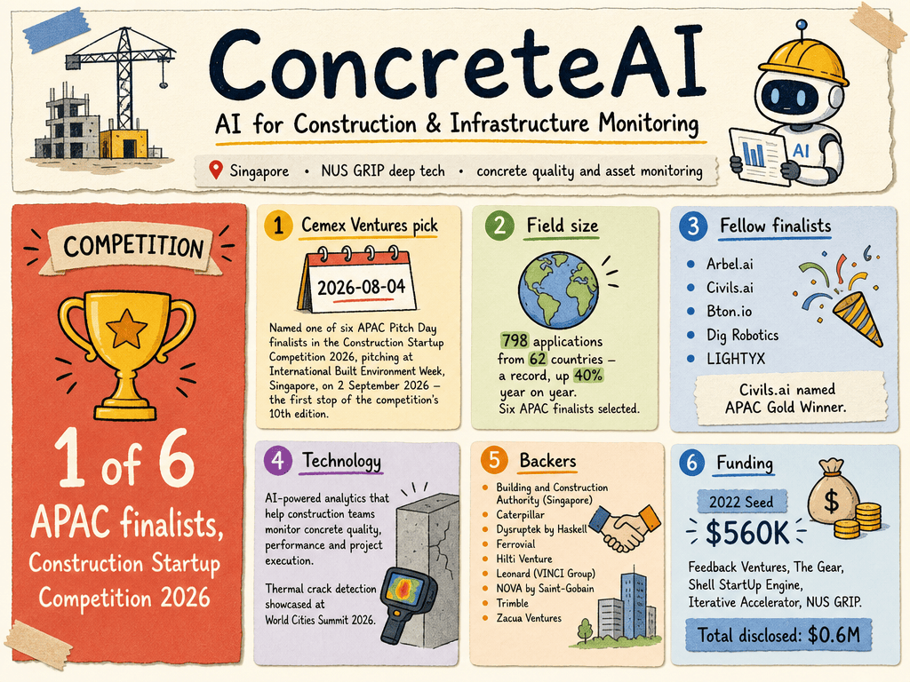

# ConcreteAI — LIVING BRIEF
_Last updated: 2026-09-15 17:34 UTC_

## Thesis
ConcreteAI is an NUS GRIP-incubated Singapore deep-tech startup developing AI-powered solutions for construction and infrastructure monitoring. The company showcased its thermal crack detection technology at World Cities Summit 2026, indicating traction in the smart infrastructure space.

_Last material event: 2026-08-04 — Selected as one of six APAC Pitch Day finalists in the Construction Startup Competition 2026_

## Profile
- Sector: Deep tech
- Region: Singapore

## Funding history
- **2022** — Seed, $560K — Feedback Ventures, The Gear, Shell StartUp Engine, Iterative Accelerator, NUS GRIP — [cbinsights.com](https://www.cbinsights.com/company/concreteai)

_Total disclosed: $0.6M._

## Recent signals
_none_

## Older signals
- **2026-08-04** — Named one of six APAC Pitch Day finalists in the Construction Startup Competition 2026, pitching at IBEW Singapore on 2 September 2026 — [cemexventures.com](https://www.cemexventures.com/startup-competition-2026-apac-finalists) (Also reported by: [bca.gov.sg](https://www1.bca.gov.sg/resources/newsroom/winner-of-the-inaugural-asia-pacific-edition-of-the-world-s-largest-competition-for-construction-start-ups))
  - Summary: Cemex Ventures selected six startups from a record 798 applications across 62 countries to pitch at the APAC Pitch Day on 2 September 2026 during International Built Environment Week in Singapore — the first stop of the competition's 10th edition. ConcreteAI was chosen for AI-powered analytics that help construction teams monitor concrete quality, performance and project execution, alongside Arbel.ai, Civils.ai, Bton.io, Dig Robotics and LIGHTYX. The APAC Pitch Day is backed by the Building and Construction Authority (Singapore), Caterpillar, Dysruptek by Haskell, Ferrovial, Hilti Venture, Leonard (VINCI Group), NOVA by Saint-Gobain, Trimble and Zacua Ventures. A 3 September post on the same site names fellow finalist Civils.ai as the APAC Gold Winner. BCA, the competition's APAC partner, records the same 2 September Pitch Day as five APAC Track winners pitching — Arbel.ai, Civils.ai, ConcreteAI, Bton.io and LIGHTYX — chosen from 243 APAC applications out of nearly 800 submissions from 64 countries (Dig Robotics appears on Cemex Ventures' list but not BCA's), and describes ConcreteAI's entry as IoT sensors tracking in-situ concrete strength and temperature in real time, cutting casting-cycle waiting times by over 30% and reducing reliance on cube testing.
  - Counterparties: Cemex Ventures (organiser); Building and Construction Authority (Singapore), Caterpillar, Ferrovial, Hilti Venture, Trimble, Zacua Ventures (competition partners)
  - Numbers: 6 APAC finalists (Cemex Ventures) / 5 APAC Track winners (BCA); 243 APAC applicants; ~800 submissions from 64 countries; casting-cycle waiting time cut over 30%; €10,000 Gold prize
- **2026-06-23** — ConcreteAI at World Cities Summit 2026 in Singapore — [linkedin.com](https://www.linkedin.com/posts/concreteai_worldcitiessummit-concreteai-thermalcrack-activity-7471120375322664960-VTSa)

## Open questions
- What specific product or solution did ConcreteAI showcase at World Cities Summit 2026?
- Is ConcreteAI's thermal crack monitoring technology deployed commercially or still in pilot phase?
- Did ConcreteAI convert the APAC Pitch Day (2 September 2026) into pilot or commercial discussions with the competition's corporate partners?
