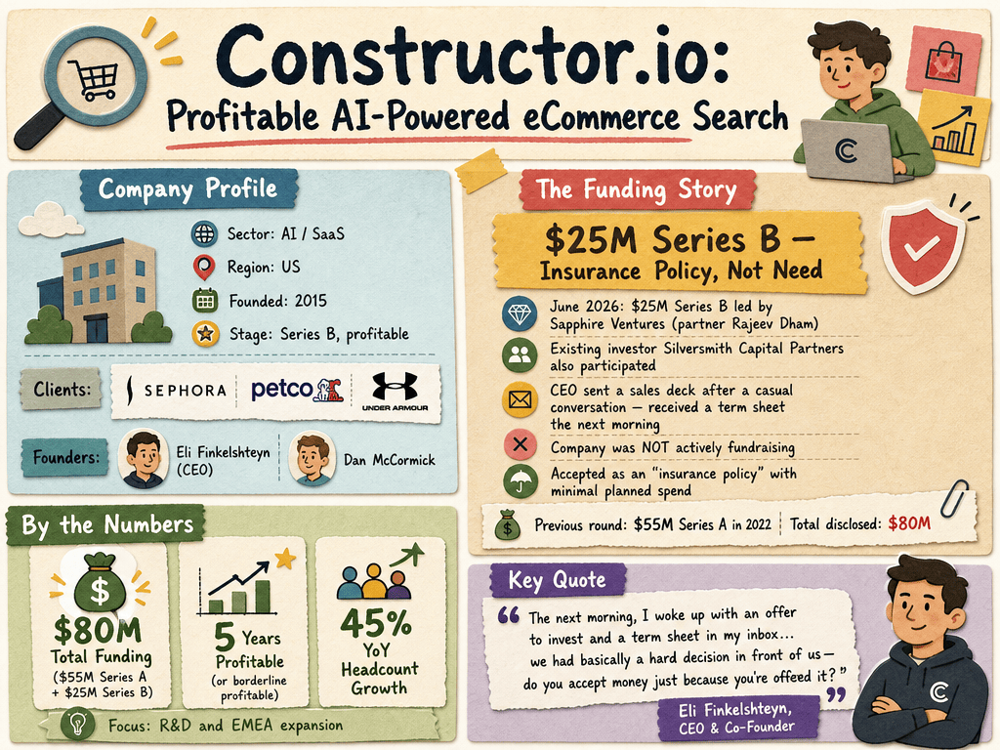

# Constructor.io — LIVING BRIEF
_Last updated: 2026-06-10 16:43 UTC_

## Thesis
US-based enterprise eCommerce search and product-discovery platform using NLP and ML ranking to power personalized search, browse, and recommendations for major retailers. Already profitable and serving brands like Sephora, Petco, and Under Armour, Constructor recently raised a $25M Series B as an insurance policy — with minimal planned spend and a focus on R&D and EMEA expansion.

## Profile
- Sector: AI / SaaS
- Region: US
- Founded: 2015
- Stage / funding: Series B; profitable
- Key people: Eli Finkelshteyn (CEO & Co-Founder), Dan McCormick (Co-Founder)

## Funding history
- **2022-02-08** — Series A, US$55M — Silversmith Capital Partners — [crunchbase.com](https://www.crunchbase.com/organization/constructor-io)

_Total disclosed: $55.0M._

## Recent signals
- **2026-06-09** — Raised $25M Series B from Sapphire Ventures as an insurance policy despite being profitable; minimal spending planned on R&D and EMEA expansion — [finance.yahoo.com](https://finance.yahoo.com/news/constructor-raises-25-million-ai-040100096.html)
  - Summary: Constructor raised $25M in Series B funding led by Sapphire Ventures, with participation from existing investor Silversmith Capital Partners. The company was not actively fundraising — CEO Eli Finkelshteyn sent a sales deck after a casual conversation with Sapphire partner Rajeev Dham and received a term sheet the next morning. The company accepted the funding as an "insurance policy" and plans not to spend it, having been profitable or borderline profitable for five years. Headcount grew 45% YoY; new roles will focus on R&D and EMEA expansion.
  - People: Eli Finkelshteyn (CEO & Co-Founder), Rajeev Dham (Partner, Sapphire Ventures)
  - Counterparties: Sapphire Ventures (lead investor), Silversmith Capital Partners (existing investor)
  - Numbers: $25M Series B; $55M prior Series A; 45% YoY headcount growth; profitable for 5 years
  - Quote: "The next morning, I woke up with an offer to invest and a term sheet in my inbox… we had basically a hard decision in front of us—do you accept money just because you're offered it?" — Eli Finkelshteyn, CEO

## Older signals
_none_

## Open questions
- How does Constructor's AI Shopping Assistant (ASA) tool differentiate from broader generative AI search products?
- What drove the 45% YoY headcount growth if the company wasn't actively fundraising?
- Will the Series B trigger any changes to Constructor's ownership or board structure?
