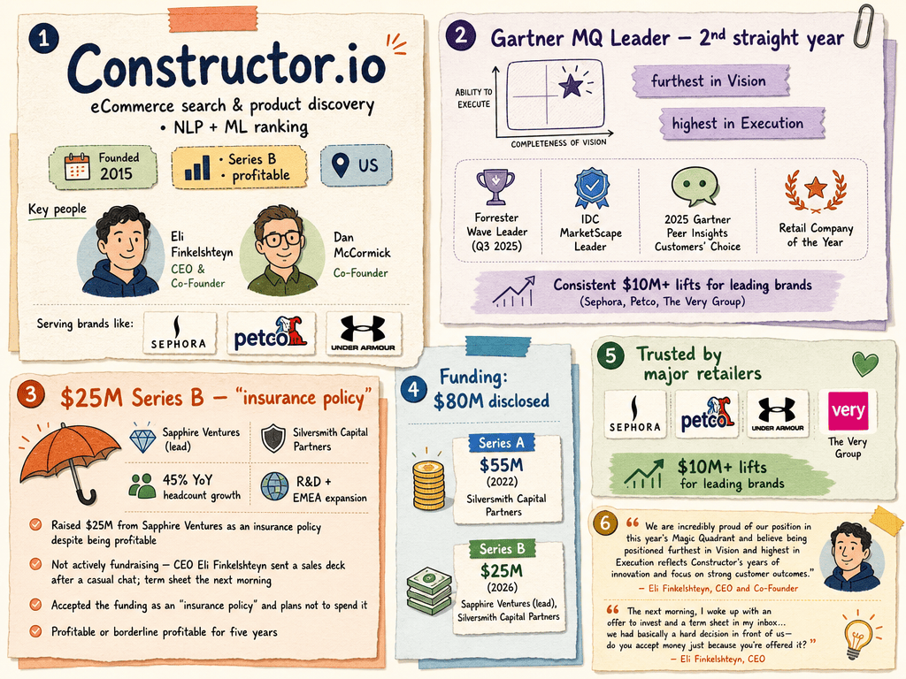

# Constructor.io — LIVING BRIEF
_Last updated: 2026-09-02 17:10 UTC_

## Thesis
US-based enterprise eCommerce search and product-discovery platform using NLP and ML ranking to power personalized search, browse, and recommendations for major retailers. Already profitable and serving brands like Sephora, Petco, and Under Armour, Constructor recently raised a $25M Series B as an insurance policy — with minimal planned spend and a focus on R&D and EMEA expansion.

_Last material event: 2026-08-27 — Partnered with IMPACT Commerce to pair AI product discovery with commerce strategy and implementation expertise_

## Profile
- Sector: AI / SaaS
- Region: US
- Founded: 2015
- Stage / funding: Series B; profitable
- Key people: Eli Finkelshteyn (CEO & Co-Founder), Dan McCormick (Co-Founder)

## Funding history
- **2022-02-08** — Series A, US$55M — Silversmith Capital Partners — [crunchbase.com](https://www.crunchbase.com/organization/constructor-io)

_Total disclosed: $55.0M._

## Recent signals
- **2026-08-27** — Partnered with IMPACT Commerce so retailers can combine Constructor's AI search and product discovery with IMPACT's commerce strategy, customer-experience and implementation expertise, building on joint work for beauty brand ELEMIS across the UK, US and EU — [constructor.com](https://constructor.com/blog/constructor-and-impact-commerce-partner-to-drive-better-ecommerce-experiences-with-ai)
  - Summary: Constructor is partnering with IMPACT Commerce to offer retailers a bundled path from AI-powered product discovery to measurable growth: Constructor supplies search, browse, recommendations and conversational shopping built on real shopper behaviour, while IMPACT brings commerce strategy, customer experience and implementation capabilities. The partnership formalises an existing working relationship — the two teams previously ran a successful project for global beauty brand ELEMIS across the UK, US and EU. Constructor's 2025 State of Ecommerce research found 68% of shoppers think retail website search needs an upgrade and 40% say their favourite retailer still treats them like a stranger.
  - Counterparties: IMPACT Commerce (partner), ELEMIS (joint customer reference)
  - Numbers: 68% of shoppers say retail search needs an upgrade; 40% say favourite retailer treats them like a stranger

## Older signals
- **2026-07-09** — Ranked #1 in 3 of 5 use cases in Gartner's Critical Capabilities for Search and Product Discovery — GenAI Product Discovery, Product Search and Discovery, and Multisite and Globalization — the only vendor to score highest in 3 of 5 use cases for the second straight year — [prnewswire.com](https://www.prnewswire.com/news-releases/constructor-has-the-most-1-rankings-in-gartner-critical-capabilities-for-search-and-product-discovery-report-302821039.html)
  - Summary: Gartner's Critical Capabilities for Search and Product Discovery report evaluated 12 vendors across five use cases, with Constructor ranked #1 in three — "GenAI Product Discovery," "Product Search and Discovery," and "Multisite and Globalization" — the second year running that Constructor is the only vendor to score highest in three of five use cases. The report is the companion to the Gartner Magic Quadrant for Search and Product Discovery, where Constructor was recently named a Leader placing furthest in Vision and highest in Execution.
  - People: Eli Finkelshteyn (CEO & Co-Founder)
  - Numbers: #1 in 3 of 5 use cases; 12 vendors evaluated; 2 years straight
  - Quote: "In our view, these rankings reflect Constructor's commitment to applying AI to solve real challenges for our customers and their shoppers." — Eli Finkelshteyn, CEO and Co-Founder
- **2026-06-25** — Named a Leader in Gartner's Magic Quadrant for Search and Product Discovery for the second straight year, placing furthest in Vision and highest in Execution among all vendors evaluated — [prnewswire.com](https://www.prnewswire.com/news-releases/constructor-named-a-leader-in-gartner-magic-quadrant-for-search-and-product-discovery--placing-furthest-in-vision-and-highest-in-execution-302810989.html) (Also reported by: [constructor.com](https://constructor.com/blog/gartner-magic-quadrant-2026-leader))
  - Summary: Constructor was named a Leader in the Gartner Magic Quadrant for Search and Product Discovery — its second consecutive year in the Leaders quadrant — placing furthest on the Completeness of Vision axis and highest on the Ability to Execute axis among all vendors evaluated. The recognition follows a run of analyst accolades: Leader in the Forrester Wave for Commerce Search and Product Discovery (Q3 2025), Leader in the IDC MarketScape for Retail GenAI-Driven Product Discovery, the only vendor named Customers' Choice in the 2025 Gartner Peer Insights Voice of the Customer report, and Retail Company of the Year at the American Business Awards for the second straight year.
  - People: Eli Finkelshteyn (CEO & Co-Founder)
  - Numbers: 2nd straight year as Gartner MQ Leader; consistent $10M+ lifts for leading brands (Sephora, Petco, The Very Group)
  - Quote: "We are incredibly proud of our position in this year's Magic Quadrant and believe being positioned furthest in Vision and highest in Execution reflects Constructor's years of innovation and focus on strong customer outcomes." — Eli Finkelshteyn, CEO and Co-Founder
- **2026-06-09** — Raised $25M Series B from Sapphire Ventures as an insurance policy despite being profitable; minimal spending planned on R&D and EMEA expansion — [finance.yahoo.com](https://finance.yahoo.com/news/constructor-raises-25-million-ai-040100096.html)
  - Summary: Constructor raised $25M in Series B funding led by Sapphire Ventures, with participation from existing investor Silversmith Capital Partners. The company was not actively fundraising — CEO Eli Finkelshteyn sent a sales deck after a casual conversation with Sapphire partner Rajeev Dham and received a term sheet the next morning. The company accepted the funding as an "insurance policy" and plans not to spend it, having been profitable or borderline profitable for five years. Headcount grew 45% YoY; new roles will focus on R&D and EMEA expansion.
  - People: Eli Finkelshteyn (CEO & Co-Founder), Rajeev Dham (Partner, Sapphire Ventures)
  - Counterparties: Sapphire Ventures (lead investor), Silversmith Capital Partners (existing investor)
  - Numbers: $25M Series B; $55M prior Series A; 45% YoY headcount growth; profitable for 5 years
  - Quote: "The next morning, I woke up with an offer to invest and a term sheet in my inbox… we had basically a hard decision in front of us—do you accept money just because you're offered it?" — Eli Finkelshteyn, CEO

## Open questions
- How does Constructor's AI Shopping Assistant (ASA) tool differentiate from broader generative AI search products?
- What drove the 45% YoY headcount growth if the company wasn't actively fundraising?
- Will the Series B trigger any changes to Constructor's ownership or board structure?
