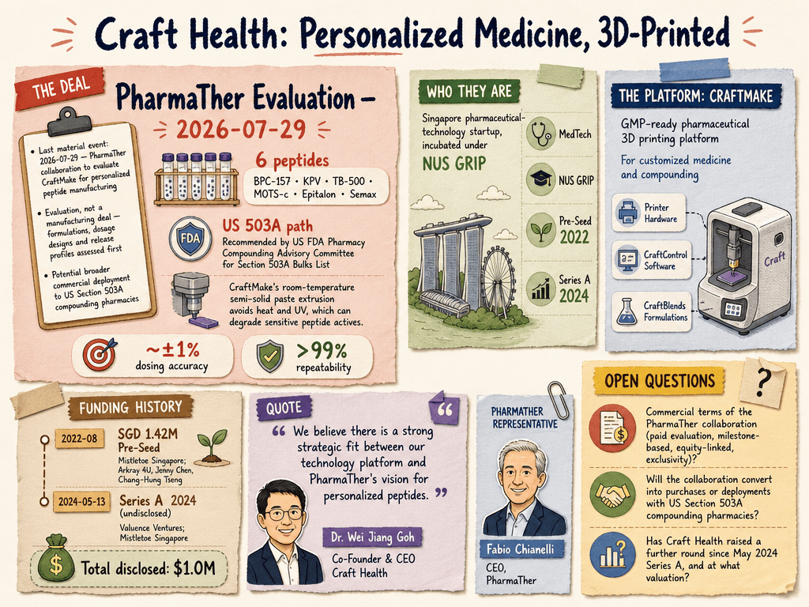

# Craft Health — LIVING BRIEF
_Last updated: 2026-08-28 23:00 UTC_

## Thesis
Craft Health is a Singapore pharmaceutical-technology startup, incubated under NUS GRIP, building CraftMake — a GMP-ready pharmaceutical 3D printing platform combining printer hardware, CraftControl software and CraftBlends printable formulations for customized medicine and compounding. In July 2026, Canadian specialty-pharma company PharmaTher (CSE: PHRM) agreed to evaluate CraftMake for personalized peptide production under its Personaliz3D Peptides initiative, including a potential broader commercial deployment to US Section 503A compounding pharmacies — a validation step that moves the platform from lab-scale toward commercial adoption.

_Last material event: 2026-07-29 — PharmaTher collaboration to evaluate CraftMake for personalized peptide manufacturing_

## Profile
- Sector: MedTech
- Region: Singapore
- Stage / funding: Pre-Seed (2022); Series A (2024)

## Funding history
- **2022-08** — Pre-Seed, SGD 1.42M — Mistletoe Singapore; Arkray 4U, Jenny Chen, Chang-Hung Tseng — [3dprint.com](https://3dprint.com/293411/3d-printed-pharma-firm-craft-health-receives-1m-from-investors-including-jenny-chen/)
- **2024-05-13** — Series A, undisclosed — Valuence Ventures; Mistletoe Singapore — [namic.sg](https://namic.sg/news/craft-health-secures-pre-series-a2-funding-to-revolutionize-compounding-pharmacy-with-3d-printing-technology/)

_Total disclosed: $1.0M._

## Recent signals
_none_

## Older signals
- **2026-07-29** — PharmaTher (CSE: PHRM) signs collaboration to evaluate Craft Health's CraftMake 3D-printing platform for personalized peptide doses, with a path toward US compounding-pharmacy deployment — [newsfilecorp.com](https://www.newsfilecorp.com/release/307086/PharmaTher-Collaborates-with-Craft-Health-to-Evaluate-CraftMakeTM-GMPReady-Pharmaceutical-3D-Printing-Platform-for-Personalized-Peptides) (Also reported by: [3dprintingindustry.com](https://3dprintingindustry.com/news/craft-healths-craftmake-platform-gets-a-peptide-test-run-253591/))
  - Summary: PharmaTher will evaluate CraftMake — Craft Health's GMP-ready pharmaceutical 3D printer, CraftControl workflow software and CraftBlends formulations — for producing personalized peptide doses, combination formulations, controlled-release designs and differentiated dosage forms under PharmaTher's Personaliz3D Peptides initiative. The evaluation targets six peptides (BPC-157, KPV, TB-500, MOTS-c, Epitalon, Semax) recently recommended by the US FDA's Pharmacy Compounding Advisory Committee for the Section 503A Bulks List. PharmaTher also intends to explore a broader commercial relationship to deploy CraftMake with qualified US Section 503A compounding pharmacies. 3D Printing Industry's August 7 report adds that PharmaTher launched the Personaliz3D Peptides division on July 27 with a three-part Connect, Personalize and Deliver plan (a telemedicine platform at PersonalizedPeptidesRx.com, 3D printing and AI formulation tools, and 503A pharmacy partnerships); the current agreement is an evaluation, not a manufacturing deal, with formulations, dosage designs and release profiles assessed before either side commits further. CraftMake's room-temperature semi-solid paste extrusion avoids heat and UV, which can degrade sensitive peptide actives.
  - People: Dr. Wei Jiang Goh (Co-Founder & CEO, Craft Health), Fabio Chianelli (CEO, PharmaTher)
  - Counterparties: PharmaTher Holdings (partner)
  - Numbers: 6 peptides under evaluation; ~±1% dosing accuracy; >99% repeatability
  - Quote: "We believe there is a strong strategic fit between our technology platform and PharmaTher's vision for personalized peptides." — Dr. Wei Jiang Goh, Co-Founder & CEO, Craft Health

## Open questions
- What are the commercial terms of the PharmaTher collaboration — paid evaluation, milestone-based, or equity-linked, and does it carry exclusivity for peptides?
- Will the collaboration convert into purchases or deployments of CraftMake with US Section 503A compounding pharmacies?
- Has Craft Health raised a further round since its May 2024 Series A, and at what valuation?
