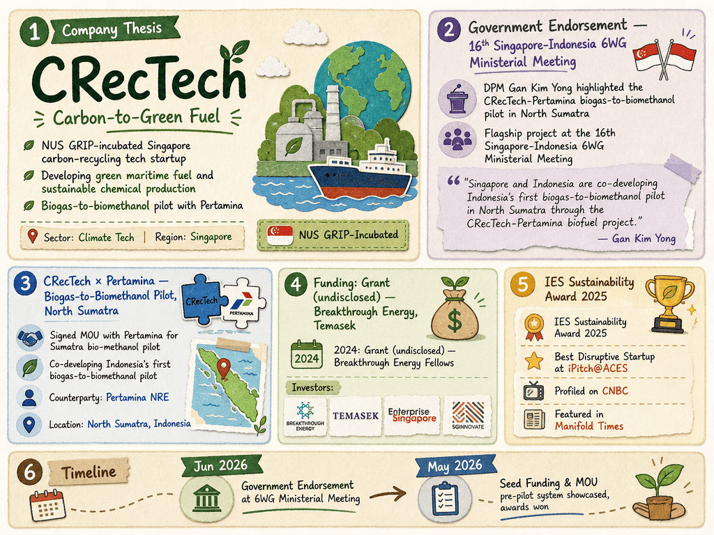

# CRecTech — LIVING BRIEF
_Last updated: 2026-07-01 15:44 UTC_

## Thesis
NUS GRIP-incubated Singapore carbon-recycling tech startup developing green maritime fuel and sustainable chemical production. Its biogas-to-biomethanol pilot with Pertamina was highlighted as a flagship bilateral cooperation project at the 16th Singapore-Indonesia 6WG Ministerial Meeting, signaling strong government endorsement.

## Profile
- Sector: Climate tech
- Region: Singapore

## Funding history
- **2024** — Grant, undisclosed — Breakthrough Energy Fellows; Breakthrough Energy, Temasek, Enterprise Singapore, SGInnovate — [temasek.com.sg](https://www.temasek.com.sg/en/news-and-resources/news-room/news/2024/BEF-SEA_announce_first_cohort)

## Recent signals
- **2026-06-10** — CRecTech-Pertamina bio-methanol pilot covered as case study in Singapore-Indonesia green economy cooperation — [opengovasia.com](https://opengovasia.com/singapore-indonesia-strengthen-digital-green-and-industrial-cooperation/)
  - Summary: Corroborates the 2026-06-09 announcement; no new facts.
- **2026-06-09** — DPM Gan Kim Yong highlighted CRecTech-Pertamina biogas-to-biomethanol pilot in North Sumatra as a flagship project at the 16th Singapore-Indonesia 6WG Ministerial Meeting — [mti.gov.sg](https://www.mti.gov.sg/newsroom/remarks-by-deputy-prime-minister-and-minister-for-trade-and-industry-gan-kim-yong-at-the-16th-six-bilateral-economic-working-groups-ministerial-meeting-joint-press-conference/)
  - Summary: DPM and Minister for Trade and Industry Gan Kim Yong named the CRecTech-Pertamina biogas-to-biomethanol pilot in North Sumatra as a key bilateral green economy project at the 16th Singapore-Indonesia Six Bilateral Economic Working Groups Ministerial Meeting in Jakarta.
  - People: Gan Kim Yong (Singapore DPM and Minister for Trade and Industry)
  - Counterparties: Pertamina NRE (partner)
  - Quote: "Singapore and Indonesia are also co-developing Indonesia's first biogas-to-biomethanol pilot in North Sumatra through the CRecTech-Pertamina biofuel project." — Gan Kim Yong
- **2026-05-21** — raised seed funding for green maritime fuel and sustainable chemical production — [crectech.net](https://crectech.net/news/crectech-receives-seed-funding)
- **2026-05-21** — signed MOU with Pertamina for Sumatra bio-methanol pilot — [crectech.net](https://crectech.net/news/pertamina-power-indonesia-crectech-sumatra-bio-methanol-pilot)
- **2026-05-21** — showcased integrated pre-pilot system — [crectech.net](https://crectech.net/news/crectech-showcases-integrated-pre-pilot-system)
- **2026-05-21** — profiled on CNBC — [crectech.net](https://crectech.net/news/crectech-featured-on-cnbc)
- **2026-05-21** — won IES Sustainability Award 2025 — [crectech.net](https://crectech.net/news/ies-sustainability-award-2025)
- **2026-05-21** — won Best Disruptive Startup at iPitch@ACES — [crectech.net](https://crectech.net/news/ipitch-aces-award-best-disruptive-startup)
- **2026-05-21** — featured in Manifold Times — [crectech.net](https://crectech.net/news/feature-on-manifold-times)

## Older signals
_none_

## Open questions
- What is the size and valuation of the seed funding round?
- Who led the seed round and who are the other investors?
