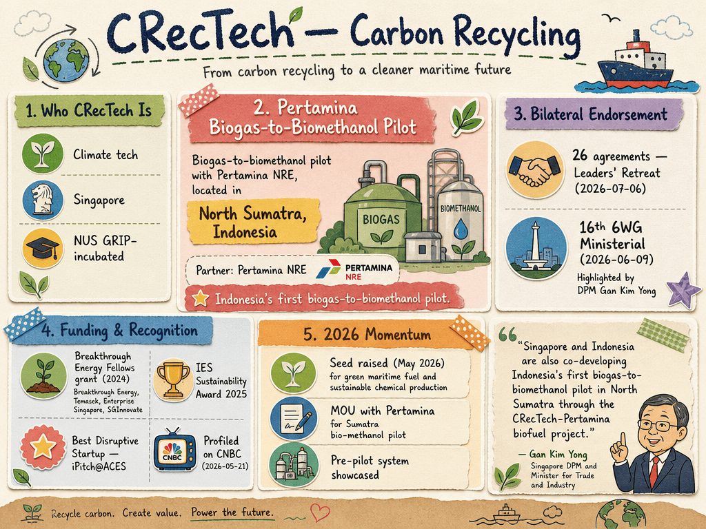

# CRecTech — LIVING BRIEF
_Last updated: 2026-08-30 17:18 UTC_

## Thesis
CRecTech is an NUS GRIP-incubated Singapore carbon-recycling startup converting waste biogas into bio-methanol for green maritime fuel and sustainable chemical production. Its Pertamina NRE partnership has moved from MOU to project development: a Joint Development Agreement signed 14 August 2026 covers a ~50 t/yr biogas-to-bio-methanol demonstration facility at Sei Mangkei, North Sumatra, and anchors an end-to-end value chain spanning domestic offtake (Pertachem) and international marine-fuel supply (PIMD, with Singapore as the reference market around 2028). The project carries strong bilateral endorsement, having been highlighted at the Singapore-Indonesia 6WG Ministerial Meeting and Leaders' Retreat.

_Last material event: 2026-08-29 — CEO Lim Kang Hui named Young Innovator at the inaugural IP for Growth Awards 2026_

## Profile
- Sector: Climate tech
- Region: Singapore

## Funding history
- **2024** — Grant, undisclosed — Breakthrough Energy Fellows; Breakthrough Energy, Temasek, Enterprise Singapore, SGInnovate — [temasek.com.sg](https://www.temasek.com.sg/en/news-and-resources/news-room/news/2024/BEF-SEA_announce_first_cohort)

## Recent signals
- **2026-08-29** — CEO Lim Kang Hui named Young Innovator at the inaugural IP for Growth Awards 2026 (IPOS), recognition centered on CRecTech's patent-plus-trade-secret strategy for its catalytic bio-methanol tech — [crectech.net](https://crectech.net/news/lim-kang-hui-young-innovator-ip-for-growth-awards-2026)
  - Summary: Dr. Lim Kang Hui, CRecTech co-founder and CEO, received the Young Innovator award at the inaugural IP for Growth Awards 2026, organised by the Intellectual Property Office of Singapore (IPOS) and IPOS International; the ceremony was held 25 August 2026 ahead of Singapore IP Week 2026. The category recognises individuals aged 35 and below who use intellectual property to turn ideas into ventures with economic, environmental, or social impact. CRecTech says it protects its technology through patents on selected catalyst innovations plus trade secrets and confidential know-how covering catalyst manufacturing, process design, and operating conditions — an approach also highlighted in The Straits Times' coverage of the awards.
  - People: Dr. Lim Kang Hui (Co-founder & CEO)
  - Counterparties: IPOS / IPOS International (award organiser)
- **2026-08-24** — CRecTech and Pertamina NRE signed a Joint Development Agreement on 14 Aug for a biogas-to-bio-methanol demonstration facility at Sei Mangkei, advancing the April MOU into project development and anchoring a full value chain with Pertachem (domestic offtake) and PIMD (international marine fuel) — [crectech.net](https://crectech.net/news/crectech-pertamina-nre-jda-end-to-end-biomethanol-value-chain) (Also reported by: [energynews.pro](https://energynews.pro/en/pertamina-nre-builds-indonesian-biomethanol-supply-chain-toward-singapore-by-2028))
  - Summary: The JDA, signed 14 August 2026 in Bali, commits the two companies to develop a biogas-to-bio-methanol demonstration facility at Pertamina NRE's existing Sei Mangkei biogas power plant in the North Sumatra Special Economic Zone, producing about 50 tonnes of bio-methanol per year from palm oil mill effluent biogas. The facility will use CRecTech's two-stage CRecREF catalytic process, which CRecTech says can cut production costs by up to 50% versus the conventional four-stage route. The signing anchors a wider chain: a Heads of Agreement with PT Pertamina Petrochemical Trading (Pertachem) for a domestic offtake pathway — Indonesia imports about two-thirds of its ~2M tonnes annual methanol requirement — and an MoU with Pertamina International Marketing & Distribution (PIMD) to explore international marine-fuel supply. S&P Global reported the pilot is targeted to begin operating in December 2026; PIMD is assessing Singapore as the initial reference market for Indonesian bio-methanol after commercial scale-up, currently targeted around 2028.
  - People: Dr. Lim Kang Hui (Co-founder & CEO, CRecTech), John Anis (CEO, Pertamina NRE), Aditya Prabowo (Managing Director, PIMD)
  - Counterparties: Pertamina NRE (partner), Pertachem (domestic offtake partner), PIMD (marine-fuel partner)
  - Numbers: ~50 t/yr bio-methanol; up to 50% lower production cost; pilot ops targeted Dec 2026; export scale-up ~2028; Indonesia imports ~two-thirds of ~2M t/yr methanol demand

## Older signals
- **2026-07-06** — CRecTech-Pertamina biogas-to-biomethanol pilot named among 26 agreements at the Singapore-Indonesia Leaders' Retreat, extending the bilateral endorsement from the June ministerial meeting — [crectech.net](https://www.crectech.net/news/crectech-pertamina-project-singapore-indonesia-leaders-retreat-2026)
- **2026-06-10** — CRecTech-Pertamina bio-methanol pilot covered as case study in Singapore-Indonesia green economy cooperation — [opengovasia.com](https://opengovasia.com/singapore-indonesia-strengthen-digital-green-and-industrial-cooperation/)
  - Summary: Corroborates the 2026-06-09 announcement; no new facts.
- **2026-06-09** — DPM Gan Kim Yong highlighted CRecTech-Pertamina biogas-to-biomethanol pilot in North Sumatra as a flagship project at the 16th Singapore-Indonesia 6WG Ministerial Meeting — [mti.gov.sg](https://www.mti.gov.sg/newsroom/remarks-by-deputy-prime-minister-and-minister-for-trade-and-industry-gan-kim-yong-at-the-16th-six-bilateral-economic-working-groups-ministerial-meeting-joint-press-conference/)
  - Summary: DPM and Minister for Trade and Industry Gan Kim Yong named the CRecTech-Pertamina biogas-to-biomethanol pilot in North Sumatra as a key bilateral green economy project at the 16th Singapore-Indonesia Six Bilateral Economic Working Groups Ministerial Meeting in Jakarta.
  - People: Gan Kim Yong (Singapore DPM and Minister for Trade and Industry)
  - Counterparties: Pertamina NRE (partner)
  - Quote: "Singapore and Indonesia are also co-developing Indonesia's first biogas-to-biomethanol pilot in North Sumatra through the CRecTech-Pertamina biofuel project." — Gan Kim Yong
- **2026-05-21** — raised seed funding for green maritime fuel and sustainable chemical production — [crectech.net](https://crectech.net/news/crectech-receives-seed-funding)
- **2026-05-21** — signed MOU with Pertamina for Sumatra bio-methanol pilot — [crectech.net](https://crectech.net/news/pertamina-power-indonesia-crectech-sumatra-bio-methanol-pilot)
- **2026-05-21** — showcased integrated pre-pilot system — [crectech.net](https://crectech.net/news/crectech-showcases-integrated-pre-pilot-system)
- **2026-05-21** — profiled on CNBC — [crectech.net](https://crectech.net/news/crectech-featured-on-cnbc)
- **2026-05-21** — won IES Sustainability Award 2025 — [crectech.net](https://crectech.net/news/ies-sustainability-award-2025)
- **2026-05-21** — won Best Disruptive Startup at iPitch@ACES — [crectech.net](https://crectech.net/news/ipitch-aces-award-best-disruptive-startup)
- **2026-05-21** — featured in Manifold Times — [crectech.net](https://crectech.net/news/feature-on-manifold-times)

## Open questions
- What is the size and valuation of the seed funding round?
- Who led the seed round and who are the other investors?
- Will PIMD secure a dedicated Singapore methanol bunkering license — its current MPA license covers only conventional marine fuels — and on what timeline?
- What does CRecTech's IP portfolio around CRecREF consist of (patents filed vs trade secrets), and could the IP for Growth recognition support an IP-backed licensing or financing push?
