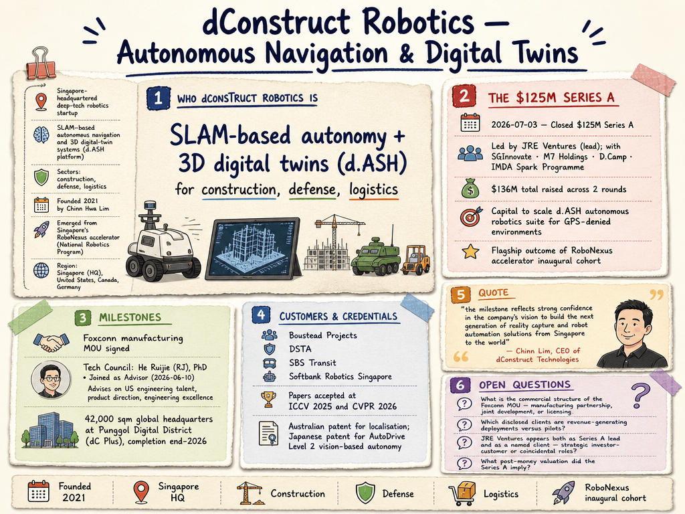

# dConstruct Robotics — LIVING BRIEF
_Last updated: 2026-08-13 14:33 UTC_

## Thesis
dConstruct Robotics is a Singapore-headquartered deep-tech robotics startup building SLAM-based autonomous navigation and 3D digital-twin systems (d.ASH platform) for construction, defense, and logistics. Founded in 2021 by Chinn Hwa Lim, the company emerged from Singapore's RoboNexus accelerator and closed a $125M Series A in mid-2026, the largest round from the inaugural cohort, backed by the National Robotics Program. It has signed a manufacturing MOU with Foxconn, appointed robotics veteran He Ruijie to its Tech Council, and is establishing a 42,000 sqm global headquarters at Punggol Digital District (dC Plus) targeting completion by end-2026.

_Last material event: 2026-07-03 — Closed $125M Series A led by JRE Ventures with SGInnovate, M7 Holdings, D.Camp, IMDA Spark Programme_

## Profile
- Sector: Robotics
- Region: Singapore (HQ), United States, Canada, Germany

## Funding history
_No disclosed funding._

## Recent signals
_none_

## Older signals
- **2026-07-03** — dConstruct closed a $125M Series A round led by JRE Ventures, the flagship outcome of Singapore's RoboNexus accelerator inaugural cohort under the National Robotics Program — [technode.global](https://technode.global/2026/07/03/singapores-dconstruct-raises-125m-series-a-as-robonexus-accelerator-concludes-inaugural-cohort) (Also reported by: [ai-market-watch.com](https://www.ai-market-watch.com/company/dconstruct-robotics), [jtc.gov.sg](https://www.jtc.gov.sg/about-jtc/news-and-stories/industry-news/pdd-dconstruct-secures-usd125-million-series-a-funding))
  - Summary: dConstruct Technologies raised $125M in Series A funding led by JRE Ventures, with participation from SGInnovate, M7 Holdings, D.Camp, and the IMDA Spark Programme, marking the standout achievement of the inaugural RoboNexus accelerator cohort. The company will use the capital to scale its d.ASH autonomous robotics suite for GPS-denied environments and establish a 42,000 sqm global headquarters at Punggol Digital District (dC Plus), targeting completion by end-2026. The National Robotics Programme release (via JTC) names Boustead Projects, DSTA, SBS Transit, and Softbank Robotics Singapore among clients, and notes papers accepted at ICCV 2025 and CVPR 2026 plus an Australian patent for localisation and a Japanese patent for AutoDrive Level 2 vision-based autonomy.
  - People: Chinn Lim (CEO and Founder)
  - Counterparties: JRE Ventures (lead), SGInnovate, M7 Holdings, D.Camp, IMDA Spark Programme; Boustead Projects, DSTA, SBS Transit, Softbank Robotics Singapore (clients)
  - Numbers: $125M Series A ($136M total raised across 2 rounds); 42,000 sqm global HQ in Punggol Digital District, completion end-2026; ICCV 2025 + CVPR 2026 papers; AU localisation + JP AutoDrive patents
  - Quote: "the milestone reflects strong confidence in the company's vision to build the next generation of reality capture and robot automation solutions from Singapore to the world" — Chinn Lim, CEO of dConstruct Technologies
- **2026-06-10** — He Ruijie (RJ), PhD joins dConstruct Robotics as Tech Council Advisor — [dconstruct.ai](https://www.dconstruct.ai/news/he-ruijie-phd-joins-dconstruct-as-tech-council-advisor)
  - Summary: He Ruijie (RJ), PhD joins dConstruct's Tech Council to advise on engineering talent acquisition in the United States and provide strategic guidance on product direction and engineering excellence. RJ brings over a decade of experience in autonomous systems and is currently a Founding Technical Member at Mind Robotics, having previously co-founded two robotics startups from concept to deployment.
  - People: He Ruijie (RJ) (Tech Council Advisor); Chinn Hwa Lim (CEO and Founder)
  - Numbers: Founded 2021; three offices globally

## Open questions
- What is the commercial structure of the Foxconn MOU — manufacturing partnership, joint development, or licensing?
- Which disclosed clients (Boustead Projects, DSTA, SBS Transit, Softbank Robotics Singapore) are revenue-generating deployments versus pilots?
- JRE Ventures appears both as Series A lead and as a named client — strategic investor-customer or coincidental roles?
- What post-money valuation did the Series A imply?
