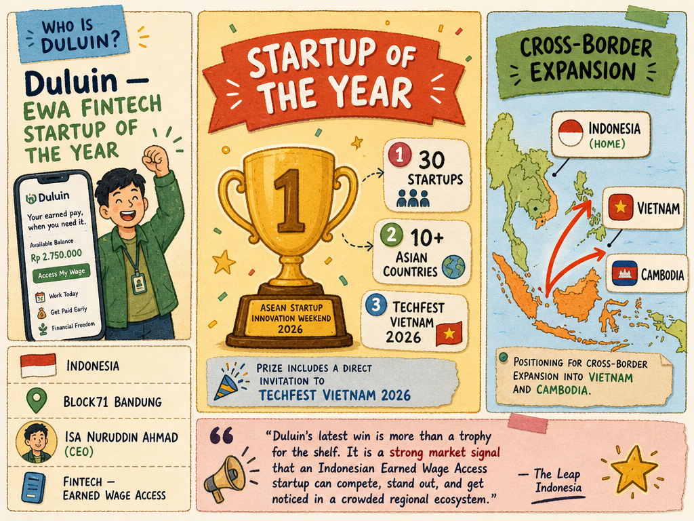

# Duluin — LIVING BRIEF
_Last updated: 2026-05-26 16:47 UTC_

## Thesis
Duluin is an Indonesian Earned Wage Access (EWA) fintech startup, resident at BLOCK71 Bandung. Named Startup of the Year at the ASEAN Startup Innovation Weekend 2026 in Phnom Penh, it is positioning its EWA platform — which lets workers access earned wages before the payroll cycle ends — for cross-border expansion into Vietnam and Cambodia.

## Profile
- Sector: Fintech (Earned Wage Access)
- Region: Indonesia (BLOCK71 Bandung)
- Key people: Isa Nuruddin Ahmad (CEO)

## Recent signals
- **2026-05-26** — Duluin won Startup of the Year at Startup Innovation Weekend 2026 (Phnom Penh) and secured a direct invitation to TechFest Vietnam 2026, validating its EWA model's regional appeal — [The Leap Indonesia](https://theleap.id/detail/4087/earned-wage-access-startup-duluin-secures-regional-spotlight-through-techfest)
  - Summary: Duluin was named Startup of the Year at the three-day Startup Innovation Weekend 2026 in Phnom Penh, competing against 30 startups from more than 10 Asian countries. The prize includes a direct invitation to TechFest Vietnam 2026, offering market-access and investor-exposure opportunities for the Indonesian EWA platform.
  - Numbers: 30 startups from 10+ Asian countries
  - Quote: "Duluin's latest win is more than a trophy for the shelf. It is a strong market signal that an Indonesian Earned Wage Access startup can compete, stand out, and get noticed in a crowded regional ecosystem." — The Leap Indonesia

## Older signals
_none_

## Open questions
- When does Duluin plan to enter the Vietnam and Cambodian markets, and what will its go-to-market strategy look like?
- Has Duluin raised any institutional equity round beyond BNI Ventures Axel Arc program support?
