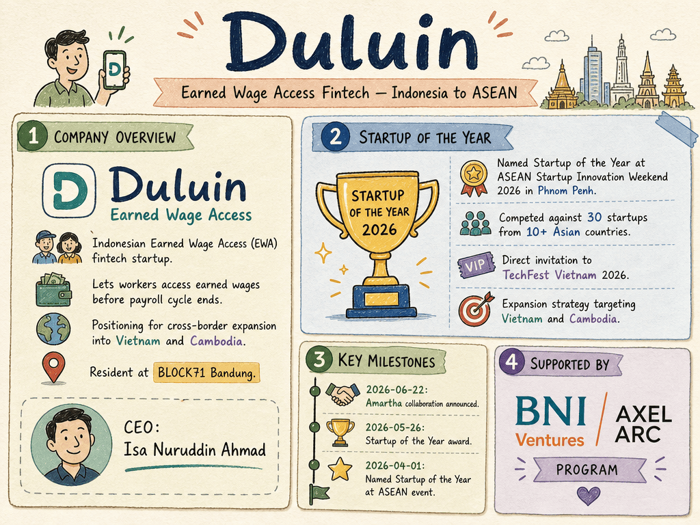

# Duluin — LIVING BRIEF
_Last updated: 2026-07-26 14:28 UTC_

## Thesis
Duluin is an Indonesian Earned Wage Access (EWA) fintech startup, resident at BLOCK71 Bandung. Named Startup of the Year at the ASEAN Startup Innovation Weekend 2026 in Phnom Penh, it is positioning its EWA platform — which lets workers access earned wages before the payroll cycle ends — for cross-border expansion into Vietnam and Cambodia.

_Last material event: 2026-05-26 — Named Startup of the Year at ASEAN Startup Innovation Weekend 2026; targeted Vietnam and Cambodia expansion_

## Profile
- Sector: Fintech
- Region: Indonesia (BLOCK71 Bandung)
- Key people: Isa Nuruddin Ahmad (CEO)

## Funding history
_No disclosed funding._

## Recent signals
_none_

## Older signals
- **2026-06-22** — Duluin Amartha Collaboration Boosts Indonesia Fintech — [linkedin.com](https://www.linkedin.com/posts/duluin_duluin-x-amartha-activity-7475118135449235456-InPx)
- **2026-05-26** — Duluin won Startup of the Year at Startup Innovation Weekend 2026 (Phnom Penh) and secured a direct invitation to TechFest Vietnam 2026, validating its EWA model's regional appeal — [The Leap Indonesia](https://theleap.id/detail/4087/earned-wage-access-startup-duluin-secures-regional-spotlight-through-techfest) (Also reported by: [nasionalnews.id](https://www.nasionalnews.id/ekonomi/startup-fintech-indonesia-duluin-raih-startup-of-the-year-di-asean-kini-bidik-ekspansi-vietnam-dan-kamboja/))
  - Summary: Duluin was named Startup of the Year at the three-day Startup Innovation Weekend 2026 in Phnom Penh, competing against 30 startups from more than 10 Asian countries. The prize includes a direct invitation to TechFest Vietnam 2026. CEO Isa Nuruddin Ahmad confirmed the company's expansion strategy targeting Vietnam and Cambodia.
  - Numbers: 30 startups from 10+ Asian countries
  - Quote: "Duluin's latest win is more than a trophy for the shelf. It is a strong market signal that an Indonesian Earned Wage Access startup can compete, stand out, and get noticed in a crowded regional ecosystem." — The Leap Indonesia
- **2026-04-01** — Duluin named Startup of the Year at ASEAN Startup Innovation Weekend 2026, Phnom Penh — [aseanstartupinnovationweekend.com](https://aseanstartupinnovationweekend.com/awards-2026)

## Open questions
- What is the specific timeline for Duluin's market entry into Vietnam and Cambodia?
- Has Duluin raised any institutional equity round beyond BNI Ventures Axel Arc program support?
