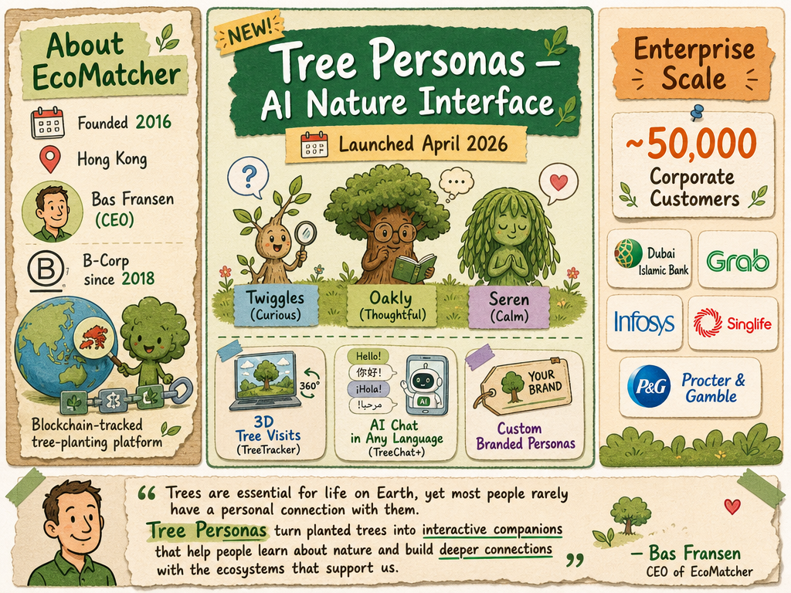

# EcoMatcher — LIVING BRIEF
_Last updated: 2026-05-26 16:47 UTC_

## Thesis
EcoMatcher is a Hong Kong-headquartered B-Corp operating a blockchain-tracked tree-planting and forest-management platform serving ~50,000 global corporate customers including Grab and Procter & Gamble. Its April 2026 launch of Tree Personas — a Nature Interface with 3D tree visits, multi-language AI tree chat, and three initial digital personalities (Twiggles, Oakly, Seren) — expands its sustainability engagement offering for enterprise clients.

## Profile
- Sector: Climate tech / sustainability
- Region: Hong Kong (BLOCK71 Bandung-listed); global operations
- Founded: 2016
- Key people: Bas Fransen (CEO)
- Stage / funding: B-Corp (since 2018), revenue-funded
- Customers: Dubai Islamic Bank, Grab, Infosys, Singlife

## Recent signals
- **2026-04-21** — EcoMatcher launched Tree Personas, an AI-powered Nature Interface that assigns a distinct digital personality to each gifted tree, enabling recipients to chat with their tree in any language and follow its growth — [Thailand Business News](https://www.thailand-business-news.com/pr-news/ecomatcher-unveils-tree-personas)
  - Summary: EcoMatcher unveiled Tree Personas, allowing companies to assign each gifted tree a personality — Twiggles (curious), Oakly (thoughtful), or Seren (calm) — with options for custom branded personas. Recipients visit their tree via TreeTracker 3D and interact through TreeChat+ in any language, building a personalised relationship with the tree and its ecosystem.
  - People: Bas Fransen (CEO)
  - Counterparties: Dubai Islamic Bank, Grab, Infosys, Singlife (customers)
  - Quote: "Trees are essential for life on Earth, yet most people rarely have a personal connection with them. Tree Personas turn planted trees into interactive companions that help people learn about nature and build deeper connections with the ecosystems that support us." — Bas Fransen, CEO of EcoMatcher

## Older signals
_none_

## Open questions
- What is the adoption pipeline for custom Tree Personas among existing corporate clients?
- Does EcoMatcher plan to raise external equity funding, or will it continue to grow as a revenue-funded B-Corp?
