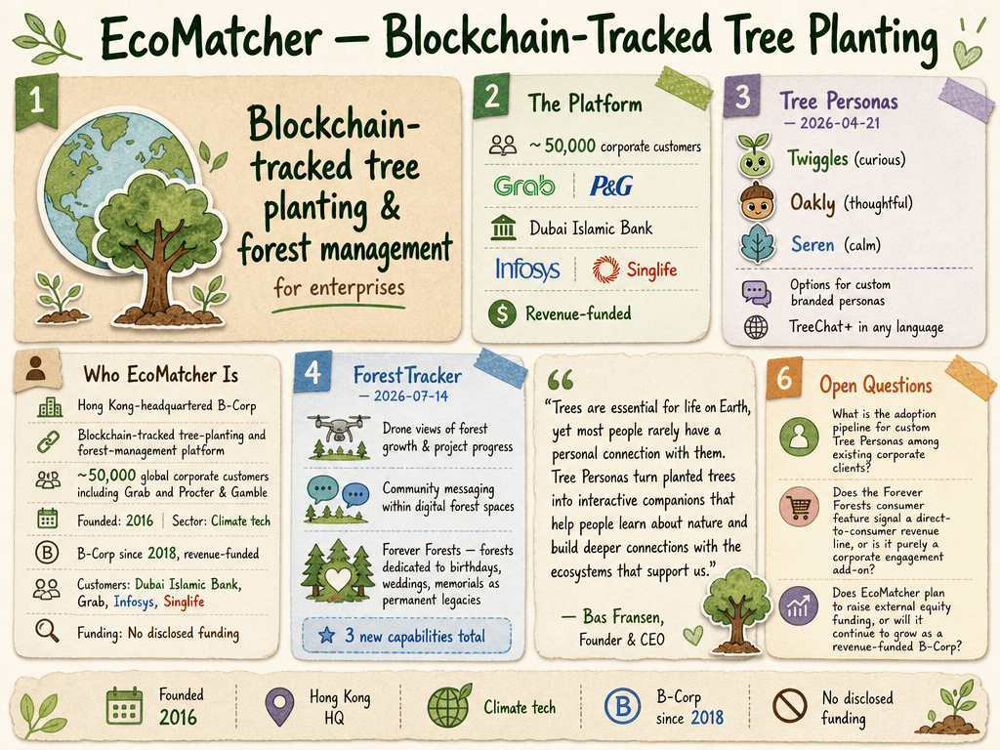

# EcoMatcher — LIVING BRIEF
_Last updated: 2026-08-13 14:33 UTC_

## Thesis
EcoMatcher is a Hong Kong-headquartered B-Corp operating a blockchain-tracked tree-planting and forest-management platform serving ~50,000 global corporate customers including Grab and Procter & Gamble. Its April 2026 launch of Tree Personas — a Nature Interface with 3D tree visits, multi-language AI tree chat, and three initial digital personalities (Twiggles, Oakly, Seren) — expands its sustainability engagement offering for enterprise clients.

_Last material event: 2026-07-14 — Launched next-generation ForestTracker with drone integration, community messaging, and Forever Forests_

## Profile
- Sector: Climate tech
- Region: Hong Kong (BLOCK71 Bandung-listed); global operations
- Founded: 2016
- Key people: Bas Fransen (CEO)
- Stage / funding: B-Corp (since 2018), revenue-funded
- Customers: Dubai Islamic Bank, Grab, Infosys, Singlife

## Funding history
_No disclosed funding._

## Recent signals
_none_

## Older signals
- **2026-07-14** — Launched next-generation ForestTracker with drone-captured forest views, community messaging, and Forever Forests dedicated to life milestones — [ecomatcher.com](https://www.ecomatcher.com/ecomatcher-launches-next-generation-foresttracker)
  - Summary: EcoMatcher announced a major upgrade to ForestTracker, its flagship forest visualization platform, adding three capabilities: drone-captured aerial views of forest growth and project progress, messaging within digital forest spaces aimed at employee and customer communities, and Forever Forests — forests dedicated to birthdays, weddings, and memorials as permanent legacies. The release targets transparency and engagement for corporate sustainability programs.
  - People: Bas Fransen (Founder and CEO)
  - Numbers: 3 new capabilities (drone integration, community messaging, Forever Forests)
  - Quote: "By combining enhanced forest visibility with personalization and community, we are making environmental impact more transparent, more measurable, and more deeply human." — Bas Fransen, Founder and CEO
- **2026-04-21** — EcoMatcher launched Tree Personas, an AI-powered Nature Interface that assigns a distinct digital personality to each gifted tree, enabling recipients to chat with their tree in any language and follow its growth — [Thailand Business News](https://www.thailand-business-news.com/pr-news/ecomatcher-unveils-tree-personas) (Also reported by: [heraldchronicle.com](https://www.heraldchronicle.com/archives/2026/04/21/ecomatcher-unveils-tree-personas), [prnewswire.com](https://www.prnewswire.com/news-releases/ecomatcher-unveils-tree-personas-302741328.html))
  - Summary: EcoMatcher unveiled Tree Personas, allowing companies to assign each gifted tree a personality — Twiggles (curious), Oakly (thoughtful), or Seren (calm) — with options for custom branded personas. Recipients visit their tree via TreeTracker 3D and interact through TreeChat+ in any language, building a personalised relationship with the tree and its ecosystem.
  - People: Bas Fransen (CEO)
  - Counterparties: Dubai Islamic Bank, Grab, Infosys, Singlife (customers)
  - Quote: "Trees are essential for life on Earth, yet most people rarely have a personal connection with them. Tree Personas turn planted trees into interactive companions that help people learn about nature and build deeper connections with the ecosystems that support us." — Bas Fransen, CEO of EcoMatcher

## Open questions
- What is the adoption pipeline for custom Tree Personas among existing corporate clients?
- Does the Forever Forests consumer feature signal a direct-to-consumer revenue line, or is it purely a corporate engagement add-on?
- Does EcoMatcher plan to raise external equity funding, or will it continue to grow as a revenue-funded B-Corp?
