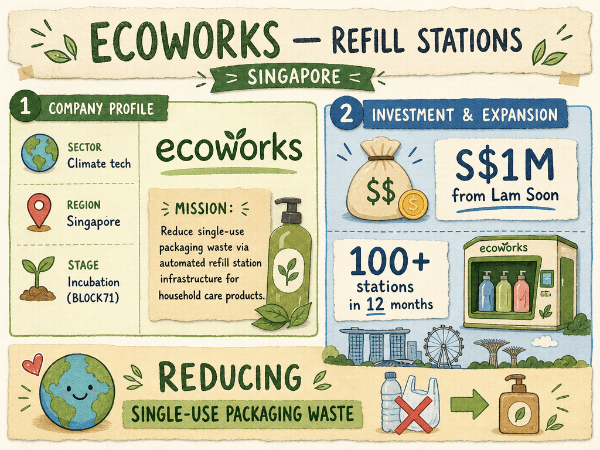

# Ecoworks — LIVING BRIEF
_Last updated: 2026-07-23 15:10 UTC_

## Thesis
BLOCK71 Singapore-resident sustainability startup building automated refill station infrastructure for household care products. Backed by Lam Soon, Ecoworks is expanding its network of refill stations across Singapore with a focus on reducing single-use packaging waste.

## Profile
- Sector: Climate tech
- Region: Singapore
- Stage / funding: Incubation (BLOCK71)

## Recent signals
- **2026-07-23** — Ecoworks secured S$1M (US$776,216) investment from Lam Soon to expand refill station infrastructure for household care products across Singapore; plans over 100 stations in 12 months — [techinasia.com](https://www.techinasia.com/news/singapore-refill-startup-ecoworks-secures-lam-soon-investment)

## Older signals
_none_

## Open questions
- What is Lam Soon's equity stake and expected commercial terms from the partnership?
- Which additional brands beyond bio-home will join Ecoworks' refill network?
