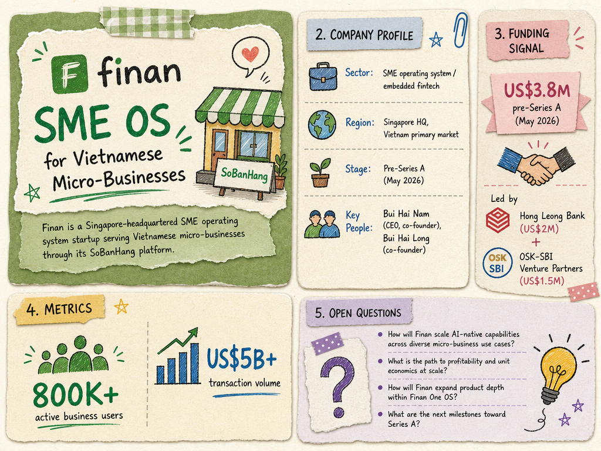

# Finan — LIVING BRIEF
_Last updated: 2026-05-27 00:00 UTC_

## Thesis
Finan is a Singapore-headquartered SME operating system startup serving Vietnamese micro-businesses through its SoBanHang platform, with over 800,000 active users and US$5B+ in transaction volume. In May 2026 it raised a US$3.8M pre-Series A led by Hong Leong Bank to scale its AI-native Finan One OS and expand embedded financial services across Southeast Asia.

## Profile
- Sector: SME operating system / embedded fintech
- Region: Singapore (HQ), Vietnam (primary market)
- Stage / funding: Pre-Series A
- Key people: Bui Hai Nam (CEO and co-founder), Bui Hai Long (co-founder)

## Funding history
- **2026-05-13** — Pre-Series A, US$3.8M — Hong Leong Bank; OSK-SBI Venture Partners — [technode.global](https://technode.global/2026/05/13/finan-raises-3-8m-to-expand-vietnam-sme-management-platform-across-southeast-asia/)

_Total disclosed: $3.8M._

## Recent signals
- **2026-05-13** — Finan raised US$3.8M in a pre-Series A round led by Hong Leong Bank, earmarked for scaling Finan One and expanding across Southeast Asia — [TechNode Global](https://technode.global/2026/05/13/finan-raises-3-8m-to-expand-vietnam-sme-management-platform-across-southeast-asia/)
  - Summary: Finan's SoBanHang platform serves 800K+ active business users and has processed US$5B+ in transaction volume. The pre-Series A was anchored by Hong Leong Bank (US$2M) and OSK-SBI Venture Partners (US$1.5M). Finan will use the capital to scale Finan One, an AI-native business OS built on SoBanHang's transaction data infrastructure, and to support embedded financial services, additional banking partnerships, and regional expansion into other Southeast Asian markets.
  - Counterparties: Hong Leong Bank (lead), OSK-SBI Venture Partners
  - Numbers: US$3.8M raised, 800K+ active business users, US$5B+ transaction volume
  - Quote: "Vietnam's SME sector is rapidly adopting digital payments, e-invoicing, accounting, and tax systems, creating an opportunity for businesses to move directly toward newer financial and operational infrastructure." — Sam Davidson, Investment Manager at OSK-SBI Venture Partners

## Older signals
_none_

## Open questions
- What is the revenue model for Finan One vs SoBanHang — subscription, transaction-based, or both?
- Which Southeast Asian markets are the initial expansion targets beyond Vietnam?
- Does the Hong Leong Bank investment signal a broader strategic partnership or just financial backing?
