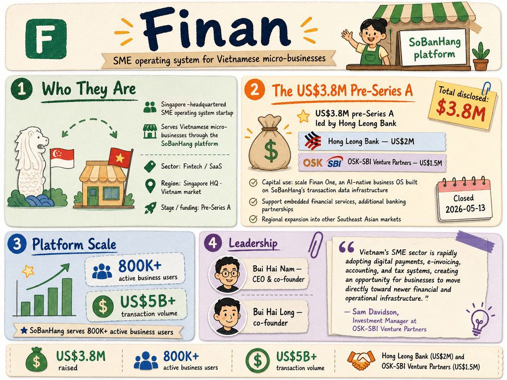

# Finan — LIVING BRIEF
_Last updated: 2026-09-19 16:23 UTC_

## Thesis
Finan is a Singapore-headquartered SME operating system startup serving Vietnamese micro-businesses through its SoBanHang platform, with over 800,000 active users and US$5B+ in transaction volume. In May 2026 it raised a US$3.8M pre-Series A led by Hong Leong Bank to scale its AI-native Finan One OS and expand embedded financial services across Southeast Asia.

_Last material event: 2026-08-25 — Hong Leong Bank Vietnam's banking services integrated directly into the SoBanHang app, launched at a joint Ho Chi Minh City event_

## Profile
- Sector: Fintech / SaaS
- Region: Singapore (HQ), Vietnam (primary market)
- Stage / funding: Pre-Series A
- Key people: Bui Hai Nam (CEO and co-founder), Bui Hai Long (co-founder)

## Funding history
- **2026-05-13** — Pre-Series A, US$3.8M — Hong Leong Bank; OSK-SBI Venture Partners — [technode.global](https://technode.global/2026/05/13/finan-raises-3-8m-to-expand-vietnam-sme-management-platform-across-southeast-asia/)
_Total disclosed: $3.8M._

## Recent signals
_none_

## Older signals
- **2026-08-25** — Hong Leong Bank Vietnam's banking services are live inside SoBanHang, launched at a joint Ho Chi Minh City event for a voice-driven "Multitasking AI Assistant" that books orders, reconciles HLB account balances and preps period tax returns — [vietnam.vn](https://vietnam.vn/en/trai-nghiem-tro-ly-ai-da-nhiem-tieu-thuong-go-duoc-nut-that-van-hanh-kinh-doanh)
  - Summary: Hong Leong Bank Vietnam (HLB) and SoBanHang staged a "Multitasking AI Assistant" launch in Ho Chi Minh City on 20 August 2026, reported by Báo Tiền Phong on 25 August. The assistant takes Vietnamese voice commands — a spoken order creates the order, deducts inventory, applies the discount and posts to the receivables ledger — and reconciles balance changes from the linked HLB account against real-time revenue and expenditure, flagging invoice discrepancies, chasing overdue debts and helping compile period tax returns. HLB frames the tie-up as banking embedded in the seller's existing sales-management app rather than a separate product, and the article sets out a longer-term plan to turn transparent sales data into a credit record that unlocks unsecured lending for household businesses — evidence that May's Hong Leong-led investment came with a broader strategic partnership, not just capital.
  - People: Fred Lim (Director of Digital Commercialization, Hong Leong Bank Berhad)
  - Counterparties: Hong Leong Bank Vietnam (banking partner and lead investor)
  - Quote: "Hong Leong Bank is not simply a provider of funding, but also actively partners with businesses to help them operate more efficiently. By democratizing AI to help small business owners manage their cash flow accurately, we aim to provide every business owner with a smart digital assistant to save time, make accurate decisions, and achieve breakthrough growth." — Fred Lim, Director of Digital Commercialization, Hong Leong Bank Berhad
- **2026-08-05** — VPBank, Finan and Mastercard launched the VPBiz FinanONE Mastercard, a virtual corporate debit card opened entirely online on the FinanOne platform and activated through VPBank NEO Biz — [vietnam.vn](https://www.vietnam.vn/en/vpbank-finan-va-mastercard-hop-tac-ra-mat-dong-the-ghi-no-phi-vat-ly) (Also reported by: [vietnam.vn](https://vietnam.vn/en/ai-mo-them-loi-giai-cho-bai-toan-quan-tri-tai-chinh-doanh-nghiep))
  - Summary: VPBank, Finan and Mastercard launched the VPBiz FinanONE Mastercard on 5 August 2026 — a non-physical corporate debit card that businesses register for on the FinanOne platform and activate through VPBank NEO Biz, after which it works for domestic and international online payments across Mastercard's acceptance network. From a main card, businesses can create multiple online sub-cards with their own spending limits, user permissions and validity periods, and all transactions update in real time so spend is tracked per department, employee or project as it happens rather than at settlement. CEO Bui Hai Nam framed the launch as FinanOne's move beyond sales and cash-flow tooling into controlling spend before a transaction occurs.
  - People: Bui Hai Nam (General Director, Finan)
  - Counterparties: VPBank (issuing bank partner), Mastercard (payment network)
  - Numbers: 800,000+ sellers onboarded via SoBanHang
  - Quote: "The launch of FinanONE with VPBank and Mastercard, integrating Business Payment Controls technology, is a crucial step in realizing this vision: helping businesses empower spending by individual personnel, departments, or projects, while still controlling limits and transactions in real time." — Bui Hai Nam, General Director of Finan
- **2026-05-29** — Tech in Asia: SoBanHang serves 800k merchants, raises funding for AI-powered SME finance tools — [techinasia.com](https://www.techinasia.com/news/sobanhang-funding-pre-series-a)
- **2026-05-13** — Finan raised US$3.8M in a pre-Series A round led by Hong Leong Bank, earmarked for scaling Finan One and expanding across Southeast Asia — [TechNode Global](https://technode.global/2026/05/13/finan-raises-3-8m-to-expand-vietnam-sme-management-platform-across-southeast-asia/) (Also reported by: [sbivm.com](https://sbivm.com/osk-sbi-venture-partners-launches-second-fund-and-makes-first-investment-2))
  - Summary: Finan's SoBanHang platform serves 800K+ active business users and has processed US$5B+ in transaction volume. The pre-Series A was anchored by Hong Leong Bank (US$2M) and OSK-SBI Venture Partners (US$1.5M). Finan will use the capital to scale Finan One, an AI-native business OS built on SoBanHang's transaction data infrastructure, and to support embedded financial services, additional banking partnerships, and regional expansion into other Southeast Asian markets.
  - Counterparties: Hong Leong Bank (lead), OSK-SBI Venture Partners
  - Numbers: US$3.8M raised, 800K+ active business users, US$5B+ transaction volume
  - Quote: "Vietnam's SME sector is rapidly adopting digital payments, e-invoicing, accounting, and tax systems, creating an opportunity for businesses to move directly toward newer financial and operational infrastructure." — Sam Davidson, Investment Manager at OSK-SBI Venture Partners
- **2026-05-12** — Vietnamese merchant app SoBanHang (Finan) raises $3.8M Pre-Series A — [backscoop.com](https://www.backscoop.com/newsletter-posts/vietnamese-market-app-sobanhang-raises-fresh-funds)
  - Summary: Corroborates the existing coverage; no new facts.
- **2026-05-12** — Vietnam Investment Review covers Finan/SoBanHang's pre-Series A round with additional context on Vietnam's digital compliance-driven SME adoption — [vir.com.vn](https://vir.com.vn/sobanhang-wraps-up-pre-series-a-funding-round-152647.html)
  - Summary: Corroborates the May 13, 2026 pre-Series A announcement from TechNode Global; no new facts.
- **2026-05-11** — SoBanHang targets SME digitisation with new funding — [ibsintelligence.com](https://ibsintelligence.com/ibsi-news/sobanhang-targets-sme-digitisation-with-new-funding)

## Open questions
- What is the revenue model for Finan One vs SoBanHang — subscription, transaction-based, or both?
- Which Southeast Asian markets are the initial expansion targets beyond Vietnam?
- Does the VPBiz FinanONE card push Finan upmarket from household businesses to registered SMEs, and if so does it need a different sales motion from SoBanHang?
- If sales data becomes a credit record, does Finan carry lending risk or does Hong Leong underwrite while Finan supplies the rails?
