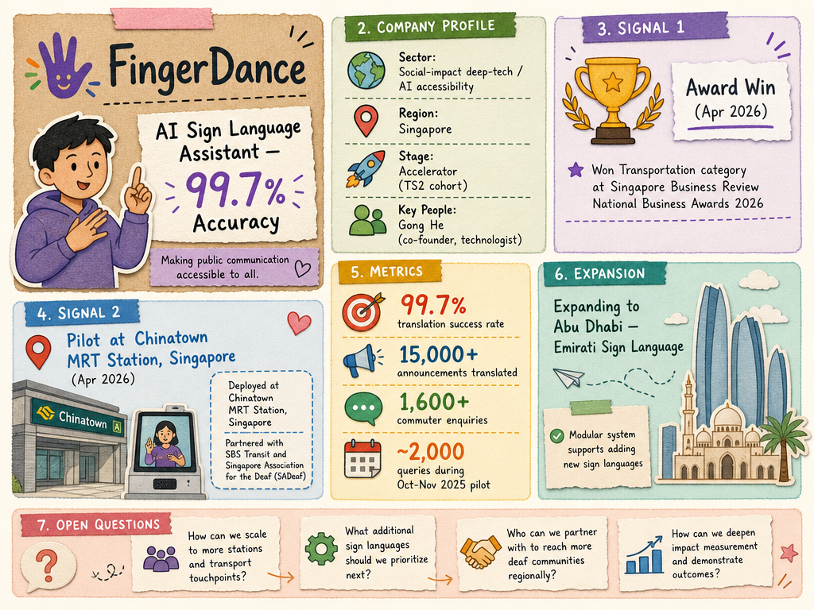

# FingerDance — LIVING BRIEF
_Last updated: 2026-06-11 17:02 UTC_

## Thesis
FingerDance is a Singapore social-impact deep-tech startup building SiLViA (Sign Language Virtual Assistant), an AI-powered platform that converts audio announcements into sign language in real time. It partnered with SBS Transit to deploy SiLViA at Chinatown MRT Station, achieving a 99.7% translation success rate and winning the 2025 Global Rail Innovation Award. The company is now adapting SiLViA for international deployment, starting with Abu Dhabi using Emirati Sign Language.

## Profile
- Sector: AI / Social impact
- Region: Singapore
- Stage / funding: Accelerator stage (TS2 cohort)
- Key people: Gong He (co-founder, technologist)

## Recent signals
- **date unknown** — GovInsider profiles SBS Transit's AI accessibility initiatives including SiLViA, with expansion planned to more transport hubs within 12 months — [govinsider.asia](https://govinsider.asia/intl-en/article/making-transportation-user-friendly-for-the-hearing-impaired)
  - Summary: GovInsider profiles SBS Transit's accessibility AI tools including SiLViA, the sign-language virtual assistant built with FingerDance. SiLViA is in a six-month pilot at Chinatown MRT Station, translating announcements into Singapore Sign Language via a kiosk with speech, keyboard, and text input. SBS Transit plans to expand SiLViA to more transport hubs within the next 12 months.
  - People: Shaun Liew (SBS Transit Head of Rail Operations & Support and Head of Customer Experience & Commercial), Gong He (co-founder, FingerDance)
  - Counterparties: SBS Transit, Singapore Association for the Deaf (SADeaf)
  - Numbers: 6-month pilot at Chinatown MRT Station; expansion to more transport hubs within 12 months
  - Quote: "SBS Transit's broader goal is not to create a perfect technology, but to develop a 'symbol of hope' that demonstrates how technology can enable more inclusive transportation experiences." — Shaun Liew, SBS Transit
- **2026-04-15** — SBS Transit's SiLViA, powered by FingerDance, won the Transportation category at the Singapore Business Review National Business Awards 2026 — [Singapore Business Review](https://sbr.com.sg/co-written-partner/event-news/sbs-transits-sign-language-virtual-assistant-clinches-win-singapore-business-review-national-business-awards)
  - Summary: SiLViA was fully deployed at Chinatown MRT Station after a 2024 public trial. Within two months of deployment, it translated over 15,000 station announcements and responded to nearly 1,600 commuter enquiries with a 99.7% translation success rate. The modular system allows new sign languages to be added without major overhauls, supporting international expansion to Abu Dhabi for Emirati Sign Language.
  - People: Gong He (co-founder, FingerDance)
  - Counterparties: SBS Transit, Singapore Association for the Deaf (SADeaf)
  - Numbers: 99.7% translation success rate, 15,000+ announcements, 1,600+ commuter enquiries
  - Quote: "SBS Transit, Singapore's leading public transport operator, was recognised in the Transportation category at the Singapore Business Review National Business Awards 2026 for SiLViA — the nation's first AI-powered sign language virtual assistant."
- **2026-04-08** — SBS Transit piloted SiLViA at Chinatown MRT Station handling ~2,000 queries during the Oct–Nov 2025 trial, developed in collaboration with FingerDance and SADeaf — [The Business Times](https://www.businesstimes.com.sg/events-awards/design-ai-tech-awards/design-ai-and-tech-awards/sbs-transit-breaks-communication-barrier-singapores-first-ai-sign-language-assistant)
  - Summary: SiLViA uses NLP, speech recognition, and sign language generation to produce a lifelike avatar on platform screens. It processes sign language as a natural language and responds with real-time expressive signing, operating 24/7 without a human interpreter. The pilot aligned with Singapore's Enabling Masterplan 2030 and has potential applications beyond transit, including sign-language interpretation at conferences and events.
  - Counterparties: SBS Transit, Singapore Association of the Deaf (SADeaf)
  - Numbers: ~2,000 queries during pilot, 1.2M daily ridership (SBS Transit network)
  - Quote: "Strong early adoption post-launch, handling some 2,000 queries during its pilot phase at Chinatown MRT station between October and November 2025."

## Older signals
_none_

## Open questions
- What is FingerDance's business model — licensing SiLViA to transit operators, or a SaaS/subscription model?
- Has FingerDance raised any institutional equity funding beyond the TS2 accelerator commitment?
- What is the deployment pipeline beyond Abu Dhabi — any other transit operators evaluating SiLViA?
