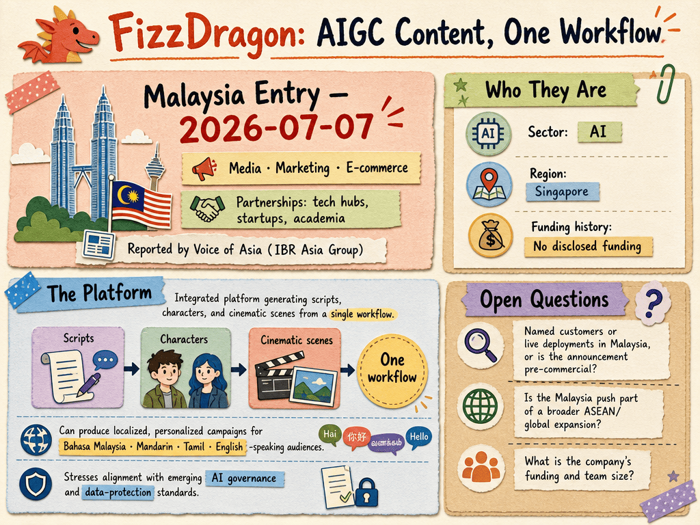

# FizzDragon — LIVING BRIEF
_Last updated: 2026-08-29 17:18 UTC_

## Thesis
FizzDragon is a Singapore-headquartered AIGC (AI-generated content) company building an integrated platform that generates scripts, characters, and cinematic scenes from a single workflow. In July 2026 it announced the introduction of its scalable AIGC platform to Malaysia, targeting media, marketing, and e-commerce content production, and said it is exploring partnerships with Malaysian tech hubs, startups, and academic institutions.

_Last material event: 2026-07-07 — Malaysia market entry of its scalable AIGC platform announced_

## Profile
- Sector: AI
- Region: Singapore

## Funding history
_No disclosed funding._

## Recent signals
_none_

## Older signals
- **2026-07-07** — FizzDragon announced it is bringing its scalable AIGC content-creation platform to Malaysia, targeting media, marketing, and e-commerce use cases, and exploring partnerships with local tech hubs and academic institutions — [voiceofasean.com](https://voiceofasean.com/newsroom/malaysia/fizzdragon-advances-malaysias-digital-economy-with-scalable-aigc-platform-for-next-generation-content-creation)
  - Summary: Voice of Asia (IBR Asia Group) reports FizzDragon is introducing its AI-generated content platform to Malaysia as part of the country's digital-economy push, offering a unified workflow covering NLP-based script generation, generative character design, and cinematic rendering. The company says the platform can produce localized, personalized campaigns for Bahasa Malaysia, Mandarin, Tamil, and English-speaking audiences, and stresses alignment with emerging AI governance and data-protection standards.

## Open questions
- Does FizzDragon have named customers or live deployments in Malaysia, or is the announcement pre-commercial?
- Is the Malaysia push part of a broader ASEAN/global expansion, and what is the company's funding and team size?
