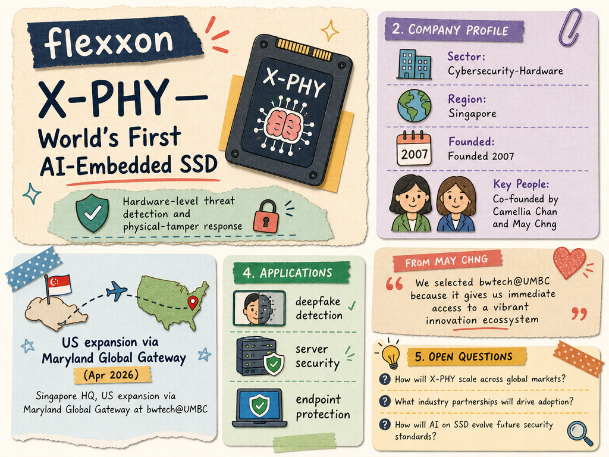

# Flexxon — LIVING BRIEF
_Last updated: 2026-06-24 15:45 UTC_

## Thesis
Flexxon is a Singapore cybersecurity-hardware company (founded 2007) that builds X-PHY, the world's first AI-embedded SSD with hardware-level threat detection and physical-tamper response. Co-founded by Camellia Chan and May Chng, the company has expanded into the US market through Maryland's Global Gateway Soft Landing Program at bwtech@UMBC, focusing on deepfake detection, server security, and endpoint protection built into the device itself.

## Profile
- Sector: Cybersecurity / Deep tech
- Region: Singapore (HQ), US (Maryland)
- Founded: 2007
- Key people: Camellia Chan (co-founder), May Chng (co-founder, COO)

## Recent signals
- **2026-03-23** — X-PHY Deepfake Detector Wins Global InfoSec Award for Innovative AI Security and Safety at RSAC 2026 — [x-phy.com](https://x-phy.com/x-phy-deepfake-detector-wins-global-infosec-award-for-innovative-ai-security-and-safety-at-rsac-2026/)
- **2026-03-31** — X-PHY SSD Named Finalist at the 2026 UK Cyber OSPAs — [x-phy.com](https://x-phy.com/x-phy-ssd-named-finalist-at-the-2026-uk-cyber-ospas/)
- **2026-04-07** — Flexxon established US operations through Maryland's Global Gateway Soft Landing Program at bwtech@UMBC, citing engineering talent and the university innovation ecosystem — [business.maryland.gov](https://business.maryland.gov/news/singapore-cybersecurity-company-finds-success-in-maryland/)
  - Summary: Flexxon's X-PHY cybersecurity spin-off joined Maryland's soft-landing program at UMBC's research and technology park. The company chose Maryland for its engineering talent, proximity to research institutions, and resourceful industry partners. X-PHY's approach embeds hardware and firmware-based security directly into the device, enabling proactive real-time defense at the data level, with applications in deepfake detection, server security, and endpoint protection.
  - People: May Chng (Co-founder & COO)
  - Counterparties: bwtech@UMBC, Maryland Global Gateway
  - Quote: "We selected bwtech@UMBC because it gives us immediate access to a vibrant innovation ecosystem... We chose a base where we could plug-in quickly, learn faster, and build the right relationships." — May Chng, Co-founder & COO

## Older signals
_none_

## Open questions
- What is Flexxon's funding or revenue stage — bootstrapped, VC-backed, or generating revenue from X-PHY hardware sales?
- Are there announced customers or channel partnerships for X-PHY in the US market?
- How does X-PHY's hardware-level approach to deepfake detection compare to software-only alternatives in terms of efficacy and cost?
