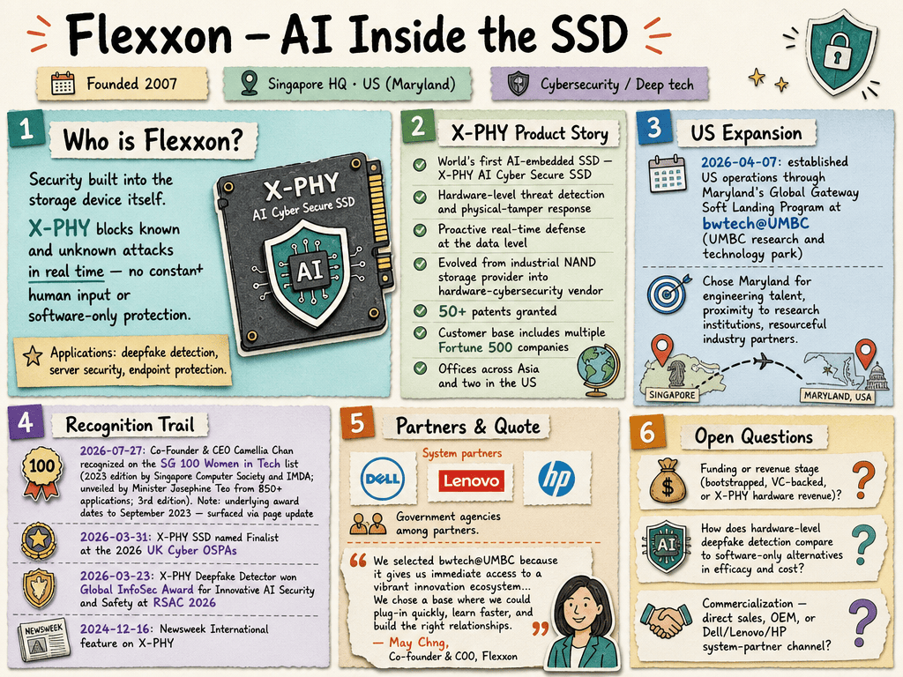

# Flexxon — LIVING BRIEF
_Last updated: 2026-09-19 16:23 UTC_

## Thesis
Flexxon is a Singapore cybersecurity-hardware company (founded 2007) that builds X-PHY, the world's first AI-embedded SSD with hardware-level threat detection and physical-tamper response. Co-founded by Camellia Chan and May Chng, the company has expanded into the US market through Maryland's Global Gateway Soft Landing Program at bwtech@UMBC, focusing on deepfake detection, server security, and endpoint protection built into the device itself.

_Last material event: 2026-04-07 — Established US operations through Maryland's Global Gateway Soft Landing Program at bwtech@UMBC_

## Profile
- Sector: Cybersecurity / Deep tech
- Region: Singapore (HQ), US (Maryland)
- Founded: 2007
- Key people: Camellia Chan (co-founder), May Chng (co-founder, COO)

## Funding history
_No disclosed funding._

## Recent signals
_none_

## Older signals
- **2026-08-14** — CEO Camellia Chan uses a vendor-bylined op-ed to argue that securing enterprise AI agents needs hardware-level controls, citing the Model Context Protocol vulnerability and a Meta agent data leak as evidence that software guardrails get bypassed — [techticker.net](https://techticker.net/2026/08/14/ai-agents-are-inside-the-enterprise-are-your-security-foundations-ready-for-them)
  - Summary: Camellia Chan, billed as CEO and founder of X-PHY, a Flexxon brand, published a bylined piece (carried by techticker.net as TechRadar Pro Perspectives syndicated content) arguing that AI agents have moved from chatbots to systems holding database access, API keys and system privileges, while defences still rely on the software-only strategy that failed against ChatGPT jailbreaks in 2023. She points to the Model Context Protocol vulnerability CVE-2025-49596 (CVSS 9.4) and a data leak attributed to a Meta AI agent as evidence that input guardrails and permission monitoring sit inside the software trust boundary, and argues the answer is a hardware root of trust — the layer X-PHY sells. It is vendor-authored positioning rather than independent reporting; no product launch, customer or figure is attached to it.
  - People: Camellia Chan (CEO and Founder, X-PHY, a Flexxon brand)
  - Quote: "Guardrails, permissions, and monitoring are necessary, but they are insufficient, and they represent the security layers that history shows will eventually be bypassed."
- **2026-08-13** — Tech in Asia feature traces Flexxon's X-PHY IP strategy from the 2021 AI-embedded SSD launch to a hardware-rooted security product portfolio, with co-founder May Chng saying IP is developed alongside R&D and shapes global expansion — [techinasia.com](https://techinasia.com/innovative-firms-turned-great-ideas-global-growth)
- **2026-07-27** — Co-founder and CEO Camellia Chan recognized on the SG 100 Women in Tech list (2023 edition by Singapore Computer Society and IMDA); the underlying award dates to September 2023, with the page updated 27 July 2026 — [flexxon.com](https://www.flexxon.com/flexxon-ceo-camellia-chan-named-one-of-singapores-100-women-in-tech)
  - Summary: Flexxon's news page records that Co-Founder and CEO Camellia Chan was named an SG 100 Women in Tech 2023 honouree by the Singapore Computer Society and IMDA — the third edition of the list, unveiled at a closed-door forum by Minister Josephine Teo from more than 850 applications. Nominees had to demonstrate tech expertise, leadership and vision, and community advocacy. Note: the underlying recognition dates to September 2023; this item surfaced via a page update rather than a new award.
  - People: Camellia Chan (Co-Founder & CEO), Josephine Teo (Minister for Communications and Information; SGWIT patron)
  - Counterparties: Singapore Computer Society (award organiser), IMDA (award organiser)
  - Numbers: 850+ applications; 3rd edition of SG100WIT
- **2026-04-07** — Flexxon established US operations through Maryland's Global Gateway Soft Landing Program at bwtech@UMBC, citing engineering talent and the university innovation ecosystem — [business.maryland.gov](https://business.maryland.gov/news/singapore-cybersecurity-company-finds-success-in-maryland/)
  - Summary: Flexxon's X-PHY cybersecurity spin-off joined Maryland's soft-landing program at UMBC's research and technology park. The company chose Maryland for its engineering talent, proximity to research institutions, and resourceful industry partners. X-PHY's approach embeds hardware and firmware-based security directly into the device, enabling proactive real-time defense at the data level, with applications in deepfake detection, server security, and endpoint protection.
  - People: May Chng (Co-founder & COO)
  - Counterparties: bwtech@UMBC, Maryland Global Gateway
  - Quote: "We selected bwtech@UMBC because it gives us immediate access to a vibrant innovation ecosystem... We chose a base where we could plug-in quickly, learn faster, and build the right relationships." — May Chng, Co-founder & COO
- **2026-03-31** — X-PHY SSD Named Finalist at the 2026 UK Cyber OSPAs — [x-phy.com](https://x-phy.com/x-phy-ssd-named-finalist-at-the-2026-uk-cyber-ospas/)
- **2026-03-23** — X-PHY Deepfake Detector Wins Global InfoSec Award for Innovative AI Security and Safety at RSAC 2026 — [x-phy.com](https://x-phy.com/x-phy-deepfake-detector-wins-global-infosec-award-for-innovative-ai-security-and-safety-at-rsac-2026/)
- **2024-12-16** — Newsweek International feature on X-PHY: AI embedded directly in the SSD blocks known and unknown attacks in real time, with Dell, Lenovo and HP among Flexxon's system partners and a Fortune 500 customer base — [flexxon.com](https://www.flexxon.com/flexxon-equips-memory-hardware-with-autonomous-cybersecurity-function)
  - Summary: A Newsweek International interview (December 20, 2024 edition, republished on Flexxon's news page) profiles the X-PHY AI Cyber Secure SSD, which embeds AI inside memory hardware to detect and block both known and unknown cyber threats in real time without constant human input or software-only protection. Flexxon, led by co-founder and CEO Camellia Chan, has evolved from an industrial NAND storage provider into a hardware-cybersecurity vendor with 50+ patents granted and a customer base that includes multiple Fortune 500 companies. The company is headquartered in Singapore with offices across Asia and two in the US.
  - People: Camellia Chan (co-founder & CEO)
  - Counterparties: Dell, Lenovo, HP (system partners); government agencies (partners)
  - Numbers: 50+ patents; Fortune 500 customers
  - Quote: "We recognized that there are pain points or gaps in the market that needed to be addressed. We found an effective way to leverage the hardware layer using cutting-edge AI algorithms to protect a device in a way that cybersecurity software cannot. Our solution will become the future de facto standard for all hardware devices." — Camellia Chan, Co-founder & CEO

## Open questions
- What is Flexxon's funding or revenue stage — bootstrapped, VC-backed, or generating revenue from X-PHY hardware sales?
- How does X-PHY's hardware-level approach to deepfake detection compare to software-only alternatives in terms of efficacy and cost?
- Does the AI-agent security pitch correspond to a shipping X-PHY product line, or is it positioning ahead of one?
- How does X-PHY commercialize — direct sales, OEM, or through the Dell/Lenovo/HP system-partner channel?
