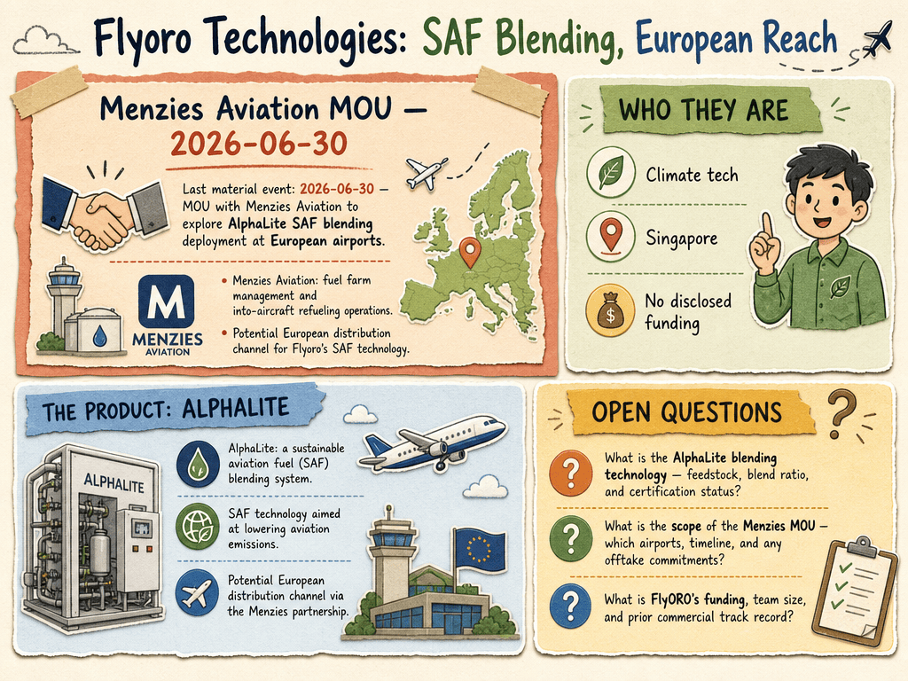

# Flyoro Technologies — LIVING BRIEF
_Last updated: 2026-08-29 17:18 UTC_

## Thesis
Flyoro Technologies is a Singapore-based startup developing AlphaLite, a sustainable aviation fuel (SAF) blending system. In June 2026 it signed a memorandum of understanding with Menzies Aviation to explore deploying AlphaLite at European airports served by Menzies, leveraging Menzies' fuel farm management and into-aircraft refueling operations — a potential European distribution channel for its SAF technology.

_Last material event: 2026-06-30 — MOU with Menzies Aviation to explore AlphaLite SAF blending deployment at European airports_

## Profile
- Sector: Climate tech
- Region: Singapore

## Funding history
_No disclosed funding._

## Recent signals
_none_

## Older signals
- **2026-06-30** — FlyORO signed an MOU with Menzies Aviation to explore deploying its AlphaLite SAF blending system at European airports Menzies serves, leveraging Menzies' fuel farm and into-aircraft refueling operations — [aviationweek.com](https://aviationweek.com/aerospace/emerging-technologies/menzies-singapores-flyoro-explore-saf-distribution-europe)

## Open questions
- What is the AlphaLite blending technology — feedstock, blend ratio, and certification status?
- What is the scope of the Menzies MOU — which airports, timeline, and any offtake commitments?
- What is FlyORO's funding, team size, and prior commercial track record?
