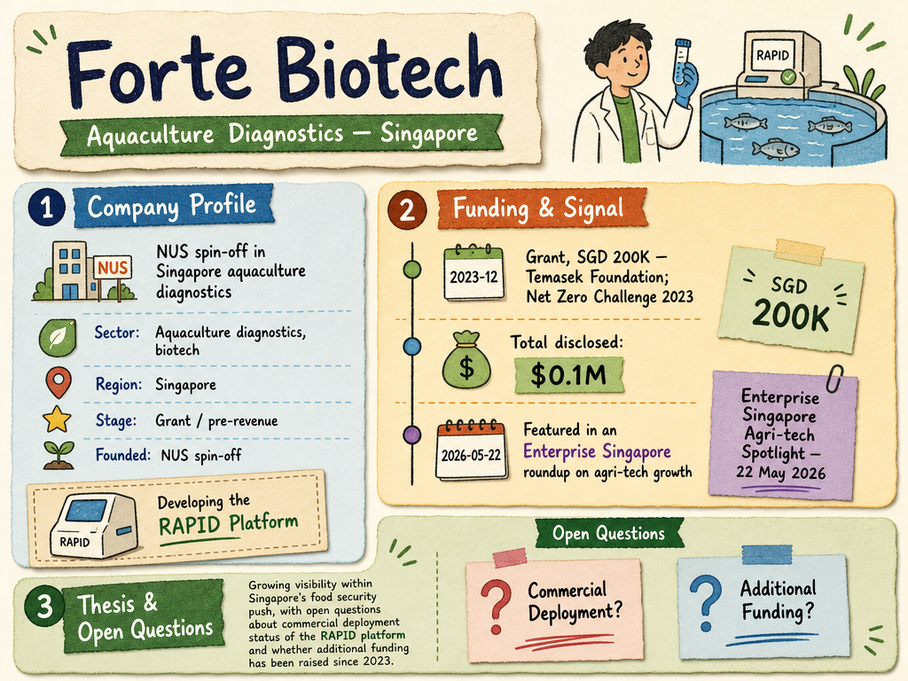

# Forte Biotech — LIVING BRIEF
_Last updated: 2026-05-22 15:56 UTC_

## Thesis

Forte Biotech is a Singapore-based NUS spin-off developing the RAPID diagnostic platform for rapid disease detection in aquaculture. Its inclusion in an Enterprise Singapore spotlight on the country's agri-tech ecosystem signals growing visibility for its solutions within Singapore's food security push, though specific operational milestones remain sparse.

## Profile

- Sector: Aquaculture diagnostics, biotech
- Region: Singapore
- Stage: Grant / pre-revenue
- Founded: NUS spin-off

## Funding history

- **2023-12** — Grant, SGD 200K — Temasek Foundation; Net Zero Challenge 2023 — [technode.global](https://technode.global/2023/12/08/alterno-forte-biotech-and-airx-carbon-win-630000-in-grant-funding-from-net-zero-challenge-2023/)

_Total disclosed: $0.1M._

## Recent signals

- **2026-05-22** — Featured in an Enterprise Singapore roundup on agri-tech growth, highlighting the sector's increasing investment and policy tailwinds — [Enterprise Singapore (Business Times)](https://www.linkedin.com/pulse/singapores-agri-tech-firms-find-fertile-ground-enterprisesingapore-6xcyc)

## Older signals

_none_

## Open questions

- Was Forte Biotech directly profiled or merely named in Enterprise Singapore's agri-tech roundup?
- What is the current commercial deployment status of the RAPID diagnostics platform?
- Has the company raised any additional grant or equity funding since the 2023 Net Zero Challenge grant?
