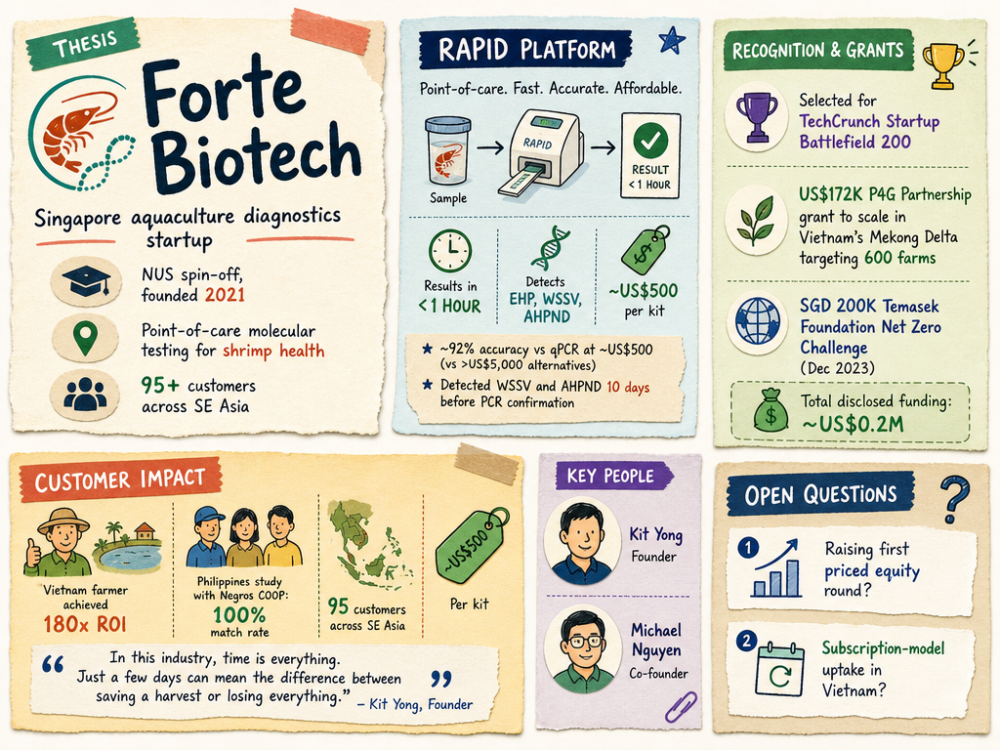

# Forte Biotech — LIVING BRIEF
_Last updated: 2026-09-19 16:23 UTC_

## Thesis
Forte Biotech is a Singapore aquaculture diagnostics startup that developed the RAPID platform — a point-of-care molecular testing system for shrimp disease detection (EHP, WSSV, AHPND) delivering results in under one hour at ~US$500 per kit. With 95+ customers across Southeast Asia, a TechCrunch Startup Battlefield 200 selection, and a P4G Partnership grant to scale in Vietnam, the company is emerging as a leading cost-effective alternative to conventional PCR testing for smallholder shrimp farmers.

_Last material event: 2026-09-10 — Named a finalist for the 2026 Responsible Seafood Innovation Award (aquaculture) for the RAPID Plus shrimp-disease test_

## Profile
- Sector: Agritech / Biotechnology
- Region: Singapore (NUS spin-off)
- Founded: 2021
- Stage / funding: Grant-funded; multiple non-dilutive awards
- Key people: Kit Yong (Founder), Michael Nguyen (Co-founder)
- Identifiers: [LinkedIn](https://www.linkedin.com/company/forte-biotech), [Crunchbase](https://www.crunchbase.com/organization/forte-biotech)

## Funding history
- **2023-12** — Grant, SGD 200K — Temasek Foundation; Net Zero Challenge 2023 — [technode.global](https://technode.global/2023/12/08/alterno-forte-biotech-and-airx-carbon-win-630000-in-grant-funding-from-net-zero-challenge-2023/)

_Total disclosed: $0.2M._

## Recent signals
- **2026-09-10** — Named a finalist for the 2026 Responsible Seafood Innovation Award (aquaculture) for RAPID Plus, its on-site shrimp-disease test that returns a result in about an hour — [globalseafood.org](https://www.globalseafood.org/advocate/responsible-seafood-innovation-award-finalist-learning-from-farm-failures-to-develop-an-on-site-rapid-test-to-detect-shrimp-diseases/)
  - Summary: Global Seafood Alliance's Responsible Seafood Advocate profiled Forte Biotech as a finalist for the 2026 Responsible Seafood Innovation Award in the aquaculture category, on the strength of RAPID Plus — a quantitative molecular diagnostic platform co-founder Kit Yong describes as "akin to a qPCR" but engineered to strip out the cost and complexity of laboratory equipment. Yong said Forte has placed around 130 machines with more than 100 customers across nine countries since commercial sales began in January 2024, with Vietnam its largest market; the company is exploring Ecuador, is developing tests for tilapia and swine, and is seeking around US$1.5M after funding the business so far on angels, grants and founder funds. The awards will be presented at the Responsible Seafood Summit in Bangkok.
  - People: Kit Yong (co-founder), Rob Fletcher (Responsible Seafood Advocate)
  - Counterparties: Global Seafood Alliance (award body)
  - Numbers: ~130 machines placed; 100+ customers; 9 countries; machine price ~US$1,000–1,300; 50,000 kits/month production capacity; ~US$1.5M raise sought
  - Quote: "[The company's] greatest achievement will be every harvest that we prevent from being lost," — Kit Yong, co-founder

## Older signals
- **2026-06-07** — Selected for TechCrunch Startup Battlefield 200, gaining global visibility among early-stage tech startups — [TechCrunch](https://techcrunch.com/startup-battlefield/company/forte-biotech/)
- **2026-06-07** — Received US$172K P4G Partnership grant to scale RAPID test kits in Vietnam's Mekong Delta, targeting 600 farms with disease-detection and farmer training — [P4G](https://p4gpartnerships.org/pioneering-green-partnerships/all-p4g-partnerships/forte-biotech-action-poverty)
  - Summary: The P4G-funded partnership with Action on Poverty aims to bring RAPID kits to 600 farms in the Mekong Delta, raise US$1M in investment, reduce over 3,500 metric tons of carbon emissions, and raise awareness for 8,200+ beneficiaries. The RAPID system has applications in fish, crab, and poultry farming beyond shrimp.
  - Counterparties: P4G, Action on Poverty
  - Numbers: $172K grant, 600 farms target, 3,500+ tons CO2 reduction target, 8,200+ beneficiaries
- **2026-06-07** — Featured in EnterpriseSG news article on Singapore agri-tech firms exporting innovations overseas — [EnterpriseSG](https://www.enterprisesg.gov.sg/resources/media-centre/news/2025/november/singapores-agri-tech-firms-find-fertile-ground)
  - Summary: EnterpriseSG's feature highlights Forte's RAPID platform achieving ~92% accuracy vs. qPCR lab results at US$500 (vs. >US$5,000 for alternatives), with 95 customers across SE Asia. The company received Startup SG Tech Proof-of-Value grant and NUS Agritech Centre test-bedding support.
  - Numbers: 92% accuracy, US$500 per kit, 95 customers across SE Asia
  - Counterparties: EnterpriseSG, NUS Agritech Centre
- **2026-06-07** — Diagnostics For Animals membership listing profiles RAPID platform and plans to extend to additional livestock species — [Diagnostics For Animals](https://diagnosticsforanimals.com/welcome-to-forte-biotech/)
  - Summary: Corroborates the RAPID commercial launch in 2024, 80+ farms across 7 Asian countries, and plans to extend the platform to additional livestock species and partner with research institutions.
- **2026-04-04** — Reported RAPID kits detected WSSV and AHPND ten days before PCR confirmation in Indonesian farms; Vietnam farmer achieved 180x ROI through data-driven disease management — [Aqua Asia Pacific](https://aquaasiapac.com/2025/04/04/how-forte-biotech-helps-farmers-take-control-of-disease-management-in-shrimp/)
  - Summary: Forte Biotech's RAPID test kits provide point-of-care detection for major shrimp diseases, enabling proactive farm management. In Vietnam, farmer Phuoc reduced disinfection cycles from 36 to 5 and monitoring costs by over 80%, achieving 180x ROI. In the Philippines, a study with Negros COOP showed 100% match rate for all three major pathogens.
  - People: Kit Yong (Founder), Michael Nguyen (Co-founder)
  - Counterparties: Negros COOP (Philippines)
  - Numbers: 10 days early detection, 180x ROI, 100% match rate, 80% cost reduction
  - Quote: "In this industry, time is everything. Just a few days can mean the difference between saving a harvest or losing everything." — Kit Yong, Founder

## Open questions
- Will the roughly US$1.5M raise close, and is it equity or non-dilutive given Forte has so far relied on angel investors, grants and founder funds?
- What is the subscription-model uptake in Vietnam — are farmers adopting the device-rental model as intended?
- Does the channel shift toward feed mills, distributors and animal-health players change the unit economics versus selling directly to smallholders?
