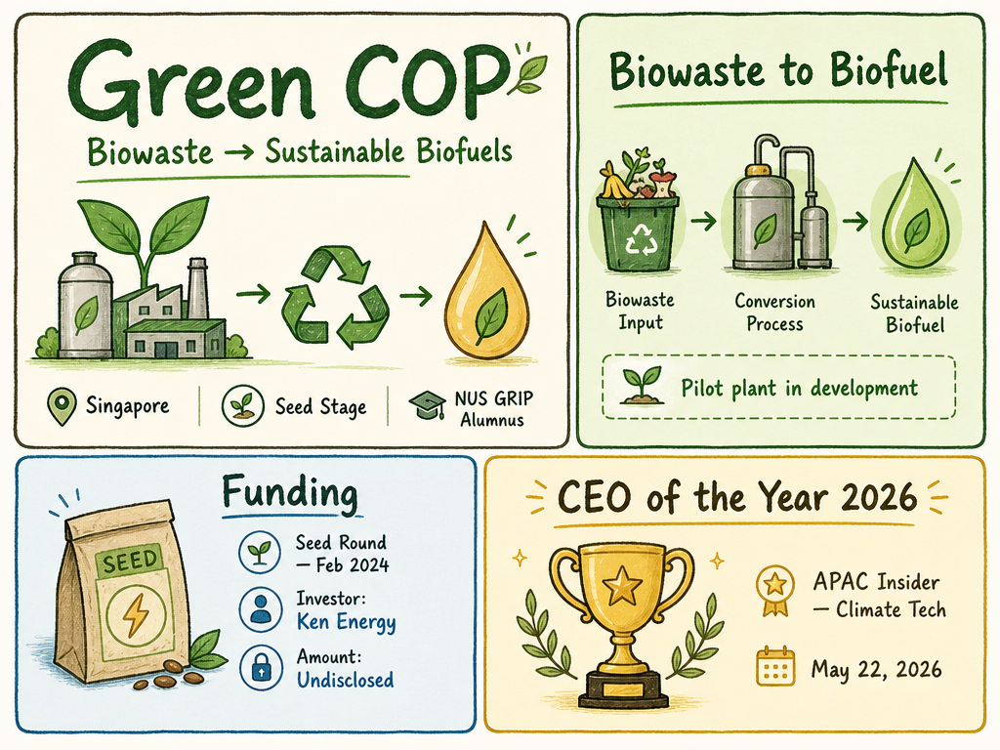

# Green COP — LIVING BRIEF
_Last updated: 2026-05-22 00:00 UTC_

## Thesis

Green COP is a Singapore deep-tech startup converting biowaste into sustainable biofuels. The CEO receiving a Climate Tech CEO of the Year award from APAC Insider underscores growing industry recognition, even as the company has yet to announce commercial-scale production or follow-on funding beyond its 2024 seed round.

## Profile

- Region: Singapore
- Sector: Climate tech, sustainable biofuels
- Stage: Seed
- Founded: NUS GRIP alumnus

## Funding history

- **2024-02** — Seed, undisclosed — Ken Energy — [e27.co](https://e27.co/green-cop-secures-investment-to-launch-a-pilot-biofuels-plant-20240214/)

## Recent signals

- **2026-05-22** — CEO recognized as APAC Insider's Climate Tech CEO of the Year 2026, signalling growing industry credibility — [APAC Insider](https://apacinsider.digital/winners/green-cop-pte-ltd-2/)

## Older signals

_none_

## Open questions

- Does the APAC Insider award correlate with any upcoming fundraising, partnership, or commercial milestone?
- When will the pilot biofuels plant move to commercial-scale production?
