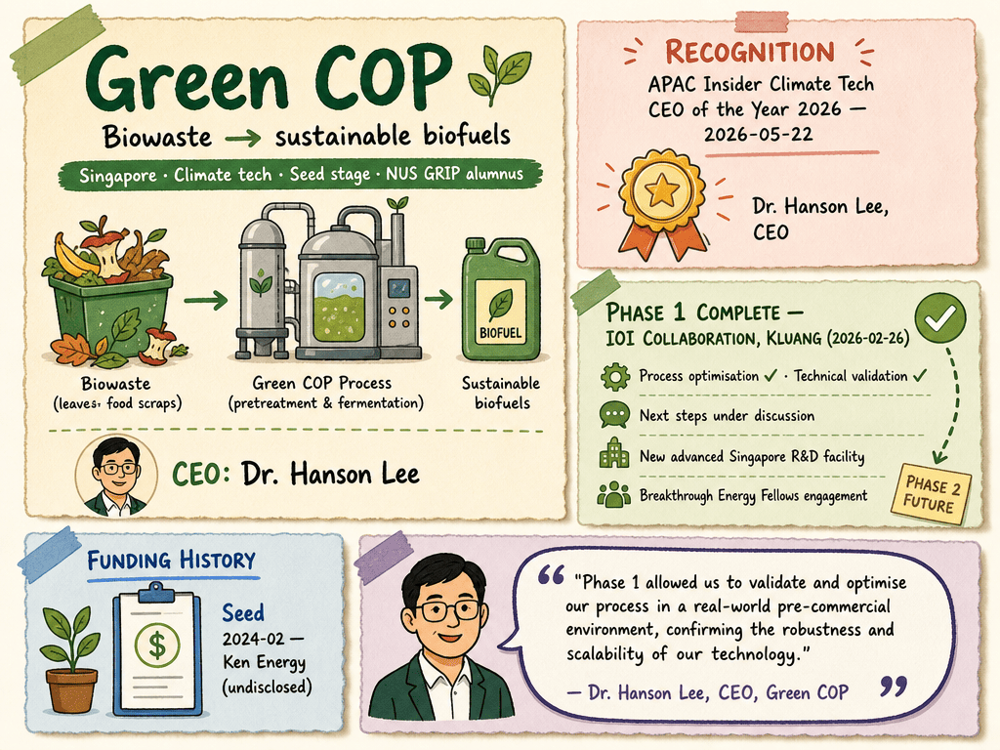

# Green COP — LIVING BRIEF
_Last updated: 2026-08-26 14:21 UTC_

## Thesis

Green COP is a Singapore deep-tech startup converting biowaste into sustainable biofuels. The CEO receiving a Climate Tech CEO of the Year award from APAC Insider underscores growing industry recognition, even as the company has yet to announce commercial-scale production or follow-on funding beyond its 2024 seed round.

_Last material event: 2026-05-22 — CEO named APAC Insider Climate Tech CEO of the Year 2026_

## Profile

- Region: Singapore
- Sector: Climate tech
- Stage: Seed
- Founded: NUS GRIP alumnus

## Funding history

- **2024-02** — Seed, undisclosed — Ken Energy — [e27.co](https://e27.co/green-cop-secures-investment-to-launch-a-pilot-biofuels-plant-20240214/)

## Recent signals
_none_

## Older signals
- **2026-05-22** — CEO recognized as APAC Insider's Climate Tech CEO of the Year 2026, signalling growing industry credibility — [APAC Insider](https://apacinsider.digital/winners/green-cop-pte-ltd-2/)
- **2026-02-26** — Completed Phase 1 of its pre-commercial collaboration with IOI at the Kluang facility and is consolidating R&D at a new advanced Singapore facility — [greencop.sg](https://www.greencop.sg/news-1/green-cop-completes-phase-1-collaboration-with-ioi%2C-transitions-to-advanced-r%26d-facility-in-singapore)
  - Summary: Green COP completed Phase 1 of its pre-commercial collaboration with Malaysian palm-oil group IOI at Kluang, achieving its process-optimisation and technical-validation objectives for its pretreatment and fermentation technologies; Kluang operations have concluded and both parties are discussing next steps. R&D is being consolidated at a new advanced facility in Singapore, with the company also flagging engagement with Breakthrough Energy Fellows as it prepares for expanded pilot deployments and commercial partnerships.
  - People: Dr. Hanson Lee (CEO), Ryan Lee (Deputy General Manager, Group Operations, IOI)
  - Counterparties: IOI Corporation Berhad (collaboration partner), Breakthrough Energy Fellows (ecosystem programme)
  - Quote: "Phase 1 allowed us to validate and optimise our process in a real-world pre-commercial environment, confirming the robustness and scalability of our technology." — Dr. Hanson Lee, CEO, Green COP

## Open questions

- Does the APAC Insider award correlate with any upcoming fundraising, partnership, or commercial milestone?
- When will the pilot biofuels plant move to commercial-scale production?
- Will the IOI collaboration extend to a Phase 2 pilot or commercial offtake, and what role does the new Singapore R&D facility play in the scale-up?
