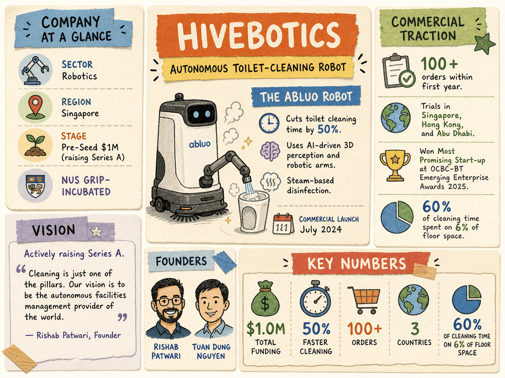

# Hivebotics — LIVING BRIEF
_Last updated: 2026-07-15 14:45 UTC_

## Thesis
Hivebotics is a Singapore-headquartered robotics startup incubated under NUS GRIP, developing autonomous cleaning robots for commercial and industrial environments. The company's toilet-cleaning robot has attracted serious commercial interest, suggesting strong early product-market fit in the janitorial robotics space.

## Profile
- Sector: Robotics
- Region: Singapore

## Funding history
- **date unknown** — Pre-Seed, $1M — The Gear, Feedback Ventures, Maple Exports, NUS Graduate Research Innovation Programme, BLOCK71 — [pitchbook.com](https://pitchbook.com/profiles/company/509315-32)
_Total disclosed: $1.0M._

## Recent signals
- **2026-06-12** — Tech in Asia republishes a profile of Hivebotics' Abluo toilet-cleaning robot, covering its 100+ commercial orders, facilities management vision, and ongoing Series A fundraising — [techinasia.com](https://www.techinasia.com/robot-cleans-toilets-humans-dont)
  - Summary: Corroborates the 2026-05-13 Business Times feature; no new facts.
- **2026-06-19** — Dealroom recap reports Hivebotics' Abluo robot cuts toilet cleaning time by 50%, confirming Series A fundraising is underway — [app.dealroom.co](https://app.dealroom.co/news/feed/hivebotics-abluo-robot-cuts-toilet-cleaning-time-by-50-with-ai-and-robotic-arms)
  - Summary: Dealroom reports Hivebotics' Abluo robot achieves a 50% reduction in cleaning time using AI-driven 3D perception and robotic arms. The article confirms Hivebotics is actively raising Series A funding to expand toward autonomous facilities management, citing 100+ orders since the July 2024 commercial launch.
  - People: Rishab Patwari (founder), Tuan Dung Nguyen (co-founder)
  - Numbers: 50% cleaning time reduction; 100+ orders; 60% of cleaning time spent on 6% of floor space

- **2026-05-13** — Hivebotics' Abluo toilet-cleaning robot passes 100 orders within a year of launch, with commercial trials across Singapore, Hong Kong, and Abu Dhabi — [The Business Times](https://www.businesstimes.com.sg/events-awards/emerging-enterprise/ocbc-emerging-enterprise-awards-robot-cleaning-toilet-hivebotics)
  - Summary: The Business Times profiles Hivebotics' Abluo autonomous toilet-cleaning robot, which combines steam-based disinfection, AI-driven 3D perception, and robotic arms. Over 100 units ordered within a year of commercial launch; trials underway at offices, shopping malls, and airports in Singapore, Hong Kong, and Abu Dhabi. The startup won Most Promising Start-up at the OCBC-BT Emerging Enterprise Awards 2025 and is now raising a Series A round.
  - People: Rishab Patwari (founder, former NUS computer engineering student), Tuan Dung Nguyen (co-founder)
  - Counterparties: OCBC Bank (award sponsor); The Business Times (award co-organizer)
  - Numbers: 100+ orders within first year; 60% of cleaning time spent on 6% of floor space
  - Quote: "Cleaning is just one of the pillars. Our vision is to be the autonomous facilities management provider of the world." — Rishab Patwari, founder, Hivebotics

- **2026-05-12** — Hivebotics' autonomous toilet-cleaning robot draws 100+ prospective customers, per Business Times feature — [The Business Times](https://news.google.com/rss/articles/CBMiywFBVV95cUxOdlVBSmR0ZlhlVXVSaGh1amJpTXNPeVR4eUhtakJ2Nk5KTWVaUEFtSG1jTUt5d3l1U1ZtWUZmZEg1WjNzSHpvMGxiTjRnMDhNZ081TnNTODRpQmRLTXNkZVZUY2hidE80X1JYOFIwdF83aHNuXzBhdTBwZEtOMVlGdE9IZ3BFUVVpemkzdnI0Y1dtS0tBV080Tl9rZ2k2bVVEdm9VdUROUFdJWEdYN2VSc2k3dTZucHVTSHBUZ3VpSHZyZ2N4SUpLdHpDbw)

## Older signals
_none_

## Open questions
- What is Hivebotics' commercial model — robot sales, leasing, or robotics-as-a-service (RaaS)?
- Hivebotics confirmed to be raising Series A; who is the lead investor and what is the target raise size?
- Which verticals (hospitality, healthcare, commercial real estate, transport) is Hivebotics targeting for its broader facilities management vision?
