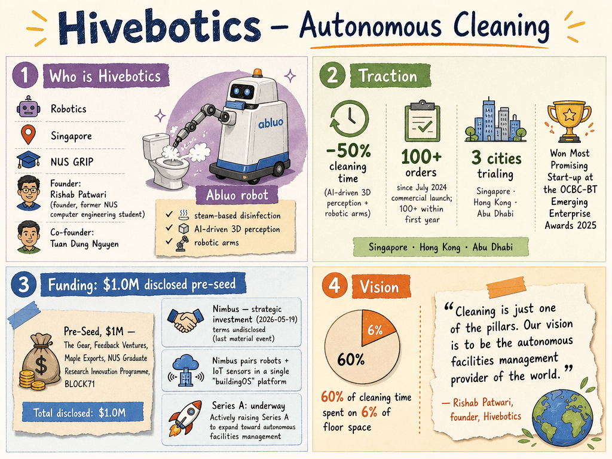

# Hivebotics — LIVING BRIEF
_Last updated: 2026-09-16 17:32 UTC_

## Thesis
Hivebotics is a Singapore-headquartered robotics startup incubated under NUS GRIP, developing autonomous cleaning robots for commercial and industrial environments. The company closed a US$6M Series A led by Vertex Ventures in September 2026 to take its Abluo restroom-cleaning robot into volume production, building on 100+ first-year orders and a strategic investment from Nimbus.

_Last material event: 2026-09-04 — Raised US$6M Series A led by Vertex Ventures to take the Abluo restroom-cleaning robot into volume production_

## Profile
- Sector: Robotics
- Region: Singapore

## Funding history
- **date unknown** — Pre-Seed, $1M — The Gear, Feedback Ventures, Maple Exports, NUS Graduate Research Innovation Programme, BLOCK71 — [pitchbook.com](https://pitchbook.com/profiles/company/509315-32)
_Total disclosed: $1.0M._

## Recent signals
- **2026-09-04** — Raised US$6M in a Series A led by Vertex Ventures, with proceeds earmarked to take the Abluo restroom-cleaning robot into volume production — [techinasia.com](https://www.techinasia.com/news/vertex-ventures-leads-6m-sg-robotics-firm-hivebotics) (Also reported by: [businesstimes.com.sg](https://www.businesstimes.com.sg/companies-markets/robotics-startup-hivebotics-raises-us6-million-series-round-led-vertex-ventures), [e27.co](https://e27.co/hivebotics-nets-us6m-to-take-restroom-cleaning-robot-abluo-into-volume-production-20260904/), [cde.nus.edu.sg](https://cde.nus.edu.sg/news/nus-cde-alumni-startup-hivebotics-secures-us6-million-to-scale-autonomous-cleaning-robots), [vertexventures.sg](https://www.vertexventures.sg/projects/hivebotics), [vertexventures.sg](https://www.vertexventures.sg/news/hivebotics-raises-us-6-million-series-a-led-by-vertex-ventures-southeast-asia-india-to-automate-facilities-management-using-robots-starting-with-restroom-cleaning))
  - Summary: Hivebotics closed a US$6M Series A led by Vertex Ventures Southeast Asia & India on 4 September 2026, with Fareast Land Development (Farglory Group) and Rigel, an Asian manufacturer of eco-friendly smart restroom products, participating alongside the lead; the capital takes Abluo — a mobile articulated-arm robot that cleans toilets, urinals, sinks and floors end to end, rather than the floor alone as existing cleaning robots do — from pilot deployments into volume production. Lead investor Vertex says the round also funds expansion of the distributor network across Hivebotics' four core markets and further development of HiveIntelligence, the proprietary physical-AI layer that plans, monitors and validates each cleaning job, and that Abluo has logged nearly 10,000 operating hours over 12 months at more than 20 sites in hospitals, airport terminals and shopping malls across Asia, Europe, the Middle East and North America. The round was reported on 4 September 2026 by Tech in Asia, The Business Times and e27, and separately by NUS CDE — whose Innovation and Design Programme and GRIP incubated the founding team — and by Vertex.
  - People: Rishab Patwari (co-founder and CEO), Tuan Dung Nguyen (co-founder and COO), Vincent Sim (Chief Sales Officer, joined 2025 from Kärcher Singapore), Liu Genping (General Partner, Vertex Ventures SEA & India)
  - Counterparties: Vertex Ventures Southeast Asia & India (lead investor), Fareast Land Development / Farglory Group (co-investor), Rigel (co-investor, restroom products)
  - Numbers: US$6M Series A; ~10,000 operating hours over 12 months; 20+ sites across four regions; 30 minutes of manual cleaning replaced by a five-minute human inspection; soft facilities management market US$770B (2024) to US$1.23T (2033) per Grand View Research
  - Quote: "We may not only be building our own robots, but we will be collaborating with other robotics companies to integrate with our ecosystem," — Rishab Patwari, co-founder
- **2026-08-26** — PickNik case study details how MoveIt Pro motion planning, autonomous navigation and simulation cut an estimated 10 months off Abluo's development and testing timeline — [picknik.ai](https://picknik.ai/case-study-hivebotics/)
  - Summary: PickNik Robotics published a case study on its work with Hivebotics to productionize the Abluo cleaning robot: customized MoveIt Pro arm path planning for confined spaces, autonomous navigation software for consistent mobile-base placement, and real-time simulations to de-risk physical deployment. PickNik estimates the collaboration saved roughly 10 months of product development and testing time against a typical year-plus timeline.
  - People: Rishab Patwari (CEO)
  - Counterparties: PickNik Robotics (technology partner)
  - Numbers: ~10 months of development/testing time saved
  - Quote: "Their contributions allowed us to overcome significant technical challenges and accelerated our path to market with confidence." — Rishab Patwari, CEO, Hivebotics

## Older signals
- **2026-06-19** — Dealroom recap reports Hivebotics' Abluo robot cuts toilet cleaning time by 50%, confirming Series A fundraising is underway — [app.dealroom.co](https://app.dealroom.co/news/feed/hivebotics-abluo-robot-cuts-toilet-cleaning-time-by-50-with-ai-and-robotic-arms)
  - Summary: Dealroom reports Hivebotics' Abluo robot achieves a 50% reduction in cleaning time using AI-driven 3D perception and robotic arms. The article confirms Hivebotics is actively raising Series A funding to expand toward autonomous facilities management, citing 100+ orders since the July 2024 commercial launch.
  - People: Rishab Patwari (founder), Tuan Dung Nguyen (co-founder)
  - Numbers: 50% cleaning time reduction; 100+ orders; 60% of cleaning time spent on 6% of floor space
- **2026-06-12** — Tech in Asia republishes a profile of Hivebotics' Abluo toilet-cleaning robot, covering its 100+ commercial orders, facilities management vision, and ongoing Series A fundraising — [techinasia.com](https://www.techinasia.com/robot-cleans-toilets-humans-dont)
  - Summary: Corroborates the 2026-05-13 Business Times feature; no new facts.
- **2026-05-19** — Nimbus, a proptech and facility-management firm, made a strategic investment in Hivebotics (terms undisclosed), pairing Hivebotics' autonomous cleaning robots with Nimbus's "buildingOS" facility-automation vision — [app.dealroom.co](https://app.dealroom.co/news/note/nimbus-invests-in-hivebotics-maker-of-the-first-fully-autonomous-bathroom-cleaning-robot) (Also reported by: [app.dealroom.co](https://app.dealroom.co/news/feed/nimbus-invests-in-hivebotics-world-s-first-fully-autonomous-bathroom-cleaning-robot))
  - Summary: Nimbus, a proptech and facility-management company, announced a strategic investment in Hivebotics on May 19, 2026; financial terms were not disclosed. The deal stems from a shared vision between Hivebotics founder Rishab and Nimbus founder Daniel to automate physical-space maintenance, with Nimbus planning to combine robots and IoT sensors in a single "buildingOS" platform while human workers shift to oversight and complex problem-solving.
  - People: Rishab Patwari (founder), Daniel (Nimbus founder)
  - Counterparties: Nimbus (strategic investor)
- **2026-05-13** — Hivebotics' Abluo toilet-cleaning robot passes 100 orders within a year of launch, with commercial trials across Singapore, Hong Kong, and Abu Dhabi — [The Business Times](https://www.businesstimes.com.sg/events-awards/emerging-enterprise/ocbc-emerging-enterprise-awards-robot-cleaning-toilet-hivebotics)
  - Summary: The Business Times profiles Hivebotics' Abluo autonomous toilet-cleaning robot, which combines steam-based disinfection, AI-driven 3D perception, and robotic arms. Over 100 units ordered within a year of commercial launch; trials underway at offices, shopping malls, and airports in Singapore, Hong Kong, and Abu Dhabi. The startup won Most Promising Start-up at the OCBC-BT Emerging Enterprise Awards 2025 and is now raising a Series A round.
  - People: Rishab Patwari (founder, former NUS computer engineering student), Tuan Dung Nguyen (co-founder)
  - Counterparties: OCBC Bank (award sponsor); The Business Times (award co-organizer)
  - Numbers: 100+ orders within first year; 60% of cleaning time spent on 6% of floor space
  - Quote: "Cleaning is just one of the pillars. Our vision is to be the autonomous facilities management provider of the world." — Rishab Patwari, founder, Hivebotics
- **2026-05-12** — Hivebotics' autonomous toilet-cleaning robot draws 100+ prospective customers, per Business Times feature — [The Business Times](https://news.google.com/rss/articles/CBMiywFBVV95cUxOdlVBSmR0ZlhlVXVSaGh1amJpTXNPeVR4eUhtakJ2Nk5KTWVaUEFtSG1jTUt5d3l1U1ZtWUZmZEg1WjNzSHpvMGxiTjRnMDhNZ081TnNTODRpQmRLTXNkZVZUY2hidE80X1JYOFIwdF83aHNuXzBhdTBwZEtOMVlGdE9IZ3BFUVVpemkzdnI0Y1dtS0tBV080Tl9rZ2k2bVVEdm9VdUROUFdJWEdYN2VSc2k3dTZucHVTSHBUZ3VpSHZyZ2N4SUpLdHpDbw)

## Open questions
- What is Hivebotics' commercial model — outright robot sales through distributors, leasing, or robotics-as-a-service? The Series A release funds "expansion of the distributor network", which points to hardware sales rather than a per-cleaning service model, but the pricing model is not stated.
- Are the Series A co-investors strategic? Fareast Land Development (Farglory Group, a property developer) and Rigel (restroom products) both sit in Hivebotics' target verticals or supply chain — are there deployment or distribution commitments attached, and was Nimbus's May 2026 investment folded into this round or held separately?
- Which are the "four core markets" the distributor expansion targets, and does North America — where Abluo already has operating sites — count as a market or only as a deployment footprint?
- Is HiveIntelligence meant only for Abluo, or licensed to the third-party robotics companies Hivebotics plans to integrate into its ecosystem?
