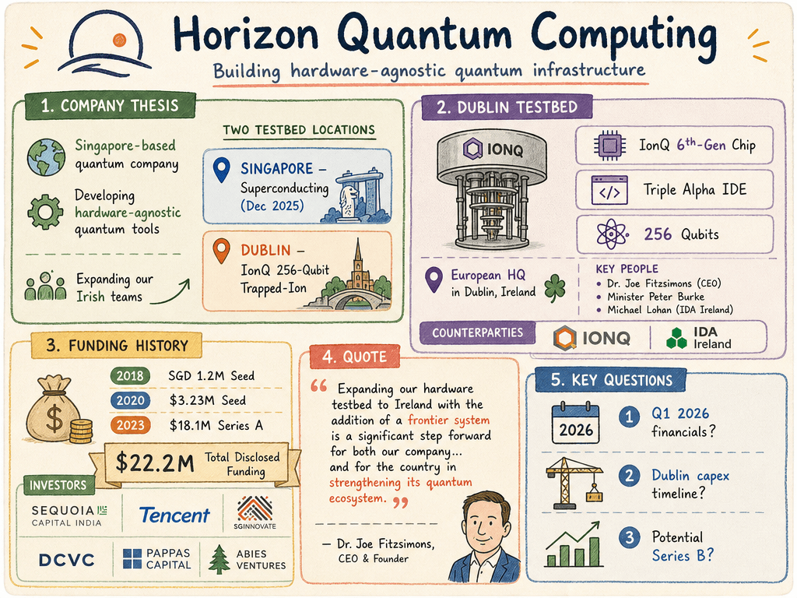

# Horizon Quantum Computing — LIVING BRIEF
_Last updated: 2026-06-24 15:45 UTC_

## Thesis
Singapore-based quantum computing company developing hardware-agnostic programming tools and infrastructure. Having assembled its first superconducting testbed in Singapore in December 2025, the company is now deploying a second, technologically distinct testbed in Dublin with an IonQ 256-qubit trapped-ion system, signaling expanding hardware operations and a deepening European presence.

## Profile
- Sector: Quantum computing
- Region: Singapore
- Identifiers: [LinkedIn](https://www.linkedin.com/company/horizon-quantum-computing/), [Crunchbase](https://www.crunchbase.com/organization/horizon-quantum-computing), [SGInnovate](https://www.sginnovate.com/investments/horizon-quantum-computing), UEN: 201802755E

## Funding history
- **2018** — Seed, SGD 1.2M — SGInnovate; Abies Ventures, DCVC, Summer Capital — [horizonquantum.com](https://www.horizonquantum.com/updates/news/horizon-closes-seed-funding-round)
- **2020-06** — Seed, $3.23M — Sequoia Capital India; SGInnovate, Abies Ventures, DCVC, Qubit Protocol, Summer Capital, et al. — [kr-asia.com](https://kr-asia.com/quantum-computing-startup-bags-usd-3-23-million-in-a-sequoia-led-seed-plus-round)
- **2023-03-31** — Series A, $18.1M — Sequoia Capital India; Tencent, SGInnovate, Pappas Capital, Expeditions Fund — [technode.global](https://technode.global/2023/04/01/singapores-horizon-quantum-computing-raises-18-1m-series-a-funding-from-sequoia-capital-india-tencent-and-others/)
_Total disclosed: $22.2M._

## Recent signals
- **2026-04-15** — Horizon Quantum and AQT to Advance Real-World Quantum Applications with Strategic Hardware–Software Collaboration — [horizonquantum.com](https://www.horizonquantum.com/resources/newsroom/horizon-quantum-and-aqt-to-advance-real-world-quantum-applications-with-strategic-hardware-software-collaboration)
- **2026-05-05** — Horizon Quantum Announces First Quarter 2026 Financial Results — [investors.horizonquantum.com](https://investors.horizonquantum.com/news-releases/news-release-details/horizon-quantum-announces-first-quarter-2026-financial-results)
- **2026-06-11** — Horizon Quantum's second testbed will be an IonQ 256-qubit trapped-ion system deployed at its European headquarters in Dublin, with plans to expand Irish-based science and engineering teams — [newsroom](https://www.horizonquantum.com/resources/newsroom/horizon-quantum-announces-dublin-as-its-second-quantum-computer-testbed-location-bringing-a-frontier-quantum-system-to-ireland)
  - Summary: Horizon Quantum announced it will deploy its second quantum computer testbed in Dublin, Ireland, featuring an IonQ 256-qubit trapped-ion system — the sixth-generation chip-based technology. The system will run on Horizon's Triple Alpha IDE and execution stack, and the company plans to expand its Irish-based science and engineering teams. This follows the December 2025 assembly of its first superconducting testbed in Singapore.
  - People: Dr. Joe Fitzsimons (CEO & Founder), Minister Peter Burke (Dept. of Enterprise, Tourism and Employment), Michael Lohan (CEO, IDA Ireland)
  - Counterparties: IonQ (256-qubit trapped-ion system supplier), IDA Ireland
  - Numbers: 256-qubit (IonQ 6th-gen chip-based trapped-ion system)
  - Quote: "Expanding our hardware testbed to Ireland with the addition of a frontier system is a significant step forward for both our company... and for the country in strengthening its quantum ecosystem." — Dr. Joe Fitzsimons, CEO & Founder
- **2026-06-11** — Corroborates the Dublin testbed announcement; reprints the same press release with quotes from Minister Burke, Dr. Fitzsimons, and IDA Ireland — [hpcwire.com](https://www.hpcwire.com/off-the-wire/horizon-quantum-selects-dublin-for-2nd-quantum-computing-testbed)
  - Summary: Corroborates the June 11 announcement; no new facts.
- **2026-06-11** — Reports Horizon Quantum's selection of Dublin for its second quantum computer testbed location — [thequantuminsider.com](https://thequantuminsider.com/2026/06/11/horizon-quantum-dublin-second-quantum-computer-testbed-ireland)
- **2026-05-14** — Horizon Quantum Computing published its Q1 2026 financial results via its newsroom, marking a voluntary public disclosure of financial standing for the privately-held startup — [newsroom](https://www.horizonquantum.com/resources/newsroom/horizon-quantum-announces-first-quarter-2026-financial-results)

## Older signals
_none_

## Open questions
- What do the Q1 2026 results reveal about revenue, burn rate, and cash runway?
- What is the total capital expenditure and deployment timeline for the Dublin IonQ 256-qubit testbed?
- Does the hardware expansion to a second continent signal an imminent Series B or other institutional funding round?
