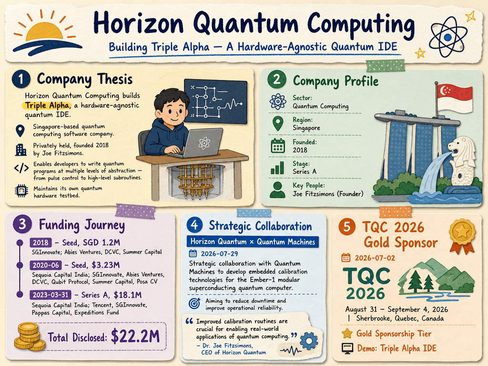

# Horizon Quantum Computing — LIVING BRIEF
_Last updated: 2026-07-29 15:35 UTC_

## Thesis
Singapore-based quantum computing software company building Triple Alpha, a hardware-agnostic integrated development environment. Privately held, founded 2018 by Joe Fitzsimons, the startup enables developers to write quantum programs at multiple levels of abstraction — from pulse control to high-level subroutines — and maintains its own quantum hardware testbed.

_Last material event: 2026-07-29 — Strategic collaboration with Quantum Machines to develop embedded calibration technologies for the Ember-1 superconducting quantum testbed_

## Profile
- Sector: Quantum computing
- Region: Singapore
- Founded: 2018
- Stage / funding: Series A
- Key people: Joe Fitzsimons (Founder)
- Identifiers: [LinkedIn](https://www.linkedin.com/company/horizon-quantum-computing/), [Crunchbase](https://www.crunchbase.com/organization/horizon-quantum-computing), UEN: 201802755E, [SGInnovate](https://www.sginnovate.com/investments/horizon-quantum-computing)

## Funding history
- **2018** — Seed, SGD 1.2M — SGInnovate; Abies Ventures, DCVC, Summer Capital — [horizonquantum.com](https://www.horizonquantum.com/updates/news/horizon-closes-seed-funding-round)
- **2020-06** — Seed, $3.23M — Sequoia Capital India; SGInnovate, Abies Ventures, DCVC, Qubit Protocol, Summer Capital, Posa CV — [kr-asia.com](https://kr-asia.com/quantum-computing-startup-bags-usd-3-23-million-in-a-sequoia-led-seed-plus-round)
- **2023-03-31** — Series A, $18.1M — Sequoia Capital India; Tencent, SGInnovate, Pappas Capital, Expeditions Fund — [technode.global](https://technode.global/2023/04/01/singapores-horizon-quantum-computing-raises-18-1m-series-a-funding-from-sequoia-capital-india-tencent-and-others/)

_Total disclosed: $22.2M._

## Recent signals
- **2026-07-29** — Strategic collaboration with Quantum Machines to develop embedded calibration technologies for the Ember-1 modular superconducting quantum computer, aiming to reduce downtime and improve operational reliability — [horizonquantum.com](https://www.horizonquantum.com/resources/newsroom/horizon-quantum-and-quantum-machines-announce-strategic-collaboration-to-increase-efficiency-of-quantum-systems)
  - Summary: Horizon Quantum and Quantum Machines will collaborate on embedded calibration technologies to enable lightweight calibration routines to run during normal system operation, reducing the need for lengthy full-system calibration cycles. The effort targets Horizon's first in-house hardware testbed, Ember-1, which uses QM's OPX1000 control system.
  - People: Dr. Joe Fitzsimons (CEO, Horizon Quantum), Dr. Itamar Sivan (CEO, Quantum Machines)
  - Counterparties: Quantum Machines (Strategic Partner)
  - Quote: "Improved calibration routines are crucial for enabling real-world applications of quantum computing." — Dr. Joe Fitzsimons, CEO of Horizon Quantum

## Older signals
- **2026-07-02** — Horizon is a gold sponsor of TQC 2026 (Quebec, Aug 31–Sep 4), where it will demo Triple Alpha, its hardware-agnostic quantum IDE — [horizonquantum.com](https://www.horizonquantum.com/resources/newsroom/meet-us-at-tqc-2026)
  - Summary: Horizon Quantum will attend and sponsor the Theory of Quantum Computation, Communication and Cryptography conference in Sherbrooke, Canada. The company plans to showcase Triple Alpha, which lets developers write quantum programs across multiple abstraction levels, and meet with the theoretical quantum information science community.
  - Numbers: Gold sponsorship tier; event dates August 31–September 4, 2026

## Open questions
- What is the adoption rate of Triple Alpha among academic and industry developers?
- When does Horizon expect its hardware testbed to reach a commercially viable qubit count?
- How will the embedded calibration collaboration with Quantum Machines affect Ember-1's timeline to operational stability?
